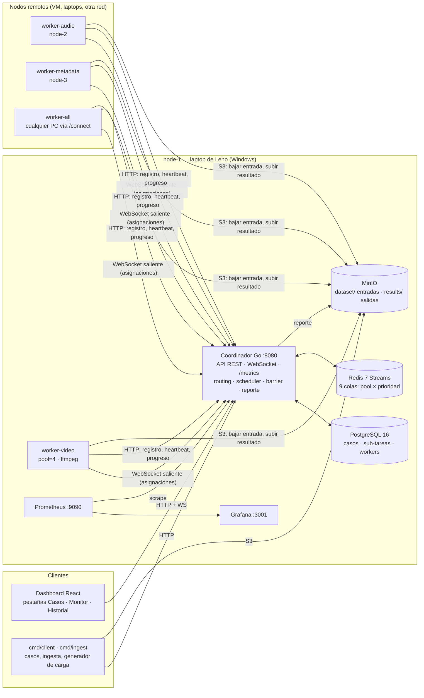
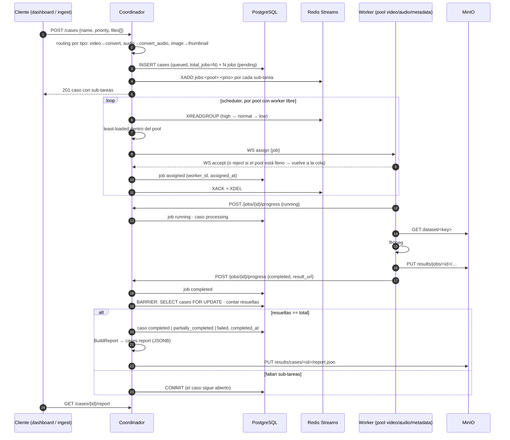
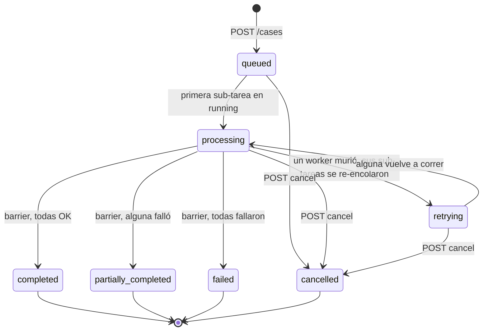
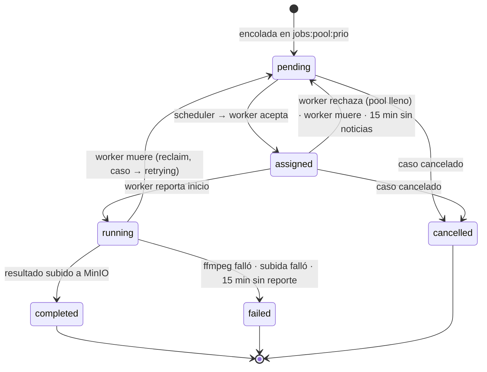
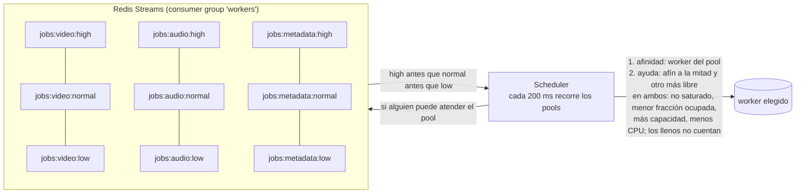
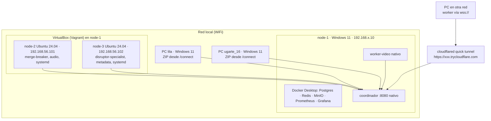

# Arquitectura de MediaCase

Plataforma distribuida de procesamiento multimedia **por casos** (IC-6600, consigna v2.0). Este
documento describe los componentes, los nodos, el flujo de un caso y de una sub-tarea, las colas,
la comunicación entre procesos y las decisiones de diseño con su justificación.

## 1. Idea central: el caso es la unidad de trabajo

Un **caso** es un conjunto de 1..N archivos multimedia relacionados que entra al sistema como una
sola solicitud (`POST /cases`). El coordinador lo inspecciona, decide qué operación le toca a cada
archivo según su tipo, lo descompone en **sub-tareas**, las reparte entre workers de distintas
máquinas, y solo cuando **todas** resolvieron (barrier/join) cierra el caso y produce un **reporte
consolidado**. Un caso puede ser homogéneo (todos los archivos del mismo tipo) o heterogéneo
(video + audio + imágenes, tres operaciones distintas en tres pools distintos).

## 2. Componentes y nodos

| Componente | Dónde corre | Qué hace |
|---|---|---|
| **Coordinador** (`cmd/coordinator`, `internal/coordinator`, `internal/cases`) | node-1, proceso nativo | Recibe casos, enruta por tipo, descompone y encola, asigna a workers, lleva el estado, cierra casos (barrier), genera el reporte, sirve dashboard/API/métricas |
| **Workers** (`cmd/worker`) | cualquier máquina | Abren un canal hacia el coordinador, ejecutan sub-tareas con ffmpeg en un pool de goroutines, reportan progreso, suben resultados a MinIO |
| **Cola** (`internal/queue`) | Redis en Docker, node-1 | 9 streams `jobs:<pool>:<prioridad>` con consumer group: lo que hay que ejecutar |
| **Estado** (`internal/db`) | PostgreSQL en Docker, node-1 | La verdad: tablas `cases`, `jobs`, `worker_registry`, `cases.report` |
| **Repositorio de archivos** (`internal/storage`) | MinIO en Docker, node-1 | `dataset/` entradas · `results/jobs/<id>/` salidas · `results/cases/<id>/report.json` |
| **Dashboard** (`dashboard/`) | compilado, lo sirve el coordinador en `/` | Casos (enviar, seguir, reporte, cancelar), Monitor (workers, colas por pool, sub-tareas por caso), Historial |
| **Monitoreo** (`infra/`) | Prometheus + Grafana en Docker | Scrapean `/metrics` del coordinador; dashboard **MediaCase** provisionado |
| **Clientes** (`cmd/client`, `cmd/ingest`) | donde sea | Enviar casos, consultar, ingesta del dataset, generación automática de casos, generador de carga |

## 3. Flujo de un caso

Puntos clave:

- **Routing por tipo** (`internal/cases/router.go`): la operación no la dicta el cliente; el
  coordinador la decide por el tipo del archivo. El cliente puede *sugerir* una operación y solo se
  acepta si aplica a ese tipo (`video_x.mp4:extract_audio` sí; `foto.jpg:convert` no).
- **Aceptar o rechazar entero**: se validan todos los archivos antes de tocar la base, así un caso
  nunca queda a medio registrar y el error dice exactamente qué archivo no sirve.
- **Barrier/join** (`internal/cases/barrier.go`): cada vez que una sub-tarea llega a `completed` o
  `failed`, el coordinador bloquea la fila del caso (`SELECT … FOR UPDATE`), cuenta, y solo si
  resueltas = total cambia el estado agregado. Dos sub-tareas que terminan en el mismo instante se
  serializan; el caso cierra una sola vez. El barrier se dispara en cuatro puntos y en los cuatro
  llega al mismo código: reporte del worker, reintentos de entrega agotados, sub-tarea vencida, y
  reclaim de un worker caído.
- **Reporte consolidado** (`internal/cases/report.go`): archivos agrupados por tipo y operación,
  resultado y error de cada sub-tarea, tiempos de inicio/fin del caso y de cada sub-tarea, worker
  responsable, y el resumen agregado (*"de 39 archivos — 20 videos convertidos, 12 audios
  convertidos, 7 miniaturas generadas"*). Ver [`api.md`](api.md).

## 4. Ciclos de vida

### Caso (7 estados)

`completed` ⟺ todas las sub-tareas exitosas; `partially_completed` ⟺ al menos una fallida; el
estado agregado se decide **solo** con todas resueltas. Cancelar cancela las sub-tareas no
iniciadas; las que corren terminan pero el caso ya no cambia (el reporte se genera al cancelar).

### Sub-tarea (6 estados)

Cada sub-tarea guarda id del caso, archivo, operación, pool, estado, worker, progreso, reintentos y
tiempos (`created_at`, `assigned_at`, `started_at`, `completed_at`). Los reportes de estado
**solo avanzan**: un avance rezagado nunca devuelve a `running` una sub-tarea terminada.

## 5. Colas y planificación

- **Nueve colas = pool × prioridad.** Prioridad 8-10 → `high`, 4-7 → `normal`, 1-3 → `low`.
  Dentro de un pool se vacía `high` antes que `normal` antes que `low` (planificación multinivel).
- **Afinidad, ayuda y carga (`Registry.PickFor`)**: para cada pool el scheduler elige primero un
  worker cuyo pool principal coincida (*afinidad*). Cuando el afín llega a la mitad de su
  capacidad (o está saturado) y otro nodo está proporcionalmente más libre, la sub-tarea va a ese
  (*ayuda*, work stealing). "Saturado" sale de las métricas reales del heartbeat: RAM ≥ 90 % o
  CPU ≥ 95 %. Dentro de cada grupo gana el no saturado con **menor fracción ocupada** (sub-tareas
  activas ÷ capacidad), a igualdad el de **más capacidad** y por último el de menos CPU; un nodo
  que ya cubrió su capacidad no se considera (la sub-tarea espera en la cola en vez de ser
  rechazada). Cada asignación se cuenta en el acto (`NoteAssigned`) y el heartbeat la corrige al
  segundo siguiente, para que una ráfaga no caiga entera en el mismo nodo. Cada sub-tarea guarda
  cómo se asignó (`assignment = afinidad | ayuda`) y el dashboard lo muestra.
  `SCHEDULER_STRICT_POOLS=true` vuelve al modelo de pools puros (sin ayuda), útil para demostrar
  la separación.
- **No se saca nada de una cola si nadie puede atenderla**: si ningún nodo vivo puede tomar un
  pool (en modo estricto, ninguno de ese pool), la profundidad de esa cola crece y **eso es lo que
  muestra el dashboard** (`by_pool`) y Grafana.
- **Capacidad y backpressure**: cada worker procesa a la vez tantas sub-tareas como su capacidad
  (`WORKER_POOL_SIZE`). Con `auto` la calcula con su hardware: un cupo cada 2 hilos lógicos y
  cada ~2 GB de RAM, lo que se agote primero, entre 1 y 8 (12 hilos y 15 GB → 6; una VM de 2 hilos
  y 2 GB → 1). La informa al registrarse y el Monitor muestra "3 de 6 cupos ocupados". Si aun así
  le llega una de más, responde `reject` y la sub-tarea vuelve a la cola sin contar como reintento.
- **Tolerancia a fallos**: heartbeat cada 1 s; sin heartbeat por 15 s el worker se expulsa y sus
  sub-tareas `assigned`/`running` vuelven a la cola (el caso pasa a `retrying`). Un worker que
  vuelve como proceso nuevo (otro `instance`) provoca el mismo reclaim de inmediato; uno que se
  apaga ordenadamente se despide (`unregister`) y no espera los 15 s. Una sub-tarea `running` sin
  reporte 15 min se marca fallida; una `assigned` sin reporte 15 min vuelve a la cola. Redis con
  consumer group asegura que un mensaje entregado y no confirmado no se pierde si el coordinador
  reinicia.

## 6. Pools especializados por tipo de contenido (Unidad 1)

Decisión: workers **especializados** (`WORKER_ROLE=video|audio|metadata`) en vez de genéricos, con
`all` como comodín. La justificación sigue la heterogeneidad de cómputo de la Unidad 1 — así como una
GPU rinde en paralelo masivo y una NPU en inferencia, aquí cada operación tiene un perfil de costo
distinto y conviene atenderla en el nodo que mejor la resuelve:

| Pool | Operaciones | Perfil | Nodo |
|---|---|---|---|
| `video` | `convert` (→ mp4/mkv/webm), `extract_audio` (→ mp3/wav/flac/aac) | CPU intensivo y sostenido: un pesado de 250 MB tarda ~3 min | node-1, el más potente (Ryzen 7, 6C/12T) |
| `audio` | `convert_audio` (→ flac/mp3/wav/aac/ogg) | CPU moderado: segundos a un minuto | node-2 (2 vCPU) |
| `metadata` | `thumbnail` (→ jpg/png/webp, 320-1280 px), `metadata` (ffprobe → json) | Liviano: < 3 s | node-3 (1 vCPU) |

Con workers genéricos puros, una sub-tarea de video podía caer en el nodo más débil y **retrasar
el cierre de todo el caso** (el barrier espera a la más lenta). Con pools puros, el trabajo pesado
iba siempre al nodo que lo termina antes, pero un nodo ocioso no ayudaba a otro pool saturado. La
versión final usa la especialización como **preferencia** (afinidad) y no como pared: el video va
primero al nodo más potente, y un nodo libre toma trabajo de otro pool antes que quedarse parado,
siempre evitando los nodos saturados según sus métricas reales (§5). Es la lectura de la Unidad 1
que se defiende en el informe: heterogeneidad de cómputo aprovechada sin desperdiciar capacidad.
Números reales en [`informe-pruebas.md`](informe-pruebas.md).

**La potencia de cada máquina también cuenta, no solo su rol.** Un número fijo de sub-tareas por
nodo trata igual a una laptop de 4 hilos y a una estación de 32: la potente se queda a medias y,
como el reparto miraba sub-tareas activas en bruto, el trabajo terminaba en la débil (2 activas de
8 posibles parecían "más carga" que 1 de 2). Por eso cada worker calcula su **capacidad** con sus
núcleos y su RAM y el planificador reparte por **fracción ocupada**: ante una ráfaga de 10
sub-tareas, un nodo de capacidad 8 recibe 8 y uno de capacidad 2 recibe 2 (prueba
`TestPickFor_RepartoProporcionalALaCapacidad`). Una PC nueva se suma desde `/connect` eligiendo su
rol (todo, video, audio o imágenes y metadatos); el ZIP la configura con `WORKER_POOL_SIZE=auto`.

Lo que queda fuera a propósito: codificar con la GPU (NVENC, QSV, AMF). Depende del modelo de la
tarjeta y de los drivers de cada máquina, y un fallo de hardware en la demo no se puede
diagnosticar a tiempo; con x264 en CPU todas las máquinas producen el mismo resultado. El worker ya
reporta sus GPUs (Monitor), así que el siguiente paso sería un rol `video-gpu` con receta propia.

## 7. Comunicación entre procesos

| Canal | Tecnología | Quién → quién | Para qué |
|---|---|---|---|
| Asignación de sub-tareas | WebSocket **saliente** del worker (`GET /workers/{id}/stream`) | worker abre → coordinador envía | `assign` ↓, `accept`/`reject` ↑, `ping`/`pong` |
| Registro, heartbeat, progreso, despedida | HTTP JSON | worker → coordinador | estado del nodo y de cada sub-tarea; el registro lleva el **hardware** (CPU, RAM, GPUs) y cada heartbeat las **métricas** (CPU %, memoria, disco, % y VRAM por GPU) |
| Casos y consultas | HTTP JSON (`/cases`, `/jobs`, `/stats`) | clientes → coordinador | enviar, seguir, reporte, cancelar |
| Dashboard en vivo | WebSocket (`/ws`), snapshot cada 1 s | coordinador → navegador | workers, sub-tareas vivas, colas por pool, casos activos |
| Archivos | S3 (MinIO) | workers y clientes ↔ MinIO | entradas y resultados |
| Cola | Redis Streams | coordinador ↔ Redis | lo que falta ejecutar |
| Métricas | HTTP (`/metrics`) | Prometheus → coordinador | CPU/mem/disco/GPU por worker, colas, casos |

**Por qué el canal es saliente.** El coordinador nunca se conecta a un worker: el worker abre la
conexión y la mantiene viva (reconexión con espera exponencial). Así un worker no necesita puerto
abierto, ni regla de firewall, ni IP alcanzable: corre detrás de cualquier router doméstico, y por
un túnel (`wss://`) desde otra red. Es lo que permite el worker descargable de `/connect`.

**Telemetría de hardware (monitoreo de recursos).** Cada worker detecta una vez su hardware y lo
manda al registrarse (se persiste en `worker_registry.hardware` para sobrevivir reinicios del
coordinador), y muestrea cada segundo lo variable, que viaja en el heartbeat. Fuentes
(`internal/monitoring`): CPU, memoria y disco por gopsutil en todos los sistemas; en **Windows**
las GPUs salen del registro de DirectX (`HKLM\SOFTWARE\Microsoft\DirectX`: nombre, LUID y VRAM
por adaptador) y su uso de los contadores PDH `GPU Engine(*)\Utilization Percentage` y
`GPU Adapter Memory(*)\Dedicated Usage` —exactamente lo que lee el Administrador de tareas: por
LUID, sumando procesos y tomando el motor más ocupado—; las **NVIDIA** además por `nvidia-smi`
(temperatura, VRAM); en **Linux** por `/sys/class/drm/cardN/device` (`gpu_busy_percent`,
`mem_info_vram_*` en amdgpu). Lo que no se puede medir queda en `null` y el dashboard lo dice.
Esto es lo que permite ver, por nodo, cómo trabajan CPU, GPU integrada y GPU dedicada durante una
carga, y compararlo con la asignación por pool (Unidad 1, heterogeneidad de cómputo).

## 8. Almacenamiento y repositorio de resultados

- **PostgreSQL es la verdad**: Redis dice qué falta ejecutar; Postgres dice qué pasó. El dashboard,
  el reporte y las métricas salen de Postgres. Sobrevive reinicios (volumen Docker).
- **MinIO centralizado en node-1** como repositorio de entradas y resultados: los workers bajan solo
  el objeto que les tocó y suben su salida a `results/jobs/<id>/`; el reporte de cada caso queda en
  `results/cases/<id>/report.json` y en `cases.report` (JSONB), consultable por `GET
  /cases/{id}/report` y descargable desde el dashboard. La consigna admite "almacenamiento local
  compartido"; se eligió MinIO (S3) porque es el mismo protocolo desde Windows, Linux o un túnel,
  y porque ningún nodo necesita una copia del dataset (14 GB).
- **node-1 es punto único de fallo, aceptado y documentado**: concentra estado, cola y archivos. Todo
  persiste en disco y nada se pierde al reiniciar; los workers se reconectan solos y reintentan la
  entrega de resultados hasta 15 min mientras el coordinador vuelve.

## 9. Topología de despliegue

Mínimo de la consigna: **3 nodos worker en entidades de ejecución separadas** con comunicación por
red. Lo cubren node-1 (host) + node-2 y node-3 (VMs con IP propia, sin Docker, binario estático bajo
systemd), y se amplía con PC físicas de la misma red, como `lila` y `ugarte_16` en la prueba de tres laptops
del 11 de setiembre, o cualquier PC que abra `/connect`. Con un solo
comando (`docker compose up`) **no** se cumple: el compose de `docker-compose.infra.yml` levanta
solo la infraestructura de node-1, no los workers.

### Puertos

| Servicio | Puerto | Quién lo usa |
|---|---|---|
| Coordinador (dashboard + API + WS + /metrics + /connect) | 8080 | navegadores, workers, clientes, Prometheus |
| MinIO API | 9000 | workers y clientes (S3) |
| MinIO consola | 9001 | humanos |
| PostgreSQL | 5432 | solo el coordinador (localhost) |
| Redis | 6379 | solo el coordinador (localhost) |
| Prometheus | 9090 | humanos, Grafana |
| Grafana | 3001 | humanos (lectura sin login) |
| Worker (diagnóstico `/health`, `/metrics`) | opcional, `WORKER_DIAG_ADDR` | nadie lo necesita para trabajar |

### Variables de entorno

| Variable | Proceso | Significado |
|---|---|---|
| `DATABASE_URL`, `REDIS_ADDR`, `REDIS_PASSWORD`, `PORT` | coordinador | conexión a la infra y puerto HTTP |
| `MINIO_ENDPOINT` | coordinador, worker | MinIO como lo ve **este** proceso |
| `MINIO_PUBLIC_ENDPOINT` | coordinador, worker | MinIO como lo ven los demás nodos (IP de node-1); así se escriben las URLs de resultados |
| `MINIO_ACCESS_KEY`, `MINIO_SECRET_KEY`, `MINIO_BUCKET` | ambos | credenciales y bucket de resultados |
| `WORKER_ID` | worker | nombre estable del nodo (`node2`, `laptop-jenn`) |
| `WORKER_ROLE` | worker | `video` · `audio` · `metadata` · `all` |
| `WORKER_POOL_SIZE` | worker | capacidad: sub-tareas simultáneas; `auto` (o vacío) = según núcleos y RAM, un número la fija |
| `COORDINATOR_URL` | worker, clientes | `http://<ip>:8080` o `https://xxx.trycloudflare.com` |
| `WORKER_DIAG_ADDR` | worker | puerto opcional de diagnóstico (`:8090`); vacío = ninguno |

Los archivos reales están en `infra/env/*.env` (no versionados; los `.example` sí). El ZIP de
`/connect` trae un `worker.env` ya lleno.

## 10. Decisiones de tecnología (justificación)

| Decisión | Por qué |
|---|---|
| **Go** para coordinador y workers | goroutines y canales modelan directo el pool de workers y el scheduler; un binario estático por SO (`CGO_ENABLED=0`) que corre en cualquier distro sin instalar nada — clave para el worker descargable y las VMs sin Docker |
| **Redis Streams** con consumer groups | cola persistente con entrega-y-confirmación: un mensaje entregado y no confirmado no se pierde; `XINFO GROUPS` da la profundidad real por cola |
| **PostgreSQL** como estado | transacciones y `SELECT … FOR UPDATE` para el barrier; consultas de agregación para reporte, `/stats` y `/metrics` |
| **MinIO** (S3) | mismo protocolo desde cualquier nodo y por túnel; URLs de resultado descargables; no obliga a replicar el dataset |
| **ffmpeg** | cubre conversión, extracción de audio, miniaturas y formas de onda; portable (va dentro del ZIP de Windows) |
| **React + Vite** para el dashboard | ya existía; se le agregó la vista por caso. Se compila a estático y lo sirve el coordinador: una sola URL |
| **Prometheus + Grafana** | estándar; el coordinador re-exporta el heartbeat de los workers porque los remotos no tienen puerto que scrapear |
| **Docker solo para la infra de node-1** | Postgres/Redis/MinIO/Prometheus/Grafana en contenedores es lo cómodo; coordinador y workers son procesos nativos porque deben correr en máquinas sin Docker |
| **Vagrant + VirtualBox** | dos nodos Linux reales con IP propia en la laptop de Leno, reproducibles con `vagrant up` |
| **Cloudflare quick tunnel** | exponer el 8080 y el 9000 sin abrir puertos ni cuenta: un worker desde otra red se conecta por `wss://` y habla S3 por TLS. Lo abre el propio coordinador desde el dashboard (`POST /tunnel`, dos `cloudflared` como procesos hijos) y detecta la red que lo bloquea (WiFi del TEC → WARP); probado con un caso completo (informe §7) |

## 11. Temas del curso que aparecen en el código

| Tema | Dónde |
|---|---|
| Administración de procesos y estados | `internal/models` (6 estados de sub-tarea, 7 de caso), `internal/db` |
| Planificación y asignación | `internal/coordinator/scheduler.go` (multinivel por prioridad, least-loaded por pool) |
| Colas y estructuras de control | `internal/queue` (Redis Streams), `worker_hub.go` (canal por worker) |
| Concurrencia y asincronía | pool de goroutines del worker, scheduler, broadcast del dashboard |
| Sincronización (barrier/join) | `internal/cases/barrier.go` con `SELECT … FOR UPDATE` |
| Comunicación entre procesos | HTTP, WebSocket saliente, S3, Redis |
| Heterogeneidad de cómputo (Unidad 1) | pools especializados y capacidad según el hardware de cada nodo, §5-6 |
| Monitoreo y balanceo | heartbeat, `/metrics`, Grafana, colas por pool, reclaim/redistribución |
| Administración de archivos | MinIO: entradas por clave, resultados por caso y sub-tarea, reporte |
