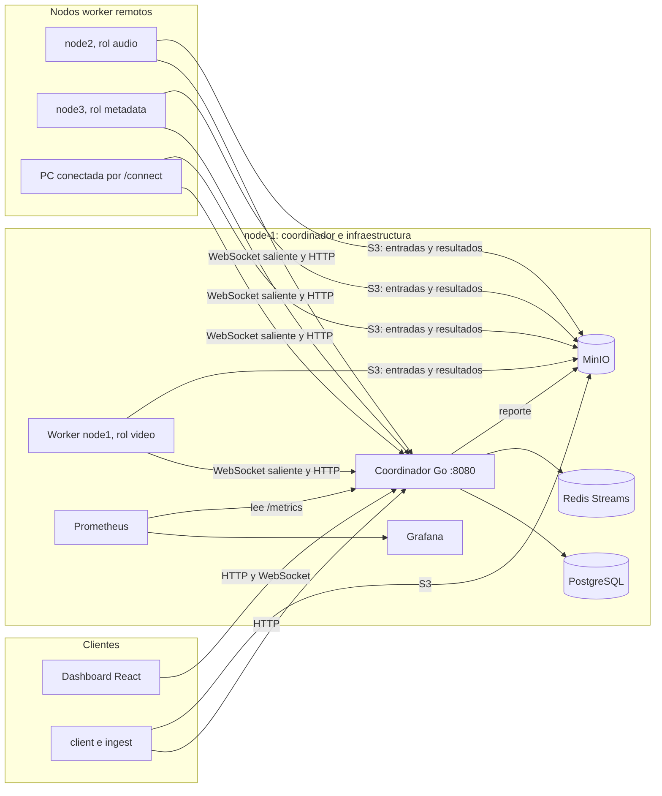
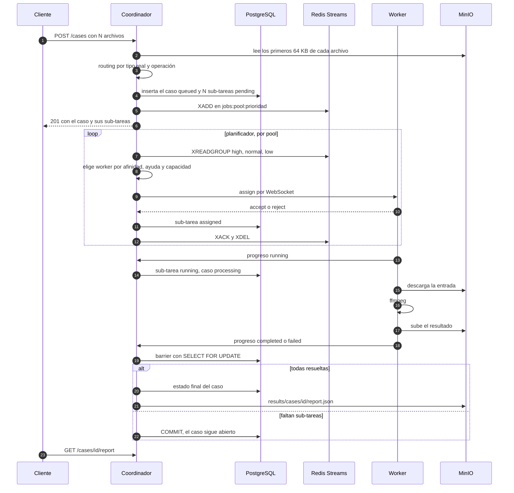
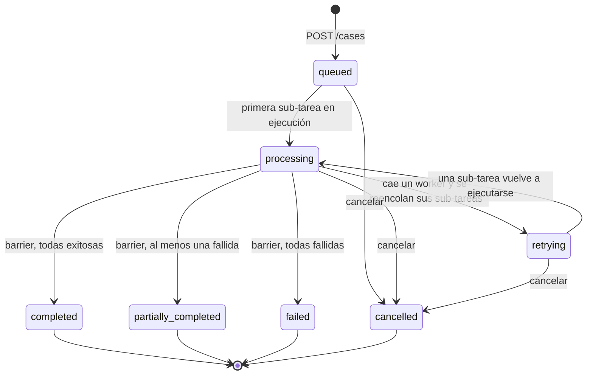
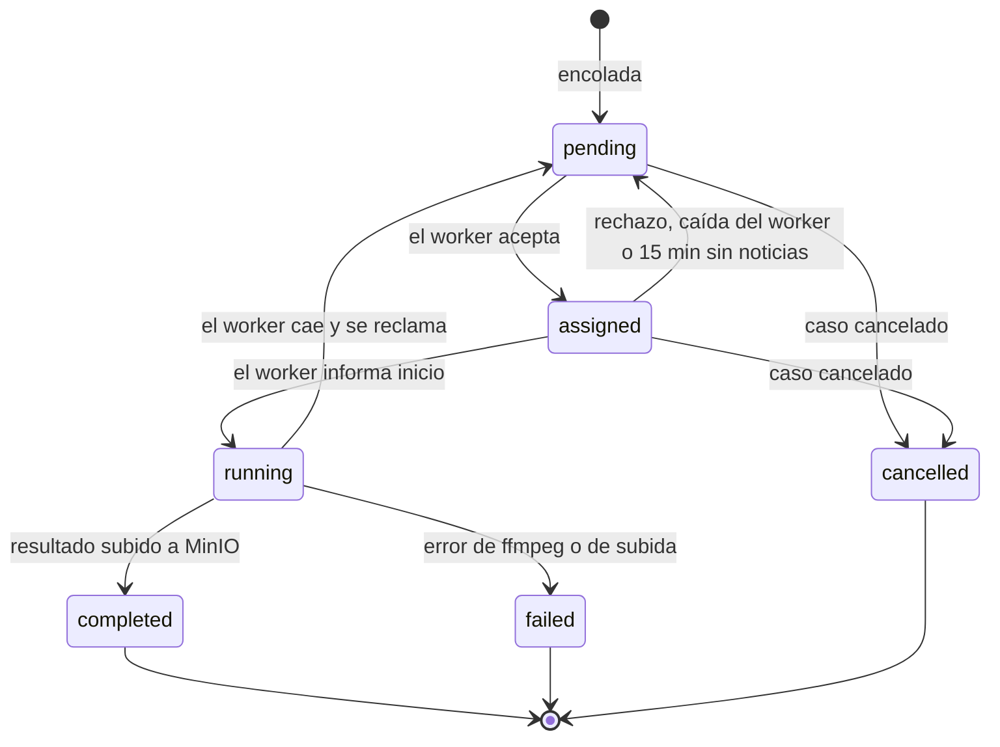
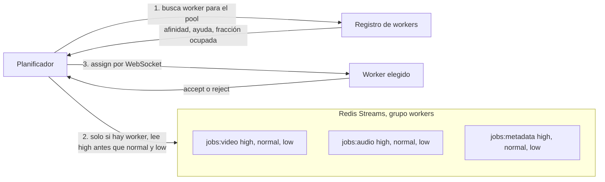
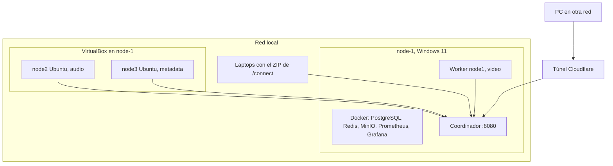

# 1. Introducción

## 1.1 Propósito y alcance

Este documento describe la arquitectura de MediaCase y reúne su documentación técnica: los componentes y los nodos donde se ejecutan, el recorrido de un caso desde que se envía hasta que se genera su reporte, los estados que se modelan, las colas y el planificador, la comunicación entre procesos, el monitoreo, las instrucciones de despliegue y la referencia de la API del coordinador. Cubre los entregables 1 (documento de arquitectura) y 5 (documentación técnica) de la consigna del I Proyecto Programado de IC-6600 Principios de Sistemas Operativos, Grupo 50, II Semestre 2026, TEC Campus San Carlos. El manual de usuario y el informe de pruebas son documentos aparte; aquí se remite a ellos cuando hace falta.

Está dirigido al profesor del curso, a quien deba desplegar el sistema en otras máquinas y a quien quiera extenderlo. Supone conocimientos básicos de redes, procesos y bases de datos, y no requiere haber leído el código. Cuando una afirmación depende de un archivo concreto del repositorio, se indica la ruta para poder verificarla.

El repositorio es `https://github.com/lenokeckler/mediacase-platform` (rama `main`). Los integrantes del equipo son Magdaleno Gómez Díaz, Jennifer López Miranda y Jonathan Sancho Loaiza.

## 1.2 El caso como unidad de trabajo

En MediaCase la unidad de trabajo es el **caso**: un conjunto de uno o varios archivos multimedia relacionados que entra al sistema como una sola solicitud (`POST /cases`). El coordinador inspecciona cada archivo, decide qué operación le corresponde según su tipo real, registra el caso y lo descompone en **sub-tareas**, una por archivo y operación. Las sub-tareas se reparten entre workers que corren en máquinas distintas. Solo cuando todas resolvieron, con éxito o con fallo, el coordinador fija el estado agregado del caso y genera un **reporte consolidado**.

Un caso puede ser homogéneo (todos los archivos del mismo tipo y con la misma operación) o heterogéneo (video, audio e imágenes mezclados, con operaciones distintas que se ejecutan en pools de workers distintos). La consigna advierte que un modelo de casos que sea solo una etiqueta sobre archivos idénticos no se evalúa positivamente. En MediaCase el caso tiene identidad propia en la base de datos (tabla `cases`), un ciclo de vida de siete estados, un mecanismo de sincronización que decide cuándo termina y un reporte que resume lo que pasó con cada archivo. Las sub-tareas apuntan a su caso con `jobs.case_id`, y el estado del caso se deriva de ellas, no del cliente.

# 2. Requisitos de la consigna y dónde se cubren

La Tabla 1 relaciona cada requisito de la consigna con el componente que lo implementa y la sección de este documento que lo explica.

Tabla 1. Requisitos de la consigna y su cobertura

| Requisito | Componente o archivo | Sección |
|---|---|---|
| Recibir un caso con uno o varios archivos | `POST /cases`, `internal/coordinator/cases_api.go` | 4, 12 |
| Inspeccionar cada archivo y determinar la operación | `internal/cases/router.go`, `sniff.go`, `internal/coordinator/routing_inspect.go` | 6 |
| Registrar el caso y descomponerlo en sub-tareas encoladas | tablas `cases` y `jobs`, `internal/queue` | 4, 7 |
| Registro de sub-tareas y estado agregado | `internal/db`, `internal/models` | 5 |
| Sincronización tipo barrier/join | `internal/cases/barrier.go` | 5.3 |
| Asignar, monitorear y redistribuir carga | `internal/coordinator/scheduler.go`, `registry.go` | 7, 10 |
| Job Queue con consumo concurrente y prioridades | Redis Streams, 9 colas pool × prioridad | 7.1 |
| Workers que ejecutan y reportan | `cmd/worker`, `internal/multimedia` | 3, 9 |
| Comunicación por red | HTTP, WebSocket, S3, Redis | 9 |
| Monitoreo de CPU, memoria, carga y sub-tareas por caso | heartbeat, `/metrics`, `/stats`, Grafana | 10 |
| Dashboard por caso y por sub-tarea | `dashboard/` (React), servido por el coordinador | 3, 10 |
| Reporte consolidado y repositorio de resultados | `internal/cases/report.go`, MinIO | 8 |
| Mínimo tres nodos worker en entidades separadas | node-1, VMs de Vagrant, laptops vía `/connect` | 11 |
| Justificación de workers genéricos o especializados | pools `video`, `audio`, `metadata` con afinidad y capacidad | 7.4 |
| Generación manual y automática de casos | formulario, `cmd/client`, `cmd/ingest` | 12.7, 13 |
| Dataset de 400 a 600 archivos organizado en casos | `dataset/manifest.json`, 542 archivos | 13 |

\pagebreak

# 3. Arquitectura general

## 3.1 Componentes

El sistema se divide en un nodo coordinador (node-1) y un número variable de nodos worker. node-1 concentra el estado, la cola y los archivos; los workers solo ejecutan. La Figura 1 muestra los componentes y los canales entre ellos, y la Tabla 2 resume la responsabilidad de cada uno.

:::diagrama Figura 1. Componentes y nodos de MediaCase

:::

Tabla 2. Componentes del sistema

| Componente | Dónde corre | Responsabilidad |
|---|---|---|
| Coordinador (`cmd/coordinator`, `internal/coordinator`, `internal/cases`) | node-1, proceso nativo | Recibe casos, inspecciona y enruta cada archivo, registra y encola sub-tareas, asigna trabajo, lleva el estado, cierra casos con el barrier, genera el reporte y sirve el dashboard, la API y las métricas |
| Workers (`cmd/worker`) | cualquier máquina con red hacia node-1 | Abren un canal hacia el coordinador, ejecutan sub-tareas con ffmpeg en un pool de goroutines, reportan progreso y suben resultados a MinIO |
| Cola (`internal/queue`) | Redis 7 en Docker, node-1 | Nueve streams `jobs:<pool>:<prioridad>` con un consumer group |
| Estado (`internal/db`) | PostgreSQL 16 en Docker, node-1 | Tablas `cases`, `jobs` y `worker_registry`; el reporte en `cases.report` (JSONB) |
| Repositorio de archivos (`internal/storage`) | MinIO en Docker, node-1 | Bucket `dataset` con las entradas y bucket `results` con salidas y reportes |
| Dashboard (`dashboard/`) | compilado a estático, lo sirve el coordinador | Pestañas Casos, Monitor e Historial |
| Monitoreo (`infra/`) | Prometheus y Grafana en Docker, node-1 | Leen `/metrics` del coordinador; tablero MediaCase provisionado |
| Clientes (`cmd/client`, `cmd/ingest`) | cualquier máquina | Envío y consulta de casos, ingesta del dataset, generación automática de casos y generador de carga |

## 3.2 Una sola dirección para todo

El coordinador atiende en un único puerto, el 8080. En `/` entrega el dashboard compilado (`dashboard/dist`), bajo `/api/` expone la API y, por compatibilidad con los workers y los scripts, también responde las mismas rutas sin prefijo (`/cases`, `/workers`, `/ws`, `/metrics`, `/connect`). Con esto basta una dirección, `http://<ip-de-node-1>:8080`, para usar el dashboard, la API y la página que conecta una computadora nueva.

## 3.3 Por qué el worker no toca PostgreSQL

Un worker no tiene credenciales de la base de datos ni de Redis. Todo lo que sabe del sistema le llega por el canal con el coordinador, y todo lo que informa lo hace por HTTP al coordinador. La regla de firewall de node-1 abre solo los puertos 8080 y 9000; la base de datos (5432) y la cola (6379) no reciben conexiones de otros nodos. Además, el manejador de `POST /jobs/{id}/progress` es la única vía para cambiar el estado de una sub-tarea, lo que evita carreras entre workers que escriben directamente en la base. La consecuencia práctica es que un worker nuevo necesita conocer solo dos direcciones: la del coordinador y la de MinIO.

\pagebreak

# 4. Flujo de un caso de punta a punta

La consigna fija el flujo cliente, cola, coordinador, workers, repositorio de resultados y dashboard. La Figura 2 lo muestra con los mensajes reales entre procesos.

:::diagrama Figura 2. Recorrido de un caso desde el envío hasta el reporte

:::

Los pasos se describen a continuación en el orden en que ocurren.

1. El cliente (el formulario del dashboard, `cmd/client` o `cmd/ingest`) envía `POST /cases` con el nombre, la prioridad y la lista de archivos. Cada archivo ya está en el bucket `dataset` de MinIO, subido antes con `POST /upload` o con `ingest upload`. El cliente puede sugerir operación, formato de salida y ancho de miniatura por archivo, pero no está obligado.
2. El coordinador valida todos los archivos antes de escribir nada. Si uno solo no sirve (extensión desconocida, operación que no aplica al tipo, formato de salida inválido), el caso se rechaza entero con `400` y un mensaje que nombra el archivo. Así nunca queda un caso registrado a medias.
3. Para cada archivo, el coordinador lee sus primeros 64 KB desde MinIO y determina el tipo real por la firma binaria (sección 6). Si la extensión no corresponde al contenido, el routing se corrige y la sub-tarea guarda una nota.
4. En una sola transacción inserta el caso en estado `queued` con `total_jobs = N` y las N sub-tareas en `pending`. Luego agrega cada sub-tarea al stream de su pool y su prioridad.
5. El planificador recorre los tres pools. Para cada uno elige un worker y, solo si lo encuentra, saca una sub-tarea de la cola de ese pool y se la envía por el WebSocket que el worker mantiene abierto. El worker responde `accept` o `reject`.
6. El worker informa `running`; el coordinador marca la sub-tarea y pasa el caso a `processing` si era la primera. El worker descarga la entrada, ejecuta ffmpeg, sube la salida a `results/jobs/<id>/` e informa `completed` con la URL del resultado, o `failed` con el motivo.
7. Cada resultado terminal dispara el barrier. Si ya resolvieron todas, el caso cierra y se genera el reporte; si no, el caso sigue abierto.
8. El dashboard recibe cada segundo un snapshot por WebSocket y muestra el avance por caso y por sub-tarea. El cliente consulta el reporte con `GET /cases/{id}/report`.

# 5. Estados y sincronización

## 5.1 Estados del caso

Un caso tiene siete estados. `queued` es el estado inicial; `processing` indica que al menos una sub-tarea está en ejecución; `retrying` que un worker cayó y sus sub-tareas volvieron a la cola; y los cuatro restantes son terminales. La Figura 3 muestra las transiciones.

:::diagrama Figura 3. Ciclo de vida de un caso

:::

Las reglas de cierre siguen la consigna: `completed` si y solo si todas las sub-tareas terminaron con éxito; `partially_completed` si terminó con al menos una fallida y al menos una exitosa; `failed` si fallaron todas. El estado agregado no se calcula por adelantado ni por mayoría: se decide solo cuando el coordinador tiene el resultado de todas. Cancelar un caso marca `cancelled` y cancela las sub-tareas que aún no empezaron (`pending` o `assigned`); las que ya corren terminan, pero el caso no vuelve a cambiar.

## 5.2 Estados de la sub-tarea

Una sub-tarea tiene seis estados, que corresponden a los que pide la consigna (pendiente, asignado, en ejecución, completado, fallido) más `cancelled` para las que pertenecían a un caso cancelado. La Figura 4 muestra el ciclo.

:::diagrama Figura 4. Ciclo de vida de una sub-tarea

:::

Cada sub-tarea guarda su identificador y el del caso, el archivo, el tipo, la operación, el formato de salida, el pool, el worker responsable, el porcentaje de progreso, los reintentos (máximo 3), la forma en que se asignó (`afinidad` o `ayuda`), la nota de routing si la hay, y los tiempos `created_at`, `assigned_at`, `started_at` y `completed_at`. El progreso lo calcula el worker a partir de la salida de ffmpeg (`out_time` frente a la duración del archivo).

Los reportes de estado solo avanzan. Los avances de progreso y el resultado final viajan en peticiones HTTP distintas, así que un avance rezagado puede llegar después del `completed`. El coordinador lo descarta con una condición en el `UPDATE` (`status IN ('pending','assigned','running')`), de modo que una sub-tarea terminada nunca regresa a `running`.

## 5.3 Barrier/join

El barrier está en `internal/cases/barrier.go`. Tiene dos partes. La primera es una función pura, `ComputeStatus(total, completed, failed)`, que devuelve el estado final solo si `completed + failed = total`; mientras falte alguna, indica que el caso sigue abierto. La segunda, `OnJobResolved`, aplica esa regla sobre la base de datos:

1. Abre una transacción y bloquea la fila del caso con `SELECT status, total_jobs FROM cases WHERE id = $1 FOR UPDATE`.
2. Si el caso ya es terminal (cerrado o cancelado), no hace nada.
3. Cuenta las sub-tareas completadas y fallidas del caso dentro de la misma transacción.
4. Si faltan, confirma la transacción sin cambios. Si no faltan, actualiza el estado y `completed_at`, confirma, y fuera de la transacción llama a la función que genera el reporte.

El bloqueo de fila es lo que convierte esto en un join correcto. Si dos sub-tareas del mismo caso terminan en el mismo instante en workers distintos, sus dos peticiones llegan al coordinador en goroutines concurrentes. Sin el bloqueo, las dos podrían contar "falta una" o las dos podrían cerrar el caso y generar dos reportes. Con `FOR UPDATE`, la segunda transacción espera a que la primera confirme y cuenta ya con el resultado de la primera, así que el caso cierra exactamente una vez.

El barrier se invoca desde cuatro puntos del coordinador, todos con el mismo código:

- cuando el worker informa `completed` (`POST /jobs/{id}/progress`);
- cuando el worker informa `failed` por el mismo endpoint;
- cuando una sub-tarea en `running` lleva más de 15 minutos sin reporte y su worker ya no tiene canal abierto, y el barrido periódico la marca fallida;
- cuando una sub-tarea agota sus reintentos de entrega (3) porque ningún worker la pudo recibir.

El reencolado por caída de un worker no pasa por el barrier, porque la sub-tarea no se resolvió: vuelve a `pending` y el caso pasa a `retrying` hasta que alguna sub-tarea vuelva a ejecutarse.

\pagebreak

# 6. Routing por tipo e inspección de contenido

## 6.1 Operaciones y formatos por tipo

La operación de cada archivo la decide el coordinador (`internal/cases/router.go`). El cliente puede sugerir una, pero solo se acepta si aplica al tipo del archivo: pedir `extract_audio` sobre un video es válido; pedir `convert` sobre una imagen devuelve `400`. Si el cliente no pide nada, el coordinador usa la primera operación de la lista de ese tipo y el primer formato de salida válido. La Tabla 3 reproduce las reglas del código.

Tabla 3. Operaciones válidas por tipo de contenido (la primera es la predeterminada)

| Tipo | Extensiones reconocidas | Operaciones y formatos de salida |
|---|---|---|
| video | mp4, mkv, avi, mov, webm, m4v, flv, wmv, ts, mts, 3gp, mpg, mpeg | `convert` a mp4, mkv o webm · `extract_audio` a mp3, wav, flac o aac · `thumbnail` a jpg, png o webp · `metadata` a json · `enrich_video` a mp4 o mkv |
| audio | mp3, wav, flac, aac, ogg, m4a, opus, wma, aiff, aif, dsf, dff | `convert_audio` a flac, mp3, wav, aac u ogg · `thumbnail` (forma de onda) · `metadata` a json · `enrich_audio` a mp3, flac, ogg o m4a |
| imagen | jpg, jpeg, png, gif, webp, bmp, tif, tiff | `thumbnail` a jpg, png o webp · `metadata` a json |

La miniatura admite tres anchos: 320 px (predeterminado), 640 px y 1280 px. En video se toma un fotograma; en audio se dibuja la forma de onda. `metadata` ejecuta ffprobe y guarda el resultado en JSON. Las recetas de conversión están en `internal/multimedia/ops.go`: mp4 y mkv se codifican con H.264 (libx264, preset `fast`, CRF 23) y audio AAC a 128 kb/s; webm con VP9 y Opus. Como libx264 y VP9 exigen ancho y alto pares, `convert` aplica siempre `scale=trunc(iw/2)*2:trunc(ih/2)*2` y el formato de píxel `yuv420p`; sin eso, un video real de 640×359 fallaba.

`GET /catalog` devuelve estas mismas tablas en JSON y el formulario del dashboard las usa para ofrecer solo lo que el coordinador va a aceptar.

## 6.2 Regla del formato de origen

En `convert` y `convert_audio` el formato de origen no se ofrece ni se acepta como salida. Convertir un mp4 a mp4 no cambia nada, así que `target: "mp4"` sobre un `.mp4` recibe `400` con el mensaje "ya está en mp4: convertirlo a mp4 no cambia el formato", y el formato predeterminado pasa a ser el siguiente de la lista (un mp4 se convierte a MKV; un flac, a MP3). Para esta comparación se tratan como el mismo formato `jpeg` y `jpg`, `tiff` y `tif`, `aiff` y `aif`, `m4a` y `aac`, y `mpeg` y `mpg`. La miniatura sí permite `png` a `png`, porque el ancho cambia y se conserva la transparencia.

## 6.3 Enriquecimiento con recursos asociados

La consigna menciona entre las operaciones posibles la "integración de letras o recursos informativos asociados". MediaCase la implementa con `enrich_audio` y `enrich_video` (`internal/multimedia/enrich.go`). La operación integra en el mismo archivo una portada (la forma de onda en audio o el fotograma del segundo 1 en video, como JPEG de 640 px), las etiquetas `title`, `artist`, `album`, `date` y `comment`, y la letra (audio) o la descripción (video). Las etiquetas se escriben mediante un archivo ffmetadata, lo que evita los límites y el escapado de la línea de comandos cuando la letra tiene varias líneas. Se conservan las etiquetas que el archivo ya traía.

Los contenedores admitidos son mp3, flac, ogg y m4a en audio, y mp4 y mkv en video. Por defecto se conserva el formato de origen si admite etiquetas (un flac queda flac). Un `.mov` se enriquece a MP4 porque QuickTime no guarda portada ni descripción con ffmpeg. Si el cliente no envía título, se deriva del nombre del archivo; si no envía álbum, se usa el nombre del caso. Estas sub-tareas van al pool `metadata`, porque primero se intenta copiar los flujos sin recodificar (`-c copy`) y el costo es bajo.

## 6.4 Inspección del contenido real

La extensión es solo el primer indicio. Al recibir un caso, el coordinador lee por rango los primeros 64 KB de cada archivo en MinIO, hasta ocho archivos en paralelo, y decide el tipo real por la firma binaria sin ejecutar ffmpeg (`internal/cases/sniff.go` e `internal/coordinator/routing_inspect.go`). Reconoce estas firmas:

- familia MPEG-4 por la caja `ftyp`, y en las marcas genéricas `isom` y `mp42` revisa las cajas `hdlr` para distinguir audio de video;
- EBML (mkv y webm), RIFF (wav, avi y webp), MPEG-TS, MPEG-PS y FLV;
- FLAC, Ogg (Vorbis, Opus o Theora), AIFF, DSD, MP3 (etiqueta ID3 o dos cuadros MPEG seguidos) y AAC en ADTS;
- JPEG, PNG, GIF, BMP y TIFF.

Si el contenido es de otro tipo que el que sugiere la extensión, la sub-tarea se enruta por el tipo real. Cuando la operación pedida por el cliente no aplica a ese tipo, se usa la predeterminada del tipo real en lugar de rechazar el caso, porque el error estaba en la extensión y no en el pedido. Si el tipo coincide pero el formato no (un `.mp4` que en realidad es Matroska), se conserva el tipo y se anota el formato real. En ambos casos la sub-tarea guarda `routing_note`, el dashboard muestra un aviso sobre la fila y el reporte cuenta cuántos archivos tenían extensión engañosa. Un archivo vacío también recibe su nota.

Cuando el contenido es ambiguo o ilegible (ASF, que puede ser audio o video; un mp4 cuyo índice `moov` está al final del archivo; un archivo dañado) manda la extensión, y si el archivo es inválido la sub-tarea falla en el worker con el motivo de ffmpeg. La inspección se verificó sobre los 542 archivos del dataset: cero diferencias con el tipo registrado en el manifest y 61 indeterminados (mp4 sin `faststart`, wmv y wma, archivos dañados), todos resueltos correctamente por extensión. En el caso de prueba tc06, un MP3 renombrado `.mp4` se procesó como audio (conversión a FLAC en el pool `audio`), un MKV con extensión `.mp4` conservó el tipo video con la nota "el contenido es mkv" y un PNG con extensión `.jpg` generó su miniatura con la nota "el contenido es png".

\pagebreak

# 7. Colas, planificación y balanceo de carga

## 7.1 Nueve colas: pool por prioridad

La cola está en Redis Streams, con un stream por combinación de pool y prioridad: `jobs:video:high`, `jobs:video:normal`, `jobs:video:low`, y lo mismo para `audio` y `metadata`. La prioridad del caso (1 a 10, predeterminada 5) decide el stream: de 8 a 10 va a `high`, de 4 a 7 a `normal` y de 1 a 3 a `low`. El pool lo decide la operación, como muestra la Tabla 4.

Tabla 4. Pools, operaciones y perfil de costo

| Pool | Operaciones | Perfil de costo | Nodo afín en el despliegue |
|---|---|---|---|
| `video` | `convert`, `extract_audio` | CPU intensivo y sostenido; un video pesado tarda minutos | node-1, la máquina más potente (6 núcleos, 12 hilos) |
| `audio` | `convert_audio` | CPU moderado, de segundos a un minuto | node2 (VM de 2 vCPU) |
| `metadata` | `thumbnail`, `metadata`, `enrich_audio`, `enrich_video` | liviano, en general pocos segundos | node3 (VM de 1 vCPU) |

Todos los streams comparten el consumer group `workers`. El coordinador lee con `XREADGROUP` pidiendo los tres streams de un pool en orden `high`, `normal`, `low`, de modo que dentro de un pool se atiende primero la prioridad alta: es una planificación multinivel por prioridad. Una vez entregada la sub-tarea, el coordinador confirma el mensaje (`XACK`) y lo borra del stream (`XDEL`). Un mensaje leído y no confirmado queda en la lista de pendientes del grupo y no se pierde si el coordinador se reinicia. La profundidad de cada cola se obtiene de `XINFO GROUPS` (entradas no entregadas más entregadas sin confirmar), y es la cifra que muestran el dashboard (`queue_depth.by_pool`) y Grafana.

## 7.2 El planificador

El planificador (`internal/coordinator/scheduler.go`) es una goroutine que recorre los tres pools en ciclo. Para cada pool primero busca un worker que pueda atenderlo y solo entonces lee de la cola. Si ningún nodo vivo puede tomar ese pool, no saca nada: las sub-tareas esperan en Redis y la profundidad de esa cola crece a la vista. Cuando no hay trabajo ni workers, duerme 200 ms para no consumir CPU. En paralelo, cada 10 s revisa qué workers dejaron de enviar heartbeat y cada 30 s busca sub-tareas atascadas (sección 10.3).

La elección del worker está en `Registry.PickFor(pool)` (`internal/coordinator/registry.go`) y combina tres criterios:

1. **Afinidad.** Se prefiere un worker cuyo rol coincide con el pool: el video va primero a un nodo de rol `video`.
2. **Ayuda.** Si no hay nodo afín, o el afín ya ocupa la mitad de su capacidad o está saturado, y otro nodo está proporcionalmente más libre, la sub-tarea va a ese otro nodo aunque su rol sea distinto. El umbral es `helpThreshold = 0.5`. Un nodo se considera saturado cuando su heartbeat informa RAM de 90 % o más, o CPU de 95 % o más.
3. **Carga proporcional.** Dentro de cada grupo gana el nodo no saturado con menor fracción ocupada (sub-tareas activas divididas entre capacidad); a igualdad, el de más capacidad; y por último, el de menos CPU. Los nodos que ya cubrieron su capacidad no se consideran, así que la sub-tarea espera en la cola en lugar de enviarse a un nodo que la rechazaría.

Cada asignación se cuenta en el acto con `NoteAssigned`, y el siguiente heartbeat (un segundo después) corrige el número con el dato real del worker. Sin ese conteo inmediato, una ráfaga de sub-tareas caería entera en el mismo nodo, porque su carga no cambiaría hasta el siguiente latido. La sub-tarea guarda si se asignó por `afinidad` o por `ayuda`, y el dashboard lo muestra con un chip. Con `SCHEDULER_STRICT_POOLS=true` el planificador vuelve al modelo de pools puros, sin ayuda entre nodos, lo que sirve para demostrar la separación.

La Figura 5 resume la relación entre colas y planificador.

:::diagrama Figura 5. Colas por pool y prioridad y elección del worker

:::

## 7.3 Capacidad según el hardware y backpressure

La capacidad de un worker es cuántas sub-tareas procesa a la vez; cada una ocupa una goroutine del pool y un proceso ffmpeg. Con `WORKER_POOL_SIZE=auto` (o vacío) el worker la calcula al arrancar (`cmd/worker/capacity.go`): un cupo por cada 2 hilos lógicos y uno por cada 2 GB de RAM aproximadamente, tomando el recurso que se agote primero, con un mínimo de 1 y un máximo de 8. Una laptop de 12 hilos y 15 GB queda con 6; una VM de 2 hilos, con 1; una estación de 32 hilos y 64 GB, con 8. Un número en la variable fija la capacidad a mano: el worker de node-1 usa 4 porque comparte la máquina con PostgreSQL, Redis y MinIO, y las VMs de Vagrant usan 2. El worker informa su capacidad al registrarse (`worker_registry.capacity`) y el Monitor la muestra como "3 de 6 cupos ocupados". A un worker que no la informa se le supone capacidad 2.

El reparto proporcional está cubierto por la prueba unitaria `TestPickFor_RepartoProporcionalALaCapacidad`: ante una ráfaga de 10 sub-tareas con dos nodos de capacidad 8 y 2, el primero recibe 8 y el segundo 2. En hardware real, el 25 de setiembre, node-1 (capacidad 4) y una PC conectada por `/connect` (capacidad automática 6) procesaron el caso tc11 de 40 archivos en 132 s, con 33 sub-tareas en la PC y 7 en node-1, sin ningún rechazo por pool lleno.

Si aun así le llega una sub-tarea que no puede atender, el worker responde `reject`. El coordinador la devuelve a la cola sin contarla como reintento y hace una pausa de 500 ms antes de seguir. Esto es backpressure: el worker frena la entrada de trabajo en vez de acumularlo. Además, ffmpeg se ejecuta con prioridad reducida (clase `BELOW_NORMAL` en Windows, `nice 10` en Linux) para que la conversión no deje sin CPU al coordinador y a la infraestructura que comparten node-1.

## 7.4 Justificación: especialización y heterogeneidad de cómputo

La consigna pide justificar si se usan workers genéricos o pools especializados, en conexión con la Unidad 1 (heterogeneidad de cómputo: CPU, GPU, NPU). En un sistema heterogéneo cada tipo de trabajo tiene un perfil de costo distinto y conviene atenderlo en la unidad que mejor lo resuelve, igual que una GPU rinde en paralelismo masivo y una NPU en inferencia. En MediaCase las operaciones difieren mucho en costo (Tabla 4) y las máquinas también: node-1 tiene 12 hilos, las VMs tienen 1 o 2.

Se evaluaron dos extremos. Con workers genéricos puros, una conversión de video pesada puede caer en el nodo más débil y retrasar el cierre de todo el caso, porque el barrier espera a la sub-tarea más lenta. Con pools puros, el trabajo pesado siempre va al nodo potente, pero un nodo ocioso no ayuda a otro pool saturado y la capacidad se desperdicia. La solución adoptada usa la especialización como preferencia y no como pared: cada worker declara un rol (`video`, `audio`, `metadata` o `all`), el video va primero al nodo que lo termina antes, y un nodo libre toma trabajo de otro pool antes que quedarse parado, siempre que no esté saturado según sus métricas reales.

A eso se suma la capacidad por hardware. Un número fijo de sub-tareas por nodo trata igual a una laptop de 4 hilos y a una estación de 32. Además, si el reparto mirara las sub-tareas activas en bruto, 2 activas en un nodo de 8 cupos parecerían más carga que 1 en uno de 2, y el trabajo terminaría en el nodo débil. Por eso el planificador compara fracciones ocupadas y cada worker deriva su capacidad de sus núcleos y su RAM. La heterogeneidad del hardware decide cuánto trabajo recibe cada máquina, y el rol decide cuál recibe primero cada tipo de trabajo.

La codificación por GPU (NVENC, QSV, AMF) queda fuera por decisión explícita. Depende del modelo de la tarjeta y de los drivers de cada máquina, y un fallo de ese tipo durante una demostración no se puede diagnosticar a tiempo; con x264 en CPU todas las máquinas producen el mismo resultado. El worker sí detecta y reporta sus GPU (nombre, VRAM, uso), y el Monitor las muestra, lo que deja preparado un rol `video-gpu` con receta propia como trabajo futuro.

:::figura Figura 6. Monitor con tres nodos de roles distintos
Qué debe verse: pestaña Monitor del dashboard con las tarjetas de node1 (rol video), node2 (rol audio) y node3 (rol metadata), cada una con su CPU, memoria y el texto "N de M cupos ocupados", y la tabla de colas por pool.
Cómo obtenerla: encender node-1 con MediaCase.bat, ejecutar vagrant up node2 y luego vagrant up node3 en infra/vagrant, enviar el caso de prueba tc11 desde "Cargar caso de prueba" y capturar a los 20 s.
Captura existente que sirve: docs/img/monitor-3-nodos-vagrant.png (11 de setiembre).
:::

\pagebreak

# 8. Reporte consolidado y repositorio de resultados

## 8.1 Contenido del reporte

Cuando el barrier cierra un caso, o cuando el caso se cancela, el coordinador arma el reporte con la función pura `BuildReport` (`internal/cases/report.go`) y lo guarda en dos lugares: en la columna `cases.report` (JSONB) de PostgreSQL y en MinIO como `results/cases/<id>/report.json`. Se consulta con `GET /cases/{id}/report` y se descarga desde el detalle del caso en el dashboard. La Tabla 5 relaciona los elementos mínimos que pide la consigna con los campos del reporte.

Tabla 5. Elementos mínimos del reporte y campos que los contienen

| Elemento que pide la consigna | Campo del reporte |
|---|---|
| Identificador del caso y momento de creación y finalización | `case_id`, `name`, `created_at`, `started_at`, `completed_at` |
| Archivos procesados agrupados por tipo y operación | `by_type_and_operation`: tipo, operación y formato de salida, con conteo de completadas, fallidas y canceladas |
| Resultado de cada sub-tarea con detalle del error | `sub_tasks[].status`, `sub_tasks[].error`, `sub_tasks[].result_url` |
| Tiempos del caso y de cada sub-tarea | `duration_seconds` del caso y `started_at`, `completed_at`, `duration_seconds` de cada sub-tarea |
| Worker responsable de cada sub-tarea | `sub_tasks[].worker_id` y `sub_tasks[].assignment` (afinidad o ayuda) |
| Resumen agregado | `summary` y `totals` |

Cada sub-tarea del reporte trae además el formato de entrada (`source_ext`), el de salida (`target`), los recursos integrados si fue un enriquecimiento (`enrichment`) y la nota de routing si la extensión era engañosa (`routing_note`).

El campo `summary` es una frase que empieza con el total ("de 11 archivos") y sigue con el conteo por operación y destino, en la forma "N videos convertidos a MP4", "N audios extraídos a MP3" o "N miniaturas generadas a WEBP", ordenado de mayor a menor. Después agrega cuántos archivos tenían extensión engañosa y cuántos fallaron, con los motivos distintos agrupados y contados ("2 × moov atom not found") y un máximo de tres motivos. El mensaje de error de cada sub-tarea lleva las últimas tres líneas de diagnóstico de ffmpeg, sin la ruta temporal del worker ni direcciones de memoria; un archivo de 0 bytes falla con "archivo vacío (0 bytes): no hay contenido que procesar" antes de llamar a ffmpeg.

El reporte de un caso cancelado se genera en el momento de cancelar. Si una sub-tarea seguía en ejecución, termina después, pero el reporte no se regenera (sección 16).

## 8.2 Repositorio de resultados en MinIO

MinIO es un almacenamiento de objetos compatible con S3 que corre en node-1. Tiene dos buckets. `dataset` guarda las entradas, una por clave (el nombre del archivo saneado, conservando tildes, ñ, espacios y paréntesis), y un objeto interno `.manifest.json` con los metadatos del dataset. `results` guarda la salida de cada sub-tarea en `results/jobs/<id-de-sub-tarea>/` y el reporte de cada caso en `results/cases/<id-de-caso>/report.json`. Así cada resultado queda asociado a su sub-tarea por la ruta, y a su caso por `jobs.case_id` y por el reporte, que lista la URL de cada resultado.

La consigna admite como repositorio un almacenamiento local compartido, la nube, una carpeta distribuida o una base de datos o sistema de archivos distribuido. Se eligió MinIO centralizado en node-1 por tres razones concretas. Primero, S3 es el mismo protocolo HTTP desde Windows, desde Linux y a través de un túnel, sin montar carpetas compartidas que dependen del sistema operativo. Segundo, ningún worker necesita una copia del dataset (16.53 GB): cada uno descarga solo el objeto que le tocó y lo borra al terminar. Tercero, las URLs de resultado se pueden abrir desde el navegador, lo que permite descargar cada salida desde el reporte. La URL la escribe el worker que procesó la sub-tarea con su propio `MINIO_PUBLIC_ENDPOINT`, así que es válida desde la red donde corre ese worker (la IP de la LAN o el túnel).

PostgreSQL es la fuente de verdad del estado: Redis indica qué falta ejecutar y PostgreSQL qué pasó. El dashboard, el reporte y las métricas salen de PostgreSQL, que persiste en un volumen de Docker y sobrevive reinicios.

# 9. Comunicación entre procesos

Toda la comunicación entre nodos pasa por la red. La Tabla 6 lista los canales.

Tabla 6. Canales de comunicación

| Canal | Tecnología | Sentido | Uso |
|---|---|---|---|
| Asignación de sub-tareas | WebSocket abierto por el worker (`GET /workers/{id}/stream`) | coordinador hacia worker por un canal que abre el worker | `assign` hacia el worker; `accept` o `reject` de vuelta; `ping` y `pong` |
| Registro, heartbeat, progreso y despedida | HTTP con JSON | worker hacia coordinador | estado del nodo y de cada sub-tarea; el registro lleva el hardware y cada heartbeat las métricas |
| Casos y consultas | HTTP con JSON | clientes hacia coordinador | enviar, seguir, reporte, cancelar |
| Dashboard en vivo | WebSocket (`/ws`), un snapshot por segundo | coordinador hacia navegador | workers, sub-tareas vivas, colas por pool, casos abiertos |
| Archivos | S3 contra MinIO | workers y clientes con MinIO | bajar entradas, subir resultados |
| Cola | Redis Streams | coordinador con Redis | sub-tareas pendientes |
| Métricas | HTTP (`/metrics`) | Prometheus hacia coordinador | series de tiempo |

El coordinador nunca abre una conexión hacia un worker. El worker abre el WebSocket y lo mantiene vivo; si se cae, reintenta con espera creciente de 1 s a 30 s. Por eso un worker no necesita puerto abierto, regla de firewall ni IP alcanzable: funciona detrás de un router doméstico y, por un túnel con `wss://`, desde otra red. Es la condición que permite distribuir el worker como un ZIP que se descomprime y se ejecuta. El único nodo que abre puertos es node-1 (8080 y 9000).

Cuando el coordinador envía un `assign`, espera la respuesta hasta 5 s. Si el worker no tiene canal abierto o no responde, la entrega falla y la sub-tarea vuelve a la cola contando un reintento; al tercer intento fallido se marca `failed` y pasa por el barrier.

Los resultados terminales no se pueden perder. Si el coordinador no responde cuando un worker informa `completed` o `failed` (por ejemplo, porque se está reiniciando), el worker reintenta en segundo plano con espera creciente durante un máximo de 15 minutos, la misma ventana en que el coordinador daría la sub-tarea por vencida. Mientras tanto el cupo del pool queda libre para otra sub-tarea. Los avances de progreso, en cambio, se envían una sola vez: si uno se pierde, el siguiente lo reemplaza.

\pagebreak

# 10. Monitoreo y tolerancia a fallos

## 10.1 Telemetría de cada nodo

Cada worker detecta una vez su hardware (sistema operativo, modelo de CPU, núcleos, hilos, RAM total y GPU con nombre, fabricante, si es integrada y VRAM) y lo envía al registrarse. El coordinador lo guarda en `worker_registry.hardware` para no perderlo si se reinicia. Lo variable se muestrea cada segundo (`internal/monitoring`) y viaja en el heartbeat: porcentaje de CPU, memoria usada y total, uso del disco de trabajo, y por GPU el porcentaje de uso, la VRAM usada y la temperatura cuando el driver la da. CPU, memoria y disco salen de gopsutil en todos los sistemas. En Windows, las GPU se identifican por el registro de DirectX y su uso sale de los contadores PDH `GPU Engine` y `GPU Adapter Memory`, tomando el motor más ocupado, que es lo mismo que muestra el Administrador de tareas; en tarjetas NVIDIA se complementa con `nvidia-smi`. En Linux se lee `/sys/class/drm`. Lo que una máquina no puede medir llega como `null` y el dashboard lo indica.

## 10.2 Dashboard, Prometheus y Grafana

El dashboard tiene tres pestañas. **Casos** permite crear un caso (subiendo archivos o eligiéndolos del dataset, con filtros por tipo, formato, tamaño y origen, y con "Cargar caso de prueba"), seguir sus sub-tareas, leer el reporte y cancelar. **Monitor** muestra una tarjeta por nodo con CPU, memoria, GPU, cupos ocupados y un historial corto, las colas por pool y prioridad, los casos abiertos con sus sub-tareas agrupadas por estado y las sub-tareas en vuelo; cada nodo tiene una vista de detalle con cinco minutos de historial. **Historial** lista todas las sub-tareas, también las terminadas, con su resultado. Todo se actualiza con el snapshot que el coordinador emite cada segundo por `/ws`.

Los workers remotos no exponen un puerto que Prometheus pueda consultar, así que el coordinador re-exporta en `/metrics` lo que recibe por heartbeat. Prometheus lee `/metrics` cada 5 s y Grafana (puerto 3001, lectura sin inicio de sesión) tiene provisionado el tablero MediaCase con 13 paneles en tres filas: workers (CPU, memoria, sub-tareas activas, GPU, VRAM), colas y pools (profundidad y sub-tareas activas por pool) y casos (por estado, abiertos, duración p50 y p95, throughput por pool). La Tabla 7 lista las familias de métricas.

Tabla 7. Métricas que expone el coordinador

| Métrica | Etiquetas | Qué mide |
|---|---|---|
| `mediacase_worker_cpu_percent`, `mediacase_worker_mem_percent` | worker, role | CPU y memoria del host de cada worker |
| `mediacase_worker_mem_bytes` | worker, role, kind | memoria usada y total en bytes |
| `mediacase_worker_disk_percent` | worker, role | uso del disco de trabajo |
| `mediacase_worker_gpu_percent`, `mediacase_worker_gpu_vram_bytes`, `mediacase_worker_gpu_temp_celsius` | worker, role, gpu, name | uso, VRAM y temperatura por GPU |
| `mediacase_worker_active_jobs`, `mediacase_worker_up` | worker, role | sub-tareas en ejecución y nodo vivo |
| `mediacase_queue_depth` | pool, priority | sub-tareas esperando worker |
| `mediacase_cases`, `mediacase_active_cases` | status | casos por estado y casos abiertos |
| `mediacase_jobs`, `mediacase_jobs_resolved_total` | status, pool | sub-tareas por estado y resueltas (throughput) |
| `mediacase_case_duration_seconds` | status | histograma de duración de los casos |

`GET /stats` agrega, además de los conteos por estado, la lista `by_case`: cada caso abierto con sus sub-tareas pendientes, en ejecución, completadas y fallidas. Es lo que la consigna llama sub-tareas activas o en espera agrupadas por caso.

:::figura Figura 7. Tablero de Grafana durante una carga de 20 casos concurrentes
Qué debe verse: tablero MediaCase en Grafana con los paneles de CPU por worker cerca de 100 %, la profundidad de la cola del pool video por encima de 150 sub-tareas y los casos por estado pasando de processing a completed.
Cómo obtenerla: con los tres nodos encendidos, ejecutar bin/ingest load --cases 20 --concurrency 5 --group-by session --wait y abrir http://localhost:3001 a los pocos minutos, con rango de 30 min.
Captura existente que sirve: docs/img/grafana-carga-20-casos.png.
:::

## 10.3 Tolerancia a fallos

La Tabla 8 resume cómo reacciona el sistema a cada tipo de falla. Todos estos mecanismos se probaron en hardware real; los resultados están en el informe de pruebas, secciones 5 y 7.

Tabla 8. Fallas y reacción del sistema

| Falla | Detección | Reacción |
|---|---|---|
| Un worker deja de responder | sin heartbeat durante 15 s (el heartbeat es cada 1 s y la revisión cada 10 s) | se expulsa del registro; sus sub-tareas `assigned` y `running` vuelven a `pending` con progreso y `started_at` reiniciados y se reencolan; el caso pasa a `retrying` |
| Un worker se cierra de forma ordenada | envía `POST /workers/{id}/unregister` | reencolado inmediato, sin esperar los 15 s |
| Un worker vuelve como proceso nuevo | cada proceso tiene un `instance` aleatorio, persistido en `worker_registry` | al registrarse con otro `instance` se reencolan sus sub-tareas en vuelo en el mismo segundo, aunque el coordinador también se haya reiniciado |
| El coordinador se reinicia | los workers reciben `404` en el heartbeat | los workers se registran de nuevo y reabren el canal; reintentan los resultados terminales hasta 15 min; los mensajes no confirmados siguen en Redis |
| Sub-tarea `running` sin noticias | barrido cada 30 s | tras 15 min se marca `failed`, salvo que su worker tenga el canal abierto (una conversión 4K puede durar más) |
| Sub-tarea `assigned` sin noticias | mismo barrido | tras 15 min vuelve a la cola |
| Worker lleno | responde `reject` | vuelve a la cola sin contar reintento |
| Entrega imposible | 3 intentos fallidos | `failed` y barrier |
| Worker matado en Windows | Job Object con `KILL_ON_JOB_CLOSE` | Windows cierra los ffmpeg hijos junto con el worker, así no retienen el archivo de entrada; el worker limpia la carpeta de la sub-tarea antes de volver a descargarla |

La excepción del barrido para workers conectados se comprobó con el caso tc07, cuya conversión de un video 4K a 60 fps superó los 15 minutos sin ser vencida: el caso cerró `completed` 12/12 en 918 s. El Job Object se verificó matando un worker con cinco ffmpeg en curso: quedaron cero.

\pagebreak

# 11. Despliegue

## 11.1 Topología

La consigna exige al menos tres nodos worker en entidades de ejecución separadas, con comunicación por red. La Tabla 9 describe los nodos usados y la Figura 8 la topología.

Tabla 9. Nodos del despliegue

| Nodo | Máquina | Qué corre | Red |
|---|---|---|---|
| node-1 | laptop Windows 11 (Ryzen 7, 6 núcleos y 12 hilos, 15 GB) | Docker Desktop con PostgreSQL, Redis, MinIO, Prometheus y Grafana; coordinador y worker `node1` (rol video, capacidad 4) como procesos nativos | IP de la LAN; `192.168.56.1` hacia las VMs |
| node2 | VM Ubuntu 24.04 en VirtualBox, creada con Vagrant (2 vCPU, 1.5 GB) | worker de rol audio bajo systemd, sin Docker | `192.168.56.101`, red host-only |
| node3 | VM Ubuntu 24.04 (1 vCPU, 1 GB) | worker de rol metadata bajo systemd | `192.168.56.102`, red host-only |
| Laptops y PCs | cualquier Windows o Linux en la misma red | worker descargado de `/connect` | WiFi o cable |
| PC en otra red | cualquier Windows o Linux | worker descargado por el túnel | internet, por Cloudflare |

:::diagrama Figura 8. Topología de despliegue

:::

Un `docker compose up` en una sola máquina no cumple el requisito de distribución, y MediaCase no lo usa para eso: `docker-compose.infra.yml` levanta solo la infraestructura de node-1. El coordinador y los workers son procesos nativos, y cada worker corre en su propia máquina o VM con su propia IP.

El sistema se ha ejecutado con esta topología en varias configuraciones: una PC Windows ajena al equipo conectada por WiFi con el ZIP de `/connect` (10 de setiembre); node-1 con las dos VMs de Vagrant, donde `tests/pools_scenario.sh` terminó con `HITO OK` y cada sub-tarea corrió en el nodo de su pool (11 de setiembre); un worker en una VM Arch Linux y otro conectado desde fuera de la red por el túnel (11 de setiembre); tres laptops físicas (`lila`, `node1` y `ugarte_16`) que resolvieron 2 093 sub-tareas completadas y 25 fallidas (11 de setiembre); y node-1 con una PC nueva de capacidad automática 6 (25 de setiembre). El detalle está en el informe de pruebas, sección 7.

:::figura Figura 9. Monitor con tres laptops físicas conectadas
Qué debe verse: pestaña Monitor con las tarjetas de lila, node1 y ugarte_16, cada una con su hostname, sistema operativo y CPU en uso, y el contador de sub-tareas completadas del sistema.
Cómo obtenerla: es la captura tomada durante la prueba del 11 de setiembre con node-1 en la IP 172.24.87.192; la prueba no se repite.
Captura existente que sirve: ninguna en docs/img. La imagen existe fuera del repositorio y debe copiarse como docs/img/monitor-3-laptops-fisicas.png.
:::

## 11.2 Requisitos

En node-1 se necesita Windows (el sistema se probó en Windows 11), Docker Desktop, ffmpeg en el PATH y Go 1.26 o posterior (o los binarios ya compilados en `bin/`). Node 20 o posterior solo hace falta para modificar el dashboard, porque el compilado `dashboard/dist` está versionado. Para las VMs se necesitan VirtualBox y Vagrant; para publicar el sistema fuera de la red, `cloudflared`.

En un nodo worker no se necesita instalar nada más que el ZIP. El ZIP de Windows incluye `worker.exe`, `ffmpeg.exe`, `ffprobe.exe`, el archivo `worker.env` ya configurado y los lanzadores `start-worker.bat` y `start-worker.ps1`. El de Linux incluye el binario estático `worker`, `worker.env` y `start-worker.sh`; ffmpeg debe estar instalado con el gestor de paquetes de la distribución (apt en Ubuntu, pacman en Arch).

## 11.3 Encender y apagar node-1

La primera vez, como administrador, se ejecuta `scripts\firewall-node1.ps1`, que abre los puertos TCP 8080 y 9000 para redes privadas. Después basta un doble clic:

```
MediaCase.bat
MediaCase-detener.bat
```

`MediaCase.bat` llama a `scripts/start-node1.ps1`, que arranca Docker Desktop si no está corriendo, levanta la infraestructura con `docker compose -f docker-compose.infra.yml up -d`, detecta la IP de la máquina en la red (`MINIO_PUBLIC_ENDPOINT=auto`, que descarta los adaptadores de WARP, VirtualBox y WSL), compila y abre el coordinador y el worker local en ventanas propias, espera hasta 3 minutos a que el coordinador responda y abre el dashboard en el navegador. `MediaCase-detener.bat` detiene el coordinador y el worker, detiene los contenedores y cierra Docker Desktop para liberar memoria.

Los mismos pasos a mano:

```powershell
docker compose -f docker-compose.infra.yml up -d
scripts\run-coordinator.ps1
scripts\run-worker.ps1
```

Los scripts leen `infra/env/node1.env` y `infra/env/worker-host.env`, que se crean a partir de los archivos `.example` de la misma carpeta. Si otra aplicación ocupa el puerto 8080 (en la laptop de desarrollo, NVIDIA Broadcast), el coordinador no arranca hasta cerrarla.

## 11.4 Sumar un worker desde /connect

Desde cualquier computadora de la red se abre `http://<ip-de-node-1>:8080/connect`. La página pregunta qué va a procesar esa PC, con las opciones Todo (recomendada), Video, Audio, e Imágenes y metadatos, y ofrece los botones Descargar para Windows y Descargar para Linux. El coordinador arma el ZIP en el momento: escribe en `worker.env` la dirección con la que llegó el navegador (cabecera `Host`), el rol elegido y `WORKER_POOL_SIZE=auto`. Quien lo descarga descomprime y ejecuta `start-worker.bat` en Windows o `bash start-worker.sh` en Linux. Si `WORKER_ID` queda vacío, el lanzador usa el nombre de la máquina. El worker aparece en el Monitor en pocos segundos.

En Windows 11 hay dos avisos conocidos: Smart App Control bloquea el ejecutable sin firma, y conviene abrir las propiedades del ZIP y marcar "Desbloquear" antes de descomprimirlo para evitar el aviso de archivo descargado de internet. El manual de usuario los explica paso a paso.

:::figura Figura 10. Página /connect del coordinador
Qué debe verse: la página "Conectar esta PC" con el formulario "¿Qué va a procesar esta PC?", las cuatro opciones de rol con Todo marcada como recomendada y los botones Descargar para Windows y Descargar para Linux.
Cómo obtenerla: con node-1 encendido, abrir http://localhost:8080/connect en el navegador y capturar la ventana completa.
Captura existente que sirve: ninguna en docs/img; hay que tomarla.
:::

## 11.5 Nodos virtuales con Vagrant

Las VMs node2 y node3 se definen en `infra/vagrant/Vagrantfile` (imagen `bento/ubuntu-24.04`, NAT más red host-only). El aprovisionamiento (`provision_worker.sh`) instala ffmpeg con apt, copia el binario `bin/worker-linux-amd64` por la carpeta compartida, escribe `/etc/mediacase/worker.env` apuntando a `192.168.56.1` e instala el servicio `mediacase-worker` bajo systemd con `Restart=always`, que relanza el worker cada 3 s si muere o si el coordinador todavía no está.

```bash
cd infra/vagrant
vagrant up node2
vagrant up node3
bash redeploy.sh
vagrant halt
```

Las máquinas se levantan de una en una, porque dos comandos `vagrant` en paralelo fallan en Windows. Con Hyper-V activo (Docker Desktop y WSL lo activan), VirtualBox tarda cerca de 6 minutos en arrancar Ubuntu, por lo que el `Vagrantfile` fija `boot_timeout = 900`. `redeploy.sh` copia un binario recién compilado a las VMs. Después de `vagrant halt`, un nuevo `vagrant up` las vuelve a conectar sin intervención.

## 11.6 Worker desde otra red

En la pestaña Monitor, la tarjeta Compartir tiene la acción "Publicar en internet". El coordinador lanza dos procesos `cloudflared` como hijos, uno para el 8080 y otro para el 9000, con `--protocol http2`, y muestra la URL `https://…trycloudflare.com/connect`. Un ZIP descargado por esa URL sale con `https://` y `wss://` para el coordinador y con MinIO a través del segundo túnel con TLS (`MINIO_USE_SSL=true`). Si en 45 s el túnel no conecta, la tarjeta muestra el error clasificado; en la red WiFi del TEC, que corta el puerto 7844 que usa cloudflared, la salida es activar Cloudflare WARP en node-1. El mismo resultado se obtiene con `scripts\tunnel.ps1`.

## 11.7 Variables de entorno y puertos

Tabla 10. Variables de entorno

| Variable | Proceso | Significado |
|---|---|---|
| `DATABASE_URL`, `REDIS_ADDR`, `REDIS_PASSWORD`, `PORT` | coordinador | conexión a PostgreSQL y Redis, y puerto HTTP (8080) |
| `MINIO_ENDPOINT` | coordinador y worker | MinIO como lo ve el propio proceso |
| `MINIO_PUBLIC_ENDPOINT` | coordinador y worker | MinIO como lo ven los demás nodos; se usa en las URLs de resultado; `auto` detecta la IP de la LAN |
| `MINIO_ACCESS_KEY`, `MINIO_SECRET_KEY`, `MINIO_BUCKET`, `MINIO_USE_SSL` | coordinador y worker | credenciales, bucket de resultados y TLS |
| `SCHEDULER_STRICT_POOLS` | coordinador | `true` desactiva la ayuda entre pools |
| `COORDINATOR_URL` | worker y clientes | `http://<ip>:8080` o la URL del túnel |
| `WORKER_ID` | worker | nombre estable del nodo; vacío usa el nombre de la máquina |
| `WORKER_ROLE` | worker | `video`, `audio`, `metadata` o `all` |
| `WORKER_POOL_SIZE` | worker | capacidad; `auto` o vacío la calcula con el hardware |
| `WORKER_DIAG_ADDR` | worker | puerto opcional de diagnóstico (`/health`, `/metrics`); vacío no abre ninguno |

Tabla 11. Puertos de node-1

| Servicio | Puerto | Quién lo usa |
|---|---|---|
| Coordinador: dashboard, API, WebSocket, `/metrics`, `/connect` | 8080 | navegadores, workers, clientes, Prometheus |
| MinIO API | 9000 | workers y clientes |
| MinIO consola | 9001 | administración |
| PostgreSQL | 5432 | solo el coordinador |
| Redis | 6379 | solo el coordinador |
| Prometheus | 9090 | Grafana y administración |
| Grafana | 3001 | lectura sin inicio de sesión |

Los workers no abren ningún puerto para trabajar. Solo 8080 y 9000 necesitan la regla de firewall.

## 11.8 Compilación y pruebas

```bash
go build ./cmd/... ./internal/...
go test ./...
```

```powershell
scripts\build-workers.ps1
scripts\build-dashboard.ps1
```

`build-workers.ps1` compila los binarios estáticos del worker (`CGO_ENABLED=0`) para Linux y Windows en `bin/`, que son los que empaqueta `/connect`. `build-dashboard.ps1` regenera `dashboard/dist`. Si Go no está instalado en la máquina pero sí Docker, se puede compilar dentro de un contenedor:

```bash
docker run --rm -v "<ruta-al-repo>:/src" -w /src golang:1.26-alpine sh -c "go build ./cmd/... ./internal/... && echo OK"
```

`go test ./...` cubre routing, inspección de contenido, barrier, reporte, registro y planificador, canal de workers, capacidad, enriquecimiento con ffmpeg real, ingesta y monitoreo. Los scripts de `tests/` (`distributed_smoke.sh`, `case_scenario.sh`, `pools_scenario.sh`, `failure_scenario.sh`, `dataset_scenario.sh`, `monitoring_scenario.sh`) verifican cada hito sobre el sistema en ejecución y terminan con `HITO OK`.

\pagebreak

# 12. Referencia de la API

## 12.1 Convenciones

La API atiende en `http://<ip-de-node-1>:8080`, bajo `/api/` y también sin prefijo. Los ejemplos usan la forma sin prefijo. Las respuestas son JSON salvo donde se indica; los errores son texto plano con el código HTTP correspondiente. Los tiempos van en RFC 3339 UTC y los identificadores son UUID v4. La Tabla 12 lista todos los endpoints.

Tabla 12. Endpoints del coordinador

| Método | Ruta | Propósito |
|---|---|---|
| POST | `/cases` | enviar un caso |
| GET | `/cases[?status=]` | listar los 500 casos más recientes, sin sub-tareas |
| GET | `/cases/{id}` | un caso con sus sub-tareas |
| GET | `/cases/{id}/report` | reporte consolidado |
| POST | `/cases/{id}/cancel` | cancelar un caso |
| POST | `/jobs` | sub-tarea suelta, sin caso (pruebas) |
| GET | `/jobs[?status=]`, `/jobs/{id}` | las 2000 sub-tareas más recientes, o una |
| POST | `/jobs/{id}/progress` | avance o resultado de una sub-tarea (lo usa el worker) |
| POST | `/workers/register` | registro de un worker |
| POST | `/workers/{id}/heartbeat` | latido con métricas, cada 1 s |
| GET | `/workers/{id}/stream` | WebSocket de asignaciones |
| POST | `/workers/{id}/unregister` | despedida ordenada |
| GET | `/workers` | workers vivos con hardware y métricas |
| POST | `/upload` | subir archivos al bucket `dataset` |
| GET | `/dataset` | listar las entradas con sus metadatos |
| GET | `/dataset/test-cases` | casos de prueba del manifest |
| GET | `/catalog` | operaciones y formatos que acepta el coordinador |
| GET | `/stats` | conteos por estado y casos abiertos |
| GET | `/ws` | WebSocket del dashboard |
| GET | `/metrics` | métricas en formato Prometheus |
| GET | `/connect` | página para conectar una PC |
| GET | `/download/worker?os=windows\|linux&role=` | ZIP del worker |
| GET | `/share` | direcciones de acceso y estado del túnel |
| POST, DELETE | `/tunnel` | abrir o cerrar los túneles de Cloudflare |

## 12.2 Casos

`POST /cases` recibe el nombre, la prioridad (1 a 10; omitida vale 5) y la lista de archivos, hasta 2000. Por archivo, `key` es obligatorio; `operation`, `target`, `width` y `enrichment` son opcionales y se validan contra el catálogo.

```json
{
  "name": "boda-2026-09-06",
  "priority": 6,
  "files": [
    { "key": "video_medium_14.mkv" },
    { "key": "video_medium_14.mkv", "operation": "extract_audio", "target": "flac" },
    { "key": "image_8.jpg", "operation": "thumbnail", "target": "webp", "width": 640 },
    { "key": "Vals del minuto (Chopin).mp3", "operation": "enrich_audio",
      "enrichment": { "artist": "Chopin", "date": "1847", "lyrics": "..." } }
  ]
}
```

La respuesta es `201 Created` con el caso y sus sub-tareas en `pending`, con la misma forma que `GET /cases/{id}`:

```json
{
  "id": "85a9da0f-90a0-4b44-9b1e-0b849ce1e78a",
  "name": "session=concierto-s3",
  "status": "completed",
  "priority": 6,
  "total_jobs": 2,
  "created_at": "2026-09-11T07:41:44.840449Z",
  "completed_at": "2026-09-11T07:42:08.789343Z",
  "jobs": [
    { "id": "2fda6147-…", "case_id": "85a9da0f-…", "file_path": "image_8.jpg",
      "file_type": "image", "pool": "metadata", "operation": "thumbnail",
      "target": "jpg", "width": 320, "status": "completed", "worker_id": "node3",
      "assignment": "afinidad", "progress": 100, "retries": 0, "max_retries": 3,
      "result_url": "http://…:9000/results/jobs/2fda6147-…/image_8_….jpg" }
  ]
}
```

Cuando la inspección de contenido corrigió el routing, la sub-tarea incluye `routing_note`, por ejemplo "extensión engañosa: .mp4 sugiere video, pero el contenido real es audio (mp3); se enrutó por el contenido real".

`GET /cases/{id}/report` responde `409 Conflict` mientras el caso no cierre ("el caso aún no ha terminado (estado: processing)"). Cerrado, devuelve el reporte descrito en la sección 8:

```json
{
  "case_id": "85a9da0f-…",
  "status": "completed",
  "duration_seconds": 23.07,
  "summary": "…",
  "totals": { "total": 2, "completed": 2, "failed": 0, "cancelled": 0 },
  "by_type_and_operation": [
    { "file_type": "video", "operation": "convert", "target": "mp4", "completed": 1, "failed": 0, "cancelled": 0 }
  ],
  "sub_tasks": [
    { "job_id": "ff48e733-…", "file": "video_medium_14.mkv", "operation": "convert",
      "source_ext": "mkv", "target": "mp4", "status": "completed", "worker_id": "node1",
      "assignment": "afinidad", "duration_seconds": 21.94, "result_url": "http://…" }
  ]
}
```

Una sub-tarea fallida trae `error` con el motivo de ffmpeg, por ejemplo "Invalid data found when processing input".

`POST /cases/{id}/cancel` marca el caso `cancelled`, cancela sus sub-tareas `pending` y `assigned` y genera el reporte. Responde `200` si se canceló y `409` si el caso no existe o ya era terminal.

## 12.3 Workers

Estas rutas las usa `cmd/worker`, no una persona. El registro envía `{id, instance, hostname, role, capabilities, capacity, hardware}`; si el `id` ya existía con otro `instance`, sus sub-tareas en vuelo se reencolan. El heartbeat envía `{cpu_percent, mem_percent, active_jobs, metrics}` cada segundo y recibe `404` si el coordinador no lo conoce, lo que hace que el worker se vuelva a registrar. Por el WebSocket de `/workers/{id}/stream` bajan mensajes `{"type":"assign","job":{…}}` y suben `{"type":"accept","job_id":"…"}` o `{"type":"reject","job_id":"…","reason":"…"}`.

El worker informa el estado de cada sub-tarea con `POST /jobs/{id}/progress`:

```json
{ "progress": 100, "status": "completed", "result_url": "http://…:9000/results/jobs/…/salida.mp4" }
```

`status` puede ser `running` (avance), `completed` o `failed` (con `error`). `GET /workers` devuelve los workers vivos con su rol, capacidad, sub-tareas activas, `hardware` y el último `metrics`.

## 12.4 Entradas y catálogo

`POST /upload` recibe un formulario multipart con uno o varios campos `file`, valida el tipo de cada archivo antes de subir ninguno y responde `201 {"keys":["a.mp4","b.jpg"]}`. Los nombres conservan tildes, ñ, espacios y paréntesis. `GET /dataset` lista el bucket con los metadatos del manifest: `[{key, size_bytes, type, format, tier, source, duration_s, event, session, license, …}]`. `GET /dataset/test-cases` devuelve los casos de prueba armados: `[{id, name, description, kind, files:[{key, operation, target, width, enrichment}]}]`.

`GET /catalog` devuelve `ops_by_type`, `targets_by_op`, `pool_by_op`, `thumbnail_widths`, `extensions`, `identity_excluded_ops`, `identity_preferred_ops` y `ext_aliases`, que son las reglas de la sección 6.

## 12.5 Monitoreo

`GET /stats` devuelve los conteos de sub-tareas por estado y la lista de casos abiertos:

```json
{
  "pending": 86, "assigned": 14, "running": 7, "completed": 1489, "failed": 22, "cancelled": 2,
  "by_case": [
    { "case_id": "16cb3b7e-…", "name": "carga-15-session=documental-s3", "status": "processing",
      "priority": 5, "total": 34, "running": 2, "pending": 2, "completed": 30, "failed": 0 }
  ]
}
```

`GET /ws` emite cada segundo un objeto con `workers`, `jobs` (solo las sub-tareas vivas), `stats`, `by_case` y `queue_depth`, este último con la profundidad por prioridad y por pool (`{"high":0,"normal":171,"low":0,"by_pool":{"video":93,"audio":65,"metadata":13}}`). `GET /metrics` expone las series de la Tabla 7 en formato de texto de Prometheus.

## 12.6 Errores

Tabla 13. Códigos de error

| Código | Cuándo | Ejemplo de mensaje |
|---|---|---|
| 400 | cuerpo inválido, `files` vacío o con más de 2000 archivos, clave faltante, extensión desconocida, operación o formato que no aplica, formato de origen igual al de salida | "archivo foo.txt: formato no soportado: \".txt\"" · "video.mp4 ya está en mp4: convertirlo a mp4 no cambia el formato; válidos: mkv, webm" |
| 400 | cuerpo JSON que no está en UTF-8 (por ejemplo, una ñ en Windows-1252 enviada desde PowerShell 5.1 sin convertir) | "el cuerpo no está en UTF-8 (tildes o ñ con otra codificación, p. ej. Windows-1252) …" |
| 404 | caso, sub-tarea o worker inexistente | "not found"; también el heartbeat de un worker que el coordinador no conoce |
| 409 | reporte de un caso abierto; cancelar un caso terminal o inexistente | "el caso aún no ha terminado (estado: processing)" · "el caso no existe o ya es terminal" |

El rechazo de cuerpos que no están en UTF-8 evita que una palabra con tilde quede guardada con el carácter de reemplazo. Desde PowerShell, la forma correcta es enviar el texto convertido a bytes UTF-8 con `-ContentType 'application/json; charset=utf-8'`.

## 12.7 Clientes de la API

El dashboard (`dashboard/src/api.js`) usa casos, reporte, cancelación, subida, dataset, catálogo y `/ws`. `cmd/client` envía y sigue casos desde la línea de comandos (`-case`, `-case-status`, `-stats`). `cmd/ingest` sube el dataset (`upload`), genera casos automáticamente agrupando el manifest (`cases --group-by event|session|batch|user|folder|type|tier`), envía los casos de prueba (`cases --test-cases all` o una lista) y genera carga con casos concurrentes (`load --cases 20 --concurrency 5 --wait`). Con `-enrich`, `ingest` convierte los metadatos del manifest en recursos asociados: el usuario pasa a artista, el evento a álbum, y la sesión y el lote a comentario.

\pagebreak

# 13. Dataset

## 13.1 Composición

El dataset tiene 542 archivos y 16.53 GB, dentro del rango de 400 a 600 que pide la consigna. Combina tres procedencias: 432 archivos sintéticos generados con ffmpeg, que controlan con precisión tamaños y cantidades; 102 reales con licencia libre (63 descargas originales y 39 variantes derivadas con ffmpeg); y 8 archivos límite preparados para fallar o para engañar al routing. Hay 28 formatos: en video mp4, mov, avi, webm, mkv, m4v, mpeg, mpg, ts, flv, 3gp y wmv; en audio mp3, wav, flac, aac, ogg, m4a, opus, aiff y wma; en imagen png, jpg, webp, gif, tif, tiff y bmp.

Tabla 14. Composición por procedencia

| Procedencia | Archivos | Video | Audio | Imagen | Volumen |
|---|---:|---:|---:|---:|---:|
| sintético | 432 | 230 | 157 | 45 | 14.24 GB |
| real | 102 | 30 | 41 | 31 | 2.26 GB |
| límite | 8 | 5 | 2 | 1 | 0.03 GB |
| total | 542 | 265 | 200 | 77 | 16.53 GB |

Tabla 15. Composición por tipo y nivel de tamaño

| Tipo | Liviano | Mediano | Pesado | Total |
|---|---:|---:|---:|---:|
| video | 140 | 90 | 35 | 265 |
| audio | 115 | 72 | 13 | 200 |
| imagen | 68 | 9 | 0 | 77 |
| total | 323 | 171 | 48 | 542 |

El nivel se mide siempre en disco. En los sintéticos, liviano es menos de 5 MB, mediano de 20 a 50 MB y pesado de 150 a 400 MB; en los reales y límite, los cortes son 10 MB y 100 MB. El material real proviene de la Blender Foundation (Big Buck Bunny, Sintel, Elephants Dream), la NASA (entre otros, el lanzamiento de un Atlas V en 4K a 60 fps, de 197 MB), Wikimedia Commons e Internet Archive (Musopen, LibriVox, Prelinger). Aporta casos que el sintético no cubre: video vertical 9:16, video sin audio, frecuencia de cuadro variable, FLAC de 24 bits y 96 kHz, WAV mono de 8 kHz, ALAC dentro de m4a, PNG y WebP con transparencia, GIF y WebP animados, TIFF y PNG de 16 bits en 4K, un JPEG de 9917 px de ancho y nueve nombres con tildes y espacios, como "Volcán Irazú 01.jpg". También aporta códecs poco comunes: Cinepak, MPEG-1 y MPEG-2, H.263, FLV1, WMV8, XviD, HEVC, VP9 y AV1.

Los ocho archivos límite son un MP4 truncado al 30 %, un archivo vacío, un MP3 con extensión `.mp4`, un MKV con extensión `.mp4`, un PNG con extensión `.jpg`, un texto con extensión `.wav`, un MP4 con extensión en mayúsculas y un MKV con 64 KiB en cero.

Cada archivo tiene metadatos en `dataset/manifest.json`: tipo, formato, tamaño, duración, nivel, evento, sesión, lote, usuario y, en el material real, autor, licencia y URL. El dataset se reproduce con `dataset/scripts/generate_dataset.sh` (sintético, con semilla fija), `fetch_real.sh` (descarga del material real, verificado por sha256 contra `dataset/real_sources.json`) y `build_manifest.py`, y se valida con `check_manifest.py`. Los archivos no se versionan. El bucket `dataset` de MinIO contiene exactamente los 542 archivos del manifest.

## 13.2 Casos homogéneos, heterogéneos y generación automática

Los cuatro metadatos de agrupación (`event`, `session`, `batch`, `user`) corresponden a los criterios que la consigna cita para la generación automática. Al agrupar por sesión, la sesión s1 de cada evento contiene solo video, la s2 solo audio y las s3 y s4 mezclan video, audio e imágenes, de modo que un mismo criterio produce 14 casos homogéneos y 17 heterogéneos. Agrupar por tipo o por nivel da casos homogéneos; por evento, lote o usuario, heterogéneos. La generación automática la hace `bin/ingest cases --group-by <criterio>`, que analiza el manifest, arma los grupos y envía un `POST /cases` por grupo.

Además, `dataset/test_cases.json` define 11 casos de prueba armados a mano, con operación, formato de salida, ancho y recursos asociados por archivo. Se envían con `bin/ingest cases --test-cases all` o desde el formulario con "Cargar caso de prueba".

Tabla 16. Casos de prueba del dataset

| Id | Nombre | Clase | Archivos |
|---|---|---|---:|
| tc01 | Película abierta en varios formatos | heterogéneo | 12 |
| tc02 | Álbum clásico enriquecido | homogéneo | 12 |
| tc03 | Archivo fotográfico NASA | homogéneo | 7 |
| tc04 | Podcast y audiolibro | heterogéneo | 12 |
| tc05 | Formatos raros | heterogéneo | 16 |
| tc06 | Casos límite y fallos | heterogéneo | 11 |
| tc07 | Carga de video pesado | homogéneo | 12 |
| tc08 | Paisajes y sonidos de campo | heterogéneo | 13 |
| tc09 | Cine con recursos asociados | homogéneo | 6 |
| tc10 | Transparencia, animación y resoluciones extremas | homogéneo | 14 |
| tc11 | Caso mixto grande | heterogéneo | 40 |

El 25 de setiembre los 11 cerraron como se esperaba: diez en `completed` y tc06 en `partially_completed`, con sus tres fallos previstos (el MP4 truncado, el archivo vacío y el texto con extensión `.wav`) explicados en el reporte. Los tiempos y workers de cada caso están en el informe de pruebas.

## 13.3 Licencias

El material sintético lo generó el equipo y no contiene obras de terceros. El material real usa solo licencias que permiten copiar, redistribuir y transformar: CC BY, CC BY-SA, CC0 y dominio público. No se usó nada con cláusula no comercial ni sin derivadas. Las licencias CC BY y CC BY-SA exigen reconocer la autoría, por lo que `dataset/CREDITS.md` lista cada obra con su autor, licencia, página y URL, y los archivos del dataset que salen de ella.

\pagebreak

# 14. Decisiones de tecnología

La consigna deja libre la tecnología siempre que se justifique. La Tabla 17 resume cada elección.

Tabla 17. Tecnologías y justificación

| Tecnología | Uso | Justificación |
|---|---|---|
| Go | coordinador, worker, clientes | Las goroutines y los canales modelan directamente el pool de workers, el planificador y los hubs de WebSocket. Compila a un binario estático por sistema operativo (`CGO_ENABLED=0`) que corre sin instalar dependencias, requisito para el worker descargable y para las VMs sin Docker |
| Redis Streams | cola de sub-tareas | Cola persistente con entrega y confirmación: un mensaje entregado y no confirmado no se pierde. Un stream por pool y prioridad da la planificación multinivel, y `XINFO GROUPS` da la profundidad real de cada cola |
| PostgreSQL | estado de casos, sub-tareas y workers | Transacciones y `SELECT … FOR UPDATE` para el barrier; consultas de agregación para el reporte, `/stats` y `/metrics`; JSONB para el reporte y el hardware |
| MinIO | repositorio de entradas y resultados | Protocolo S3 igual desde cualquier sistema y a través del túnel; URLs descargables; los workers no necesitan copia del dataset |
| ffmpeg | procesamiento multimedia | Cubre conversión, extracción de audio, miniaturas, formas de onda, metadatos (ffprobe) y etiquetas; portable, se incluye dentro del ZIP de Windows |
| React con Vite | dashboard | Se compila a archivos estáticos que sirve el mismo coordinador, con lo que hay una sola URL |
| Prometheus y Grafana | monitoreo histórico | Herramientas estándar y gratuitas; el coordinador re-exporta el heartbeat porque los workers remotos no tienen puerto que consultar |
| Docker, solo para la infraestructura de node-1 | PostgreSQL, Redis, MinIO, Prometheus, Grafana | Instalación en un paso con volúmenes persistentes. El coordinador y los workers son procesos nativos porque deben correr en máquinas sin Docker |
| Vagrant con VirtualBox | nodos node2 y node3 | Dos nodos Linux con IP propia, reproducibles con `vagrant up`, sin hardware adicional |
| Cloudflare quick tunnel | workers desde otra red | Expone el 8080 y el 9000 sin abrir puertos ni crear cuentas; lo abre el propio coordinador desde el dashboard |

Todas las herramientas son gratuitas y de código abierto, o tienen un plan libre, como recomienda la consigna.

# 15. Temas del curso en el código

Tabla 18. Temas del curso y dónde aparecen

| Tema | Dónde aparece |
|---|---|
| Administración de procesos | worker como proceso independiente con pool de goroutines; ffmpeg como proceso hijo con prioridad reducida; Job Object en Windows; servicio systemd en Linux |
| Estados y control de trabajos | seis estados de sub-tarea y siete de caso (`internal/models`), con transiciones que solo avanzan |
| Planificación y asignación | planificador multinivel por prioridad, routing por tipo, afinidad, ayuda y carga proporcional (`scheduler.go`, `registry.go`) |
| Colas y estructuras de control | nueve Redis Streams con consumer group (`internal/queue`); canal por worker con respuestas pendientes (`worker_hub.go`) |
| Concurrencia y asincronía | sub-tareas de un caso en paralelo en varios nodos; varios casos a la vez; inspección de contenido con ocho lecturas simultáneas; reportes terminales reintentados en segundo plano |
| Sincronización | barrier/join con `SELECT … FOR UPDATE` (`internal/cases/barrier.go`); mutex del registro y del canal de cada worker |
| Comunicación entre procesos | HTTP, WebSocket saliente, S3 y Redis, todo por red |
| Administración de recursos y heterogeneidad de cómputo | capacidad calculada con núcleos y RAM; roles especializados como preferencia; detección de GPU (`capacity.go`, `internal/monitoring`) |
| Monitoreo y balanceo de carga | heartbeat con métricas, `/metrics`, Grafana, colas por pool, saturación por CPU y RAM, reencolado y redistribución |
| Sistemas distribuidos | coordinador y workers en máquinas distintas; tolerancia a caída de workers y a reinicio del coordinador |
| Administración de información y archivos | MinIO con entradas por clave y resultados por sub-tarea y caso; reporte persistido en base de datos y en almacenamiento de objetos |

# 16. Limitaciones y trabajo futuro

node-1 es un punto único de fallo. Concentra el coordinador, la base de datos, la cola y los archivos. Todo persiste en disco y nada se pierde al reiniciar: los workers se reconectan solos, reintentan la entrega de resultados durante 15 minutos y los mensajes no confirmados siguen en Redis. Pero mientras node-1 está caído no se aceptan casos ni se asigna trabajo. Replicar PostgreSQL, Redis y MinIO en otros nodos queda fuera del alcance del proyecto.

El reporte de un caso cancelado se genera en el momento de cancelar. Si alguna sub-tarea seguía en ejecución, termina y su resultado queda en la base de datos y en MinIO, pero el reporte no se regenera y la muestra como estaba al cancelar.

La codificación usa solo CPU (x264). Los workers ya informan sus GPU, pero NVENC, QSV o AMF dependen del modelo y de los drivers de cada máquina. Un rol `video-gpu` con receta propia es el paso siguiente natural.

El umbral de 15 minutos para dar por vencida una sub-tarea sin noticias es fijo. Una conversión más larga solo está protegida mientras su worker mantiene el canal abierto.

La URL de cada resultado la escribe el worker con su propia dirección de MinIO. Un resultado procesado por un worker de la LAN tiene una URL de la LAN, que no se puede abrir desde fuera de esa red aunque el túnel esté activo.

Las credenciales de MinIO, PostgreSQL y Grafana son las predeterminadas del entorno de desarrollo, y las de MinIO viajan dentro del `worker.env` del ZIP. El sistema está pensado para una red de confianza; exponerlo de forma permanente en internet requeriría credenciales por worker y autenticación en la API.

El túnel de Cloudflare limita cada petición a 100 MB. Los resultados del dataset están por debajo de ese límite y el cliente de MinIO divide en partes los archivos grandes, pero una subida única mayor a ese tamaño fallaría por el túnel.
