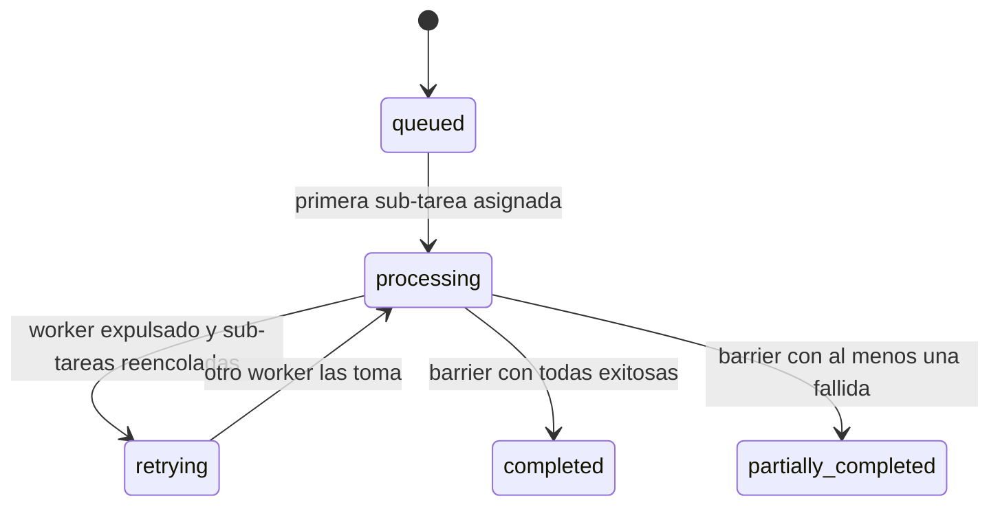

# 1. Introducción y objetivo

Este informe reúne la evidencia de las pruebas de MediaCase, la plataforma que recibe casos de archivos multimedia, los descompone en sub-tareas, las reparte entre workers ubicados en máquinas distintas y cierra cada caso con un reporte consolidado. Corresponde al entregable 6 de la consigna del I Proyecto Programado de IC-6600 Principios de Sistemas Operativos: evidencia de carga, de distribución, de casos heterogéneos y del comportamiento del sistema.

Las pruebas se hicieron en tres jornadas. El 10 y el 11 de setiembre de 2026 se midió la carga por lotes, los tiempos por sub-tarea y por caso, la distribución entre nodos físicos y virtuales, la tolerancia a caídas y la saturación de las colas, con el dataset de 492 archivos que existía en ese momento. El 25 de setiembre se repitió el recorrido con el dataset definitivo (542 archivos, 16.53 GB, con material real de licencia libre y archivos límite) y con los 11 casos de prueba curados; esa jornada encontró ocho defectos que las pruebas sintéticas no habían mostrado. Todos los números provienen de PostgreSQL (consultas de `tests/measure_times.sh`), de los reportes consolidados de cada caso, de los registros del coordinador y de los workers, de Prometheus y de las salidas de los scripts de `tests/`. Donde un valor no se midió, el texto lo indica.

La Tabla 1 relaciona cada criterio de la consigna con la sección del informe que lo evidencia.

Tabla 1. Criterios de la consigna y sección donde se evidencian

| Criterio de la consigna | Qué se debe observar | Sección |
|---|---|---|
| Carga por lotes y concurrencia | Varios casos vivos a la vez, colas con sub-tareas en espera, workers ocupados | 5 |
| Análisis de tiempos | Duración por sub-tarea, por operación, por tamaño y por caso | 6 |
| Distribución real | Al menos tres workers en entidades separadas, comunicados por red | 7 |
| Casos heterogéneos | Un mismo caso con audio, video e imagen y operaciones distintas | 8 |
| Barrier/join y estado agregado | El caso cierra solo cuando todas sus sub-tareas terminan; `completed` o `partially_completed` | 8 y 9 |
| Reporte consolidado | Archivos agrupados por tipo y operación, resultado y error por sub-tarea, workers, resumen | 8 y 9 |
| Tolerancia a fallos | Caída de un worker a mitad de un caso, reinicio del coordinador, archivos dañados | 9 |
| Monitoreo y balanceo | CPU, memoria, colas por pool, redistribución tras una caída | 10 |

# 2. Entorno de prueba

## 2.1 Nodos y hardware

El coordinador, PostgreSQL, Redis y MinIO corren siempre en `node1`, la laptop del equipo. Los workers cambian según la prueba: procesos separados en la misma laptop para las cargas pesadas, máquinas virtuales con dirección IP propia, una PC con Arch Linux en VirtualBox, PC físicas de otras personas en la misma red WiFi y un worker que entra desde internet por un túnel. La Tabla 2 resume cada entidad de ejecución.

Tabla 2. Nodos y hardware utilizados en las pruebas

| Nodo | Máquina y hardware | Rol en la prueba | Fecha |
|---|---|---|---|
| `node1` | Laptop del equipo: AMD Ryzen 7 7445HS, 6 núcleos y 12 hilos, 15.3 GB de RAM, Windows 11 Home, GPU AMD Radeon 740M y NVIDIA RTX 4050 | Coordinador, infraestructura en Docker Desktop y worker de video (4 cupos) | Todas |
| `node2`, `node3`, `node4`, `tmp-video` | Procesos nativos separados en `node1`, cada uno con su canal WebSocket | Workers de audio, metadata y video adicional para las cargas y la redistribución | 11 set |
| `w-video`, `w-audio`, `w-meta` | Tres workers del ZIP en `node1` con roles distintos | Hito de pools especializados | 10 set |
| `lila` | PC con Windows 11 de otra persona, mismo WiFi (`172.24.84.218`) | Worker descargado desde `/connect` | 10 y 11 set |
| `ugarte_16` | PC física prestada por una persona ajena al equipo | Worker en la prueba de tres laptops y en la de afinidad y ayuda | 11 set |
| `node2` y `node3` (Vagrant) | VM Ubuntu Server 24.04: `node2` con 2 vCPU y 1.5 GB (`192.168.56.101`), `node3` con 1 vCPU y 1 GB (`192.168.56.102`) | Worker de audio y worker de metadata bajo systemd, sin Docker | 11 set |
| `archlinux` | VM Arch Linux en VirtualBox, red NAT, kernel 7.2.3, ffmpeg 9.0.1, 8.6 GB de RAM visibles | Worker Linux instalado siguiendo solo el manual | 11 set |
| `remoto` | Worker del ZIP conectado por un túnel de Cloudflare | Worker desde otra red | 11 set |
| `node1-video`, `node1-audio`, `node1-metadata` | Workers locales en `node1`, uno por pool | Casos de prueba curados | 25 set |
| `pc-nueva` | PC con el ZIP de `/connect`, capacidad calculada automáticamente: 6 cupos | Prueba de capacidad según el hardware | 25 set |

Las cargas de 20 casos concurrentes del 11 de setiembre (412 sub-tareas y 14 GB de entrada) se corrieron con los tres workers como procesos separados dentro de `node1`, porque necesitaban los 12 hilos de la laptop. Lo que esas pruebas miden (colas por pool, barrier, redistribución, reportes) no depende de dónde esté el proceso. La distribución física se prueba aparte, en la sección 7, con máquinas que solo se comunican por red.

## 2.2 Red

Se usaron cuatro configuraciones de red. En el WiFi de la universidad, `node1` tuvo las direcciones `172.24.83.164` (10 de setiembre) y `172.24.87.192` (11 de setiembre, prueba de tres laptops). Las VM de Vagrant usan la red host-only de VirtualBox, `192.168.56.0/24`, con `node1` en `192.168.56.1`. La VM de Arch usa NAT y ve al host como `10.0.2.2`. El worker remoto llegó por dos túneles rápidos de Cloudflare (uno al puerto 8080 del coordinador y otro al 9000 de MinIO); como el WiFi de la universidad bloquea el puerto 7844 que usa `cloudflared`, el túnel se abrió con Cloudflare WARP activo en `node1`.

En todos los casos los workers se comunican con el coordinador por HTTP (registro) y por un canal WebSocket saliente (asignaciones, progreso y resultados), y con MinIO por S3 para bajar las entradas y subir los resultados. Ningún worker toca PostgreSQL ni Redis.

# 3. Dataset utilizado

## 3.1 Composición

El dataset definitivo (versión 3) tiene 542 archivos y 16.53 GB. Combina 432 archivos sintéticos generados con ffmpeg (controlan con precisión el tamaño y el volumen de carga), 102 archivos reales con licencia libre (Blender Foundation, NASA, Wikimedia Commons, Musopen, LibriVox y Prelinger) y 8 archivos límite construidos para fallar o para engañar al enrutamiento. El manifiesto `dataset/manifest.json` guarda para cada archivo su tipo, formato, tamaño, duración, nivel de tamaño y los metadatos de agrupación (evento, sesión, lote y usuario). Las cargas del 10 y 11 de setiembre usaron la versión anterior: 492 archivos sintéticos y 14.33 GB.

Tabla 3. Composición del dataset v3 por procedencia y tipo

| Procedencia | Archivos | Video | Audio | Imagen | Volumen |
|---|---:|---:|---:|---:|---:|
| Sintético | 432 | 230 | 157 | 45 | 14.24 GB |
| Real | 102 | 30 | 41 | 31 | 2.26 GB |
| Límite | 8 | 5 | 2 | 1 | 0.03 GB |
| Total | 542 | 265 | 200 | 77 | 16.53 GB |

Por tamaño hay 323 archivos livianos, 171 medianos y 48 pesados. Los formatos son 28: doce de video (mp4, mov, avi, webm, mkv, m4v, mpeg, mpg, ts, flv, 3gp y wmv), nueve de audio (mp3, wav, flac, aac, ogg, m4a, opus, aiff y wma) y siete de imagen (png, jpg, webp, gif, tif, tiff y bmp). El material real aporta lo que un generador no produce con facilidad: el lanzamiento del Atlas V de la NASA en 4K a 60 fps (197 MB), video vertical 9:16, video sin pista de audio, frecuencia de cuadro variable, códecs como Cinepak, MPEG-1, MPEG-2, H.263, WMV8, XviD, HEVC, VP9 y AV1, FLAC de 24 bits a 96 kHz, WAV mono a 8 kHz, ALAC dentro de m4a, PNG y WebP con transparencia, GIF animados, un JPEG de 9917 px de ancho y nueve archivos con tildes y espacios en el nombre, como "Paisaje sonoro Taxqueña.wav" y "Volcán Irazú 01.jpg".

## 3.2 Casos homogéneos y heterogéneos

El dataset produce casos de las dos clases de dos maneras. La primera es la generación automática: `bin/ingest cases --group-by session` agrupa los archivos por sesión, y por construcción la sesión s1 de cada evento solo tiene video, la s2 solo audio y las s3 y s4 mezclan video, audio e imágenes. Con ese criterio salen 31 casos, 14 homogéneos y 17 heterogéneos. La segunda son los 11 casos de prueba curados de `dataset/test_cases.json`, que fijan operación, formato de salida y recursos asociados por archivo.

Tabla 4. Casos de prueba curados

| Caso | Nombre | Clase | Archivos | Qué ejercita |
|---|---|---|---:|---|
| tc01 | Película abierta en varios formatos | Heterogéneo | 12 | Big Buck Bunny en mp4, m4v, mov, flv, 3gp, mpg, webm VP9, mkv AV1 y gif, con cinco operaciones distintas |
| tc02 | Álbum clásico enriquecido | Homogéneo | 12 | `enrich_audio` sobre grabaciones de Musopen en flac, mp3, ogg y m4a ALAC |
| tc03 | Archivo fotográfico NASA | Homogéneo | 7 | Miniaturas de 320, 640 y 1280 px desde JPEG, PNG y TIFF |
| tc04 | Podcast y audiolibro | Heterogéneo | 12 | Voz hablada: `convert_audio` y `metadata` sobre mp3, ogg, aac, opus, wav de 8 kHz y m4a |
| tc05 | Formatos raros | Heterogéneo | 16 | ts, flv, 3gp, mpeg, wmv, avi Cinepak y XviD, HEVC, opus, aiff, wma, flac 24/96, bmp, tiff y webp animado |
| tc06 | Casos límite y fallos | Heterogéneo | 11 | Los 8 archivos límite sin operación y 3 controles; se espera `partially_completed` |
| tc07 | Carga de video pesado | Homogéneo | 12 | Video real de 100 a 370 MB, el 4K a 60 fps y 6 pesados sintéticos |
| tc08 | Paisajes y sonidos de campo | Heterogéneo | 13 | Fotos con tildes en el nombre y grabaciones de campo, cuatro operaciones |
| tc09 | Cine con recursos asociados | Homogéneo | 6 | `enrich_video` con portada, título, autor, año y descripción |
| tc10 | Transparencia, animación y resoluciones extremas | Homogéneo | 14 | PNG y WebP con alfa, GIF y WebP animados, TIFF y PNG de 16 bits en 4K, ícono de 16 px |
| tc11 | Caso mixto grande | Heterogéneo | 40 | 20 reales y 20 sintéticos sin operación: el coordinador enruta todo por tipo |

En estos casos, "homogéneo" significa un solo tipo de contenido y una sola operación. `check_manifest.py` rechaza un caso cuya clase declarada no coincide con sus archivos.

# 4. Metodología

## 4.1 Envío de casos

Los casos se enviaron por tres vías, y las tres terminan en el mismo `POST /api/cases` del coordinador:

- el formulario de la pestaña Casos del dashboard, que incluye la opción "Cargar caso de prueba" y los filtros por tipo, formato, tamaño y origen;
- el cliente `bin/ingest`, con `ingest cases` (agrupación automática o `--test-cases all|tc01,...`) y con `ingest load`, que envía M casos con N envíos en paralelo y, con `--wait`, espera a que el barrier los cierre;
- los scripts de `tests/`, que arman las entradas con ffmpeg, las suben a MinIO, envían el caso y verifican el resultado. Cada uno termina en `HITO OK` o en `FALLÓ` con el motivo.

Tabla 5. Scripts de prueba y lo que verifican

| Script | Qué verifica |
|---|---|
| `distributed_smoke.sh` | Con el worker del host apagado, una sub-tarea la completa un worker de otra máquina |
| `case_scenario.sh` | Caso heterogéneo sin operaciones (video, audio y un texto con extensión `.mp4`): enrutamiento por tipo, ejecución en paralelo, cierre `partially_completed` y resumen del reporte |
| `pools_scenario.sh` | Caso de video, audio e imagen: cada sub-tarea corre en un worker de su pool |
| `dataset_scenario.sh` | El dataset está en MinIO, se crean casos por sesión, cierra al menos un homogéneo `completed` y un heterogéneo, y toda sub-tarea tiene `worker_id` |
| `monitoring_scenario.sh` | `/metrics` expone las familias `mediacase_*`, Prometheus las recoge, Grafana tiene el tablero; bajo carga, la cola de video pasa de 0, hay 3 workers ocupados y `/stats.by_case` agrupa por caso |
| `failure_scenario.sh` | Se mata un worker de video con dos sub-tareas en ejecución; el coordinador lo expulsa, reencola, el caso pasa por `retrying` y cierra `completed` sin fallos, con las sub-tareas en otro worker |
| `measure_times.sh` | Consulta PostgreSQL y produce las tablas de tiempos, distribución, espera en cola y throughput |
| `ui_case_flow.md` | Guion manual de diez pasos para el flujo completo desde el navegador |

## 4.2 Qué se mide y de dónde sale

Los tiempos de sub-tarea salen de las columnas `started_at` y `completed_at` de la tabla `jobs`; la duración de un caso va de su creación al cierre que registra el barrier. La espera en cola va de la creación de la sub-tarea al inicio de su ejecución. `measure_times.sh` calcula media y percentiles 50, 90 y 99 con `PERCENTILE_CONT`, y acepta una ventana (`SINCE='2 hours'`). El reporte consolidado de cada caso (`GET /api/cases/{id}/report`, copiado también en MinIO) aporta el resultado y el error de cada sub-tarea, el worker que la ejecutó y el resumen agregado. Las métricas de CPU, memoria, GPU y cupos ocupados las envía cada worker en su heartbeat; el coordinador las publica en `/metrics`, Prometheus las recoge y Grafana las grafica. Las capturas del dashboard y de Grafana acompañan cada resultado.

# 5. Carga por lotes y concurrencia

## 5.1 Carga de 20 casos concurrentes

La prueba de carga principal se corrió el 11 de setiembre con `bin/ingest load --cases 20 --concurrency 5 --group-by session --wait`, dentro del hito `tests/monitoring_scenario.sh`. Participaron `node1` (video), `node2` (audio) y `node3` (metadata), cada uno con 4 cupos.

Tabla 6. Carga de 20 casos concurrentes

| Métrica | Valor |
|---|---|
| Casos enviados | 20, uno por sesión: 8 homogéneos y 12 heterogéneos |
| Sub-tareas | 412: 195 de video, 152 de audio y 65 de imagen |
| Tiempo de envío | 3.4 s para los 20 casos con 5 envíos en paralelo; el caso más grande (39 archivos) tardó 3.2 s |
| Profundidad máxima de la cola de video | 195 sub-tareas en espera (198 en otra corrida) |
| Workers al 100 % de CPU | Los tres, durante toda la carga |
| Cierre de los 20 casos | 25 min 57 s en la corrida 1; cerca de 27 min en la corrida 2 |
| Resultado | Corrida 1: 20 de 20 `completed`. Corrida 2: 18 `completed` y 2 `partially_completed` (defecto de la sección 9.3) |
| Throughput sostenido | 12 a 18 sub-tareas por minuto con las tres colas ocupadas; hasta 40 por minuto al inicio, cuando entran las livianas |

Una segunda carga de 10 casos (197 sub-tareas) cerró 10 de 10 `completed`. El hito de la fase del dataset (`tests/dataset_scenario.sh`, 10 casos por sesión) dio el mismo resultado: 197 sub-tareas completadas, todas con worker asignado.

## 5.2 Concurrencia dentro de un caso y entre casos

La concurrencia dentro de un caso se vio en el caso de la sesión `clase-s4`, de 39 archivos: sus sub-tareas corrieron al mismo tiempo en los tres pools. Entre casos, con los 20 casos abiertos, el monitoreo reportó 10 sub-tareas en ejecución y 369 en espera repartidas entre los 20 casos (`/stats.by_case`). La tarjeta "Casos activos" del Monitor muestra ese mismo agrupamiento.

:::figura Figura 1. Monitor durante la carga de 20 casos
Qué debe verse: pestaña Monitor del dashboard con la tarjeta "Casos activos" listando al menos 15 casos abiertos, cada uno con sus sub-tareas en ejecución y en espera; el panel de colas por pool con la cola de video bastante mayor que la de audio y la de metadata; las tarjetas de los workers con la CPU cerca del 100 %.
Cómo obtenerla: con la infraestructura, el coordinador y un worker por pool encendidos, correr `bin/ingest load --cases 20 --concurrency 5 --group-by session` y capturar el Monitor entre el minuto 2 y el 5.
Captura existente que sirve: docs/img/dashboard-monitor-casos-activos.png (11 set, 15 casos abiertos).
:::

:::figura Figura 2. Lista de casos al inicio de la carga
Qué debe verse: pestaña Casos con los 20 casos `carga-01` a `carga-20`, uno por sesión, creados en el mismo segundo, unos en cola y otros procesando, con su cantidad de sub-tareas (de 5 a 39) y la duración en curso.
Cómo obtenerla: capturar la pestaña Casos a los 2 o 3 minutos de lanzar la carga de la Figura 1.
Captura existente que sirve: docs/img/dashboard-casos-carga.png (11 set).
:::

:::figura Figura 3. Grafana durante la carga de 20 casos
Qué debe verse: tablero MediaCase de Grafana con la CPU de los tres workers al 100 %, la cola de video subiendo cerca de 380 y bajando de forma lineal durante unos 25 minutos, la cola de metadata vaciándose en 2 minutos, las sub-tareas activas por pool estables en 8, 4 y 4, y los casos abiertos bajando de 20 a 0.
Cómo obtenerla: abrir `http://localhost:3001` durante la carga de la Figura 1, rango de 30 minutos.
Captura existente que sirve: docs/img/grafana-carga-20-casos.png (11 set).
:::

# 6. Tiempos por sub-tarea y por caso

## 6.1 Tiempos por operación

La ventana de medición son las 9 horas de pruebas del 11 de setiembre: más de 2 000 sub-tareas y 133 casos cerrados. Los tiempos están en segundos y cuentan solo sub-tareas completadas.

Tabla 7. Tiempo de procesamiento por operación, en segundos (11 set)

| Operación | Pool | n | Media | p50 | p90 | p99 | Máx. |
|---|---|---:|---:|---:|---:|---:|---:|
| `convert_audio` | audio | 686 | 27.1 | 8.9 | 72.2 | 236.0 | 367.3 |
| `thumbnail` | metadata | 259 | 3.6 | 3.1 | 6.8 | 14.3 | 26.4 |
| `convert` | video | 993 | 44.2 | 11.3 | 80.9 | 871.5 | 1797.2 |
| `extract_audio` | video | 1 | 0.2 | 0.2 | 0.2 | 0.2 | 0.2 |

La mediana de un `convert` es 11 s porque la mayoría del dataset es liviano. El p99 (871.5 s) y el máximo (1 797.2 s) corresponden a videos pesados procesados mientras la laptop estaba sobresuscrita (sección 9.7). Con ffmpeg en prioridad baja, los pesados bajan a unos 3 o 4 minutos.

## 6.2 Tiempos por nivel de tamaño

Tabla 8. Tiempo de procesamiento por nivel de tamaño, en segundos (11 set)

| Nivel | Pool | n | Media | p50 | p90 | Máx. |
|---|---|---:|---:|---:|---:|---:|
| Liviano (menos de 5 MB) | audio | 407 | 9.0 | 5.6 | 11.5 | 285.9 |
| Mediano (20 a 50 MB) | audio | 226 | 44.0 | 29.7 | 90.0 | 367.3 |
| Pesado (150 a 400 MB) | audio | 52 | 95.9 | 78.3 | 187.2 | 359.4 |
| Imagen | metadata | 258 | 3.7 | 3.2 | 6.8 | 26.4 |
| Liviano (menos de 5 MB) | video | 545 | 7.8 | 5.3 | 11.3 | 827.2 |
| Mediano (20 a 50 MB) | video | 349 | 44.6 | 26.1 | 45.6 | 1496.7 |
| Pesado (150 a 400 MB) | video | 98 | 245.2 | 174.2 | 276.9 | 1797.2 |

La consulta devolvió además cuatro sub-tareas en la categoría "otro" (una de audio, una de metadata y dos de video, todas por debajo de 0.5 s), que son archivos de prueba fuera del dataset. Los tres niveles se separan con claridad en la mediana: video liviano 5.3 s, mediano 26.1 s y pesado 174.2 s; audio liviano 5.6 s, mediano 29.7 s y pesado 78.3 s. Los máximos de los niveles livianos (827.2 s en video) son sub-tareas que esperaron CPU durante la sobresuscripción, no archivos lentos.

## 6.3 Duración de los casos

Tabla 9. Duración de los casos por clase y estado final, en segundos (11 set)

| Clase | Estado | Casos | Sub-tareas por caso | Media | p50 | p90 | Máx. |
|---|---|---:|---:|---:|---:|---:|---:|
| Heterogéneo | `completed` | 52 | 24.1 | 1040.2 | 1373.0 | 1720.1 | 2562.1 |
| Heterogéneo | `partially_completed` | 6 | 26.7 | 2575.1 | 1970.1 | 4633.7 | 4633.9 |
| Homogéneo | `completed` | 54 | 9.2 | 669.9 | 583.5 | 1448.4 | 1973.9 |
| Homogéneo | `partially_completed` | 3 | 12.7 | 1344.7 | 1532.1 | 1554.1 | 1559.6 |

Los casos heterogéneos tardan más por dos razones. Tienen más sub-tareas (24.1 en promedio contra 9.2) y el barrier espera a la más lenta, que casi siempre es un video pesado en la cola más cargada. Los `partially_completed` de esta ventana no son fallos de ffmpeg: son los reportes perdidos por reinicios del coordinador (sección 9.3) y los casos afectados por la sobresuscripción (sección 9.7).

## 6.4 Espera en cola por pool

Tabla 10. Espera en cola por pool, en segundos (11 set)

| Pool | n | Media | p50 | p90 | Máx. |
|---|---:|---:|---:|---:|---:|
| audio | 687 | 352.6 | 260.0 | 780.0 | 1377.8 |
| metadata | 259 | 48.5 | 18.3 | 159.3 | 228.2 |
| video | 1004 | 635.3 | 507.4 | 1408.6 | 2559.1 |

El pool de video es el cuello de botella: bajo 20 casos concurrentes la mediana de espera fue de 8.4 minutos. Le sigue audio, y metadata casi no espera. Es lo que predice el modelo de pools especializados: las conversiones de video consumen varias veces más CPU que una miniatura, así que su cola crece primero. La respuesta operativa es conectar otra máquina con rol de video, y eso es lo que se probó en las secciones 7.5 y 10.2.

## 6.5 Casos de prueba del 25 de setiembre

El 25 de setiembre se enviaron los 11 casos curados sobre el dataset v3. Del tc01 al tc10 corrieron en `node1` con workers locales; el tc11 se corrió con `node1` y `pc-nueva`.

Tabla 11. Resultado de los casos de prueba (25 set)

| Caso | Estado | Sub-tareas | Duración | Workers |
|---|---|---|---:|---|
| tc01 Película abierta en varios formatos | `completed` | 12/12 | 168 s | `node1-video` 7, `node1-metadata` 4, `node1-audio` 1 |
| tc02 Álbum clásico enriquecido | `completed` | 12/12 | 48 s | `node1-metadata` 12 |
| tc03 Archivo fotográfico NASA | `completed` | 7/7 | 58 s | `node1-metadata` 7 |
| tc04 Podcast y audiolibro | `completed` | 12/12 | 26 s | `node1` (único worker, rol video) 12, las 12 por ayuda |
| tc05 Formatos raros | `completed` | 16/16 | 282 s | `node1-video` 9, `node1-audio` 4, `node1-metadata` 3 |
| tc06 Casos límite y fallos | `partially_completed` | 8 bien, 3 fallidas | 17 s | `node1` 11 |
| tc07 Carga de video pesado | `completed` | 12/12 | 918 s | `node1-video` 9, `node1-metadata` 2, `node1-audio` 1 (3 por ayuda) |
| tc08 Paisajes y sonidos de campo | `completed` | 13/13 | 74 s | `node1-metadata` 8, `node1-audio` 5 |
| tc09 Cine con recursos asociados | `completed` | 6/6 | 126 s | `node1-metadata` 6 |
| tc10 Transparencia, animación y resoluciones extremas | `completed` | 14/14 | 23 s | `node1` 14 (ayuda) |
| tc11 Caso mixto grande | `completed` | 40/40 | 132 s | `pc-nueva` (capacidad 6) 33, `node1` (capacidad 4) 7 |

Diez de los once casos cerraron `completed` y el tc06 cerró `partially_completed`, que es el resultado esperado para ese caso. El tc01 y el tc05 cerraron primero `partially_completed` por el defecto de dimensiones impares (defecto 16 de la Tabla 19); tras la corrección se reenviaron y cerraron `completed`. El tc07 es el más largo: incluye la conversión de 6 minutos de video 4K a 60 fps, que superó los 15 minutos de procesamiento sin que el barrido de sub-tareas vencidas la interrumpiera (defecto 21).

:::figura Figura 4. Lista de casos con los 11 casos de prueba cerrados
Qué debe verse: pestaña Casos del dashboard con los 11 casos tc01 a tc11, diez con el estado completado y tc06 con el estado parcial, la cantidad de sub-tareas y la duración de cada uno.
Cómo obtenerla: `bin/ingest cases --test-cases all` con un worker por pool conectado; capturar la lista cuando cierre tc07 (unos 15 minutos).
Captura existente que sirve: ninguna del 25 set; la Figura 2 muestra el mismo tipo de vista durante la carga del 11 set.
:::

# 7. Distribución entre nodos

## 7.1 Tres laptops físicas

El 11 de setiembre en la noche se corrió la prueba con tres computadoras físicas en la misma red WiFi: `node1` (laptop del equipo, coordinador en `172.24.87.192`), `lila` (Windows 11) y `ugarte_16` (PC prestada por una persona ajena al equipo). Al terminar la sesión la base de datos registraba 2 093 sub-tareas completadas y 25 fallidas. Esta prueba cumple el requisito de al menos tres nodos worker en entidades de ejecución separadas, comunicadas solo por red.

:::figura Figura 5. Monitor con tres laptops físicas conectadas
Qué debe verse: pestaña Monitor con las tarjetas de `lila`, `node1` y `ugarte_16` conectadas al mismo tiempo, cada una con su nombre de equipo, rol, CPU y sub-tareas activas, y el contador acumulado de 2 093 sub-tareas completadas y 25 fallidas.
Cómo obtenerla: la captura del 11 set existe pero no está en el repositorio (quedó como `docs/image.png` sin versionar). Debe copiarse a `docs/img/monitor-3-laptops-fisicas.png` e insertarse aquí.
Captura existente que sirve: la del 11 set mencionada, fuera del repositorio.
:::

## 7.2 Primera PC externa: lila

El 10 de setiembre a las 23:40, desde la PC `lila` se abrió `http://172.24.83.164:8080/connect`, se descargó el ZIP de Windows y se ejecutó con doble clic; el nodo apareció en el dashboard. En esa máquina pasaron tres pruebas. `tests/distributed_smoke.sh`, con el worker del host apagado, terminó con la sub-tarea procesada por `lila`. `tests/case_scenario.sh` cerró su caso heterogéneo con fallo parcial. Las dos pruebas de caída de la sección 9.4 también pasaron. El worker se reconectó solo después de un reinicio del coordinador. La prueba dejó dos lecciones para el manual: Smart App Control de Windows 11 bloquea el ejecutable sin firma, y la opción "Desbloquear" en las propiedades del ZIP evita el aviso de archivo descargado de internet.

## 7.3 Tres máquinas con IP propia: Vagrant

El 11 de setiembre a las 17:52, `vagrant up` en `infra/vagrant` creó `node2` (rol audio) y `node3` (rol metadata) como VM Ubuntu 24.04 sin Docker: ffmpeg 6.1.1 de apt, el binario `bin/worker-linux-amd64` copiado por la carpeta compartida y el servicio `mediacase-worker` bajo systemd con `Restart=always`. El worker de video corría en el host. Los tres nodos se comunicaron solo por la red host-only. `tests/pools_scenario.sh` con esa topología cerró el caso `completed` en 4 s y terminó en `HITO OK`.

Tabla 12. Resultado de `pools_scenario.sh` con Vagrant (11 set)

| Archivo | Tipo | Operación | Worker que la ejecutó | Esperado |
|---|---|---|---|---|
| `pool_video.mp4` | video | `convert` | `node1` (host) | `node1` |
| `pool_audio.wav` | audio | `convert_audio` | `node2` (VM) | `node2` |
| `pool_imagen.png` | imagen | `thumbnail` | `node3` (VM) | `node3` |
| `pool_video.mp4` | video | `extract_audio` | `node1` (host) | `node1` |

El resumen del reporte fue "de 4 archivos: 1 audio convertido, 1 miniatura generada, 1 video convertido, 1 audio extraído". Durante el despliegue aparecieron dos problemas de entorno. Con Hyper-V activo en el host, VirtualBox tarda unos 6 minutos en arrancar Ubuntu, más que los 300 s que Vagrant espera por defecto, así que `boot_timeout` se subió a 900 s. Además, dos comandos `vagrant` en paralelo fallan en Windows con `powershell_error`, por lo que los nodos se levantan de uno en uno.

:::figura Figura 6. Monitor con node1 y las dos VM de Vagrant
Qué debe verse: pestaña Monitor con `node3` (metadata), `node2` (audio) y `node1` (video), cada tarjeta con su rol, sus pools y su dirección, y el caso de `pools_scenario.sh` cerrado.
Cómo obtenerla: `vagrant up node2` y luego `vagrant up node3` en `infra/vagrant`, encender `node1` con `MediaCase.bat` y correr `bash tests/pools_scenario.sh`.
Captura existente que sirve: docs/img/monitor-3-nodos-vagrant.png (11 set).
:::

## 7.4 Arch Linux y worker desde otra red

A las 18:39 del 11 de setiembre se instaló un worker en la VM de Arch Linux siguiendo solo el manual: `curl` del ZIP de Linux a `http://10.0.2.2:8080/download/worker?os=linux`, `unzip` y `bash start-worker.sh`. Con `node2` y `node3` apagadas, recibió el caso `hito-arch` (dos audios, una imagen y un video) y lo cerró `completed` 4 de 4 en 7 s: `convert_audio` en 2.7 s y 0.5 s, `thumbnail` en 0.4 s y `convert` en 3.3 s. Al reiniciar el coordinador, el worker registró "canal cerrado; reconectando" y "canal abierto" 5 s después.

:::figura Figura 7. Monitor con el worker de Arch Linux
Qué debe verse: tarjeta del nodo `archlinux` conectada, con su sistema operativo, CPU y memoria, y el caso `hito-arch` cerrado 4 de 4.
Cómo obtenerla: iniciar la VM de Arch, correr `bash start-worker.sh` desde el ZIP de Linux y enviar un caso con dos audios, una imagen y un video.
Captura existente que sirve: docs/img/monitor-worker-arch.png (11 set).
:::

A las 18:21 del mismo día se probó un worker desde fuera de la red local. `scripts/tunnel.ps1` abrió dos túneles de Cloudflare, uno hacia el coordinador y otro hacia MinIO. Por la URL del túnel el dashboard y `GET /api/workers` respondieron 200, el ZIP de Windows (85 MB) se descargó completo y su `worker.env` salió con `COORDINATOR_URL` en `https`, `MINIO_ENDPOINT` apuntando al túnel de MinIO y `MINIO_USE_SSL=true`. El worker `remoto` se registró por `wss://`. Con el worker de video local apagado se envió el caso `hito-tunel`.

Tabla 13. Caso `hito-tunel` con un worker conectado por túnel (11 set)

| Sub-tarea | Worker | Duración | Resultado |
|---|---|---:|---|
| `pesado.mp4` (29 MB), `convert` | `remoto`, por túnel | 20.2 s | MP4 de 21 MB en una URL `https` del túnel, descargable desde fuera a unos 4 MB/s |
| `prueba.mp4`, `extract_audio` | `remoto`, por túnel | 5.8 s | MP3 en una URL `https` del túnel |
| `prueba.wav`, `convert_audio` | `node2` (VM, red local) | 2.8 s | URL `http://192.168.56.1:9000/...` |

El caso cerró `completed` 3 de 3 en 20.2 s. Todo el tráfico de `remoto` (canal WebSocket, descarga de la entrada y subida del resultado) salió a internet y volvió por Cloudflare. Cada resultado lleva la URL pública que conoce el worker que lo produjo, así que los dos tipos de enlace funcionan desde donde corre cada worker. Cloudflare limita cada petición a 100 MB; los resultados de este dataset quedan por debajo y el cliente de MinIO sube en partes los archivos grandes, así que el límite no se alcanzó.

El túnel también se abre desde el dashboard (Monitor, tarjeta Compartir). Con WARP encendido, "Publicar en internet" dio el estado abierto en 6 s y "Cerrar túnel" dejó cero procesos `cloudflared`. Con WARP apagado, en el WiFi de la universidad, el coordinador desistió a los 45 s, terminó los procesos y mostró un mensaje que atribuye el fallo al bloqueo del puerto 7844 y sugiere encender WARP.

:::figura Figura 8. Worker remoto conectado por el túnel
Qué debe verse: Monitor con la tarjeta del worker `remoto` conectada por `wss://` junto a `node2`, y el caso `hito-tunel` cerrado 3 de 3 con dos sub-tareas en `remoto`.
Cómo obtenerla: `scripts/tunnel.ps1` (o Monitor, Compartir, Publicar en internet), descargar el ZIP desde la URL del túnel en otra máquina, arrancarlo y enviar el caso con el worker de video local apagado.
Capturas existentes que sirven: docs/img/monitor-worker-por-tunel.png; para la tarjeta Compartir, docs/img/dashboard-compartir-tunel.png (abierto) y docs/img/dashboard-compartir-tunel-bloqueado.png (red que bloquea el puerto 7844).
:::

## 7.5 Distribución por pools, afinidad y ayuda

Durante las cargas del 11 de setiembre, con el planificador en modo de pools estrictos (`SCHEDULER_STRICT_POOLS=true`), cada worker recibió solo sub-tareas de su pool. `tests/pools_scenario.sh` se corrió tres veces ese día y en las tres las 4 sub-tareas quedaron en el nodo esperado.

Tabla 14. Distribución del trabajo entre workers (11 set)

| Worker | Pool | Sub-tareas | Completadas | Fallidas | Minutos de CPU |
|---|---|---:|---:|---:|---:|
| `node1` | video | 877 | 867 | 10 | 526.4 |
| `node2` | audio | 659 | 658 | 1 | 305.0 |
| `node3` | metadata | 239 | 239 | 0 | 14.5 |
| `node4` | video | 119 | 119 | 0 | 200.9 |
| `tmp-video` | video | 8 | 8 | 0 | 3.6 |
| `w-audio` | audio | 28 | 28 | 0 | 5.0 |
| `w-meta` | metadata | 20 | 20 | 0 | 1.2 |

Cuando se sumó un segundo worker de video (`node4`), tomó 119 sub-tareas en 20 minutos sin cambiar la configuración: dentro del pool el planificador elige al worker menos cargado.

El planificador final trata el pool como preferencia y no como regla fija. Primero busca un nodo del pool (afinidad); si ese nodo está ocupado o saturado y hay otro más libre, el otro ayuda. Dos corridas del 11 de setiembre muestran la diferencia. En `demo-mixto-18` (6 videos, 6 audios, 4 imágenes y 2 extracciones de audio), con `node1` en rol video y `ugarte_16` en rol `all`, el caso cerró `completed` 18 de 18 en 70 s. Las 8 sub-tareas de video se repartieron entre los dos nodos (`node1` 5, `ugarte_16` 3), pero como el modo era estricto, audio y miniaturas fueron todas a `ugarte_16` mientras la laptop quedaba ociosa. Ese resultado motivó el cambio de planificador.

En `demo-formatos` (10 sub-tareas con destinos explícitos: `mkv` a WEBM, `mov` a MKV, `mp4` a FLAC por extracción, `wav` a OGG, `flac` a MP3, `aac` a FLAC, `png` a WEBP de 640 px, `jpg` a JPG y dos extracciones de metadatos a JSON), con solo `node1` conectado en rol video y el planificador nuevo, el caso cerró `partially_completed` 8 de 10 en 106 s. Los dos videos los tomó por afinidad (64.7 s y 105.4 s); los tres audios, las dos miniaturas y los metadatos los tomó por ayuda (entre 1.6 s y 70.5 s) en vez de dejarlos en cola. Las 2 fallidas eran de `hito_corrupto.mp4`, el archivo dañado a propósito, con el error "moov atom not found" completo en el reporte. El resumen agrupó los resultados por destino: un audio convertido a FLAC, uno a MP3, uno a OGG, un archivo con metadatos extraídos, una miniatura a JPG, otra a WEBP, un video convertido a MKV, otro a WEBM y 2 fallidos.

## 7.6 Capacidad según el hardware: tc11 con pc-nueva

La capacidad de cada worker (cuántas sub-tareas acepta a la vez) se calcula a partir de su hardware: un cupo cada 2 hilos lógicos y cada 2 GB de RAM aproximadamente, lo que se agote primero, entre 1 y 8. Una máquina de 12 hilos y 15 GB queda en 6 cupos; una VM de 2 hilos, en 1. En `node1` la capacidad está fijada en 4 porque comparte la máquina con PostgreSQL, Redis y MinIO. El planificador ordena a los candidatos por fracción ocupada (sub-tareas activas entre capacidad), salta los nodos llenos y deja la sub-tarea en la cola en lugar de rechazarla.

El 25 de setiembre se conectó `pc-nueva` con el ZIP de `/connect` y la capacidad automática, que dio 6 cupos. Se envió el tc11 (40 archivos sin operación, 20 reales y 20 sintéticos).

Tabla 15. Reparto del tc11 entre dos nodos de distinta capacidad (25 set)

| Nodo | Capacidad | Sub-tareas | Proporción |
|---|---:|---:|---:|
| `pc-nueva` | 6 (automática) | 33 | 82.5 % |
| `node1` | 4 (fija) | 7 | 17.5 % |
| Total | 10 | 40 | 100 % |

El caso cerró `completed` 40 de 40 en 132 s, sin ningún rechazo por pool lleno. `pc-nueva` recibió más trabajo que su proporción de cupos (60 %). Las reglas del planificador son consistentes con ese resultado, porque a igual fracción ocupada gana el nodo de más capacidad y después el de menos CPU, y `node1` también atiende la infraestructura; la causa exacta no se midió por separado. La prueba unitaria del reparto proporcional confirma el comportamiento básico: una ráfaga de 10 sub-tareas con capacidades 8 y 2 se reparte 8 y 2.

:::figura Figura 9. Monitor con cupos ocupados durante el tc11
Qué debe verse: pestaña Monitor con dos tarjetas, `node1` con "4 de 4 cupos ocupados" y `pc-nueva` con "6 de 6 cupos ocupados", la cola del caso con sub-tareas en espera y, en el detalle de cada nodo, la línea "Capacidad: N sub-tareas a la vez".
Cómo obtenerla: conectar una segunda PC con el ZIP de `/connect` (opción "Todo"), enviar `bin/ingest cases --test-cases tc11` y capturar a los 20 o 30 s.
Captura existente que sirve: ninguna.
:::

# 8. Casos heterogéneos

## 8.1 Qué se evalúa

Un caso heterogéneo mezcla tipos de contenido y operaciones en una sola solicitud. La prueba consiste en comprobar cuatro cosas en el mismo caso: que el coordinador inspecciona cada archivo y decide la operación cuando el cliente no la indica, que las sub-tareas corren en paralelo en pools distintos, que el barrier cierra el caso solo cuando todas terminaron y que el reporte agrupa los archivos por tipo y operación. En la Tabla 11, seis de los once casos curados son heterogéneos.

## 8.2 tc01: una película en nueve formatos

El tc01 toma Big Buck Bunny en mp4, m4v, mov, flv, 3gp, mpg, webm VP9, mkv AV1 y gif, y le aplica cinco operaciones: `convert`, `extract_audio`, `thumbnail`, `convert_audio` y `metadata`. Las 12 sub-tareas se repartieron entre los tres pools: 7 en `node1-video`, 4 en `node1-metadata` y 1 en `node1-audio`. El caso cerró `completed` en 168 s. En la primera corrida cerró `partially_completed`: la versión de 360p del archivo real mide 640×359 píxeles y libx264 exige ancho y alto pares. Ese defecto no aparecía con los archivos sintéticos, que tienen dimensiones redondas.

:::figura Figura 10. Detalle del caso tc01 cerrado
Qué debe verse: detalle del caso tc01 con las 12 sub-tareas, cada fila con el archivo de origen, la operación y el destino (por ejemplo "mkv a MP4"), el pool, el worker, el 100 % de progreso y los tiempos de inicio y fin; arriba, el estado completado y el reporte consolidado con los grupos por operación.
Cómo obtenerla: Casos, Nuevo caso, "Cargar caso de prueba", tc01, Enviar; capturar al cerrar (unos 3 minutos).
Captura existente que sirve: ninguna.
:::

## 8.3 tc04: un solo nodo que ayuda con todo

El tc04 (voz hablada: `convert_audio` y `metadata` sobre mp3, ogg, aac, opus, wav de 8 kHz y m4a) se corrió con un solo worker conectado, `node1` en rol video. Ninguna de sus 12 sub-tareas pertenece al pool de video. Con pools estrictos, el caso habría esperado en la cola hasta que se conectara un worker de audio o de metadata. Con el planificador de afinidad y ayuda, `node1` tomó las 12 por ayuda y el caso cerró `completed` en 26 s. El detalle del caso marca cada una de esas sub-tareas con el chip "ayuda". El tc10 (14 miniaturas) se comportó igual: 14 sub-tareas por ayuda en 23 s.

:::figura Figura 11. Detalle del tc04 con sub-tareas tomadas por ayuda
Qué debe verse: detalle del caso tc04 con las 12 sub-tareas en `node1`, cada una con el chip "ayuda", pool audio o metadata, y el estado completado del caso.
Cómo obtenerla: dejar conectado solo el worker de video de `node1`, cargar tc04 desde el formulario y capturar al cerrar.
Captura existente que sirve: ninguna.
:::

## 8.4 tc11: 40 archivos enrutados por el coordinador

El tc11 envía 40 archivos sin indicar operación. El coordinador inspecciona cada archivo, decide la operación según el tipo real (video a `convert`, audio a `convert_audio`, imagen a `thumbnail`), lo asigna al pool correspondiente y reparte las sub-tareas entre `pc-nueva` y `node1`. El caso cerró `completed` 40 de 40 en 132 s (sección 7.6). Esto equivale a unas 18 sub-tareas por minuto en dos máquinas.

## 8.5 Casos con enriquecimiento de metadatos

El 18 de setiembre se probó la operación de enriquecer, que integra en el mismo archivo una portada (forma de onda en audio, fotograma del segundo 1 en video), etiquetas (título, artista, álbum, fecha y comentario) y la letra o la descripción. Un caso de 9 sub-tareas enviado por la API con mp3, flac, ogg, wav, mp4, mkv y avi cerró 9 de 9 en 5 s; los resultados se descargaron de MinIO y ffprobe confirmó portada, etiquetas y letra de varias líneas. El 25 de setiembre, el tc02 (12 audios de Musopen) cerró en 48 s y el tc09 (6 videos) en 126 s, todos en el pool de metadata.

# 9. Comportamiento ante fallos

## 9.1 Archivos límite y extensiones engañosas: tc06

El tc06 reúne los 8 archivos límite del dataset y 3 archivos de control, sin operaciones. Al recibirlo, el coordinador lee los primeros 64 KB de cada archivo en MinIO y decide el tipo real por la firma binaria. Si la extensión no coincide con el contenido, enruta por el contenido y guarda una nota en la sub-tarea. El caso cerró `partially_completed` en 17 s, con 8 sub-tareas bien y 3 fallidas, todas en `node1`.

Tabla 16. Resultado de los archivos límite en tc06 (25 set)

| Archivo | Qué es | Decisión del coordinador | Resultado |
|---|---|---|---|
| `edge_truncado.mp4` | 30 % de un MP4 con el índice al final | `convert` por extensión | Falla: "moov atom not found … Invalid data found when processing input" |
| `edge_vacio.mp4` | 0 bytes | `convert` por extensión | Falla sin llamar a ffmpeg: "archivo vacío (0 bytes): no hay contenido que procesar" |
| `edge_texto_con_extension_wav.wav` | 180 bytes de texto plano | `convert_audio` por extensión | Falla: "Invalid data found when processing input" |
| `edge_mp3_con_extension_mp4.mp4` | MP3 renombrado a .mp4 | Enruta por contenido: `convert_audio` a FLAC en el pool de audio | Completa, con aviso de extensión engañosa |
| `edge_mkv_con_extension_mp4.mp4` | Matroska HEVC renombrado a .mp4 | Se mantiene como video, con la nota "el contenido es mkv" | Completa |
| `edge_png_con_extension_jpg.jpg` | PNG RGBA renombrado a .jpg | Miniatura, con la nota "el contenido es png" | Completa |
| `edge_extension_mayusculas.MP4` | Tráiler con extensión en mayúsculas | La extensión se normaliza | Completa |
| `edge_bytes_corruptos.mkv` | MKV con 64 KiB en cero | `convert` | Completa |

Los tres fallos son los esperados y el reporte guarda el motivo de cada uno. El resumen menciona "3 archivos con extensión engañosa, enrutados por su contenido real" y "3 fallidos", con los motivos agrupados. Ninguno de los fallos detuvo el caso ni al worker: las otras sub-tareas siguieron y el barrier cerró el caso cuando las 11 tuvieron resultado. La inspección de contenido se verificó sobre los 542 archivos del dataset: cero diferencias con el tipo del manifiesto y 61 archivos indeterminados (mp4 sin el índice al inicio, wmv, wma y archivos dañados), que se resolvieron correctamente por extensión.

También se probó una subida desde la PC: un MP3 renombrado "grabación subida.mp4" se enrutó a `convert_audio` a FLAC con el aviso de extensión engañosa, y el nombre conservó la tilde.

:::figura Figura 12. Detalle del caso tc06 con avisos y fallos
Qué debe verse: detalle del caso tc06 en estado parcial, con las 3 filas fallidas mostrando su motivo ("moov atom not found", "archivo vacío (0 bytes)", "Invalid data found") y las 3 filas con el chip "aviso", una de ellas con el tooltip abierto que muestra la nota de enrutamiento; la fila del MP3 renombrado debe mostrar el pool de audio y el destino FLAC.
Cómo obtenerla: cargar tc06 desde el formulario, esperar el cierre (17 s) y pasar el cursor sobre un chip de aviso antes de capturar.
Captura existente que sirve: ninguna.
:::

:::figura Figura 13. Reporte consolidado de tc06 en JSON
Qué debe verse: el archivo `results/cases/<id>/report.json` del tc06 abierto en un visor, con el estado `partially_completed`, los tiempos de creación y cierre, los grupos por tipo y operación, el campo de error de las 3 sub-tareas fallidas, la `routing_note` de las extensiones engañosas y el resumen agregado.
Cómo obtenerla: `GET /api/cases/<id>/report` o el botón de descarga del reporte en el detalle del caso.
Captura existente que sirve: ninguna.
:::

## 9.2 Caso heterogéneo con archivo corrupto

`tests/case_scenario.sh` envía un video, un audio y un archivo de texto renombrado `hito_corrupto.mp4`, sin indicar operaciones. El coordinador los enrutó a `convert`, `convert_audio` y `convert`. Las dos válidas terminaron bien, la corrupta falló con el error de ffmpeg y el barrier cerró el caso como `partially_completed`. El resumen del reporte fue "de 3 archivos: 1 video convertido, 1 audio convertido, 1 fallido por formato no soportado". El hito pasó en modo local y en modo distribuido, con `lila` como worker.

## 9.3 Reinicio del coordinador durante una carga

Durante la carga de 20 casos del 11 de setiembre se reinició el coordinador tres veces. Los workers se reconectaron solos, con espera exponencial de 1 a 30 s, y siguieron procesando. Ningún caso se perdió: el estado vive en PostgreSQL y la cola en Redis. La prueba sí encontró un defecto: los reportes de sub-tareas completadas que un worker enviaba mientras el coordinador estaba caído se perdían, y esas sub-tareas quedaban en `assigned` o `running` hasta vencer a los 15 minutos (5 sub-tareas en la primera corrida y 2 en la segunda, que explican parte de los `partially_completed` de la Tabla 9). Con la corrección, el worker reintenta los reportes terminales durante 15 minutos y el coordinador devuelve a la cola lo que quedó asignado sin noticias. En `tests/failure_scenario.sh` y en una carga posterior de 10 casos el problema no volvió a aparecer.

## 9.4 Caída de un worker a mitad de un caso

`tests/failure_scenario.sh` se corrió el 11 de setiembre a las 09:20. El script levanta un segundo worker de video temporal (`tmp-video`), envía un caso de 8 videos medianos con prioridad 9 y, cuando `node1` tiene dos sub-tareas en ejecución, mata su proceso sin despedida.

Tabla 17. Cronología de la caída de un worker (11 set)

| Momento | Evento |
|---|---|
| t = 0 | Se termina el proceso de `node1` con dos sub-tareas en ejecución |
| t ≈ 22 s | El coordinador lo expulsa (15 s sin heartbeat más el ciclo de evicción) y reencola sus 2 sub-tareas; el caso pasa a `retrying` |
| t ≈ 25 s | `tmp-video` toma las dos sub-tareas |
| t = 51 s | El caso cierra `completed`, 8 de 8, sin fallidas; las dos sub-tareas figuran con `worker_id = tmp-video` |

La prueba se repitió el 10 de setiembre en hardware real con `lila`. En la primera variante se cerró la ventana del worker a mitad de 4 conversiones: el worker se despidió del coordinador, las 4 sub-tareas se reencolaron en el mismo segundo, el caso pasó a `retrying`, el worker se reabrió 13 s después y el caso cerró `completed` 4 de 4 sin fallidas. En la segunda variante, sin despedida, el coordinador lo expulsó por falta de heartbeat a los 27 s y el resultado fue el mismo.

:::diagrama Figura 14. Estados de un caso durante la caída de un worker

:::

:::figura Figura 15. Caso en retrying tras la caída de un worker
Qué debe verse: detalle del caso `fallo-worker` con el estado reintentando, las dos sub-tareas del worker caído otra vez en pendiente o asignadas a `tmp-video`, y el Monitor sin la tarjeta de `node1`; en una segunda imagen, el mismo caso completado 8 de 8.
Cómo obtenerla: `bash tests/failure_scenario.sh` con la infraestructura, el coordinador y `node1` encendidos; capturar entre los segundos 22 y 30 después de la caída y otra vez al cierre.
Captura existente que sirve: ninguna del dashboard; la Figura 18 muestra la misma redistribución en Grafana.
:::

## 9.5 Caída simultánea del coordinador y de los workers

El 25 de setiembre se probó la caída del coordinador y de un worker al mismo tiempo, un escenario que la sección 9.3 no cubría. Antes de la corrección, las sub-tareas que ese worker tenía en ejecución quedaban huérfanas: el coordinador nuevo no sabía que el proceso del worker ya no existía. La instancia del worker queda guardada en `worker_registry`; cuando el worker vuelve con un proceso nuevo, el coordinador detecta el cambio de instancia y reencola lo que el proceso anterior tenía asignado. En la verificación, las 4 sub-tareas de `node1-video` se reencolaron a las 01:30:34, en el mismo segundo de la reconexión.

## 9.6 Procesos ffmpeg huérfanos en Windows

Al terminar un worker con `taskkill /F`, sus procesos ffmpeg seguían vivos y mantenían abierto el archivo de entrada. El reintento de la sub-tarea en el mismo equipo fallaba con "Access is denied". El worker entra ahora en un Job Object de Windows con la bandera `KILL_ON_JOB_CLOSE`, de modo que el sistema operativo termina todos sus procesos hijos cuando el worker muere, y además limpia la carpeta de la sub-tarea antes de bajar la entrada. En la verificación, 5 procesos ffmpeg en ejecución pasaron a 0 al matar el worker.

:::figura Figura 16. Procesos ffmpeg antes y después de matar el worker
Qué debe verse: dos salidas de `Get-Process ffmpeg` (o el Administrador de tareas), la primera con 5 procesos ffmpeg bajo el worker y la segunda, tras `taskkill /F` al worker, sin ningún proceso ffmpeg.
Cómo obtenerla: enviar un caso con al menos 5 conversiones de video mediano, ejecutar `Get-Process ffmpeg`, terminar el worker con `taskkill /F /PID <pid>` y repetir la consulta.
Captura existente que sirve: ninguna.
:::

## 9.7 Sobresuscripción de CPU

Con 16 procesos ffmpeg simultáneos (4 workers con 4 cupos cada uno) en los 12 hilos de `node1`, el coordinador y PostgreSQL se quedaban sin CPU. Los heartbeats tardaban más de 30 s, el coordinador expulsó por error a `node1` y a `node4`, y reencoló trabajo que sí estaba en ejecución. El trabajo se duplicó pero no se perdió. La corrección hace que ffmpeg corra con prioridad por debajo de la normal (`BELOW_NORMAL_PRIORITY_CLASS` en Windows, `nice 10` en Linux) y que el worker use un cliente HTTP con plazo de 10 s. `Get-Process ffmpeg` confirmó la prioridad `BelowNormal`. Es un caso de planificación de procesos: los procesos de control (coordinador, base de datos, heartbeat) necesitan prioridad sobre los de cómputo para que el sistema siga viendo a sus nodos.

## 9.8 Cancelación

Un caso en cola se cancela desde el dashboard o por `POST /api/cases/{id}/cancel`: sus sub-tareas pendientes pasan a `cancelled` y el reporte se genera en el acto. Si el caso ya tenía sub-tareas en ejecución, esas terminan pero el estado del caso no cambia más, y el reporte no se regenera con su resultado. En el guion `tests/ui_case_flow.md`, el caso `cancelar-en-cola` terminó con el estado cancelado, sus sub-tareas canceladas y un reporte con "N cancelados". Los dos casos `cancelled` de la ventana del 11 de setiembre son esas pruebas.

# 10. Saturación y redistribución de carga

## 10.1 Qué muestra el monitoreo

Cada worker envía en su heartbeat la CPU, la memoria, el disco, el uso de cada GPU y las sub-tareas activas. El coordinador agrega la profundidad de cada cola (9 colas: 3 pools por 3 prioridades) y las sub-tareas activas y en espera agrupadas por caso. Todo esto aparece en el Monitor del dashboard (actualizado por WebSocket cada segundo) y en `/metrics` para Prometheus y Grafana. `tests/monitoring_scenario.sh` verifica ese recorrido: al menos 6 familias `mediacase_*`, Prometheus recogiendo al coordinador, al menos 3 workers en `mediacase_worker_cpu_percent`, el tablero `mediacase-main` en Grafana, la cola de video mayor que 0 bajo carga, 3 workers ocupados a la vez y `/stats.by_case` con al menos 3 casos que tengan sub-tareas en ejecución y en espera.

Durante la carga de 20 casos, Grafana mostró la saturación panel por panel: CPU de los tres workers al 100 %; la cola de video subió a unas 380 sub-tareas y bajó linealmente durante 25 minutos mientras la de metadata se vaciaba en 2; las sub-tareas activas por pool se mantuvieron en 8 de video, 4 de audio y 4 de metadata, que son los cupos de cada worker; y los casos abiertos bajaron de 20 a 0 (Figura 3).

La telemetría de hardware se contrastó con el Administrador de tareas de Windows el 11 de setiembre a las 20:48, con el caso `demo-rendimiento` en curso. En `node1` el Monitor mostró CPU al 69 %, RAM de 14.1 de 15.3 GB, la GPU AMD Radeon 740M al 4 % con 393 MB de VRAM y la NVIDIA RTX 4050 al 0 % con 4 MB de 5.8 GB y 42 °C, los mismos valores del Administrador de tareas en ese momento. En la VM `archlinux` mostró CPU al 96 % mientras convertía `pesado.mp4`, RAM de 0.4 de 8.6 GB y disco al 8 %; su adaptador de video virtual aparece como "no disponible" porque el kernel no expone su uso. La codificación usa x264 en CPU: el worker reporta las GPU, pero no las usa para codificar.

:::figura Figura 17. Telemetría por nodo bajo carga
Qué debe verse: Monitor con dos nodos ocupados, `archlinux` con CPU al 96 % y `node1` con sus dos GPU, la memoria usada e instalada, el disco y las gráficas de los últimos 60 s; en el detalle del nodo, las gráficas de 5 minutos.
Cómo obtenerla: enviar un caso con varios videos medianos con dos workers conectados y capturar el Monitor y el detalle de un nodo.
Capturas existentes que sirven: docs/img/dashboard-monitor-rendimiento.png y docs/img/dashboard-nodo-rendimiento.png (11 set).
:::

## 10.2 Redistribución tras la caída de un nodo

Con la carga en curso, a las 08:41 del 11 de setiembre se levantó `node4` (video) y a las 08:43 se mató `node1`. En el panel "Sub-tareas activas por worker", `node1` cayó a 0 y `node4` se mantuvo en 4. El coordinador reencoló las 6 sub-tareas que `node1` tenía en curso (el registro dice "reclaimed job … from dead worker node1") y `node4` las procesó. `node1` se relanzó a las 08:45 y volvió a recibir trabajo. Nadie intervino sobre el coordinador.

:::figura Figura 18. Redistribución del pool de video tras la caída de node1
Qué debe verse: Grafana con el panel de sub-tareas activas por worker: la serie de `node1` cae a 0 a las 08:43, la de `node4` se mantiene en 4, y `node1` vuelve a las 08:45; la cola de video sigue bajando sin interrupción.
Cómo obtenerla: durante una carga, levantar un segundo worker de video, esperar 2 minutos, terminar `node1` y relanzarlo 2 minutos después.
Captura existente que sirve: docs/img/grafana-redistribucion-caida-node1.png (11 set).
:::

## 10.3 Cupos y reparto proporcional

El reparto por fracción ocupada (sección 7.6) es la forma en que el sistema reacciona a la heterogeneidad de las máquinas. Un nodo lleno no recibe más sub-tareas, que esperan en la cola hasta que se libere un cupo en cualquier nodo compatible. La afinidad con el pool se mantiene hasta la mitad de la capacidad del nodo afín; a partir de ahí ayuda el nodo proporcionalmente más libre. En el tc07, con el pool de video ocupado por las conversiones pesadas, 3 de las 12 sub-tareas se ejecutaron por ayuda en otros workers.

:::figura Figura 19. Progreso de la conversión 4K en tc07
Qué debe verse: detalle del caso tc07 con la fila de `real_nasa_atlas_v_4k.mp4` en ejecución y la barra de progreso en un valor intermedio que avanza de forma continua (no en 100 % desde el inicio), junto con otras sub-tareas de video en espera y las 3 marcadas con "ayuda".
Cómo obtenerla: cargar tc07 desde el formulario y capturar entre los minutos 5 y 10; repetir la captura unos minutos después para mostrar el avance.
Captura existente que sirve: ninguna.
:::

# 11. Throughput

La Tabla 18 muestra las sub-tareas completadas por minuto en los últimos 30 minutos con actividad de la ventana del 11 de setiembre (08:48 a 09:21), tal como los devuelve `measure_times.sh`. Los minutos que no aparecen no tuvieron sub-tareas completadas.

Tabla 18. Sub-tareas completadas por minuto (11 set)

| Minuto | Completadas | Video | Audio | Metadata |
|---|---:|---:|---:|---:|
| 09:21 | 8 | 8 | 0 | 0 |
| 09:19 | 5 | 5 | 0 | 0 |
| 09:18 | 9 | 9 | 0 | 0 |
| 09:17 | 4 | 2 | 1 | 1 |
| 09:15 | 2 | 2 | 0 | 0 |
| 09:13 | 6 | 6 | 0 | 0 |
| 09:12 | 1 | 1 | 0 | 0 |
| 09:10 | 4 | 4 | 0 | 0 |
| 09:09 | 8 | 8 | 0 | 0 |
| 09:08 | 2 | 2 | 0 | 0 |
| 09:07 | 4 | 4 | 0 | 0 |
| 09:06 | 4 | 4 | 0 | 0 |
| 09:05 | 22 | 21 | 1 | 0 |
| 09:04 | 29 | 16 | 13 | 0 |
| 09:03 | 10 | 7 | 3 | 0 |
| 09:02 | 17 | 9 | 8 | 0 |
| 09:01 | 17 | 8 | 9 | 0 |
| 09:00 | 4 | 3 | 1 | 0 |
| 08:59 | 8 | 5 | 3 | 0 |
| 08:58 | 13 | 4 | 9 | 0 |
| 08:57 | 2 | 1 | 1 | 0 |
| 08:56 | 4 | 2 | 2 | 0 |
| 08:55 | 2 | 2 | 0 | 0 |
| 08:54 | 18 | 10 | 8 | 0 |
| 08:53 | 17 | 8 | 9 | 0 |
| 08:52 | 17 | 8 | 9 | 0 |
| 08:51 | 12 | 9 | 3 | 0 |
| 08:50 | 14 | 9 | 5 | 0 |
| 08:49 | 9 | 7 | 2 | 0 |
| 08:48 | 1 | 1 | 0 | 0 |

Entre las 08:48 y las 09:05, con los pools de video y audio trabajando a la vez, hubo varios minutos entre 12 y 18 sub-tareas completadas, picos de 22 y 29 (a las 09:05 y 09:04; en el pico, 13 fueron de audio) y minutos sueltos de 2 a 4. Desde las 09:06 casi todo lo que termina es video y el throughput queda entre 1 y 9 por minuto: los cupos de video siguen ocupados, pero con archivos medianos y pesados cada sub-tarea dura más. La columna de metadata está en 0 casi siempre, lo que coincide con que su cola se vacía en los primeros minutos de una carga. Como referencia, la carga completa de 20 casos alcanzó hasta 40 sub-tareas por minuto al inicio, y el tc11 del 25 de setiembre procesó 40 sub-tareas en 132 s con dos nodos.

# 12. Defectos encontrados gracias a las pruebas

Las pruebas encontraron defectos que las pruebas unitarias no cubrían. Los de las filas 1 a 14 aparecieron en las cargas, en el hito del navegador y en las pruebas de hardware real del 10 y 11 de setiembre; los de las filas 15 a 22 aparecieron el 18 y el 25 de setiembre, casi todos al usar el material real del dataset v3. Todos quedaron corregidos. En la columna de verificación se indica la evidencia registrada; cuando no hay una medición aparte, se dice.

Tabla 19. Defectos encontrados, corrección y verificación

| N.° | Defecto | Cómo se detectó | Corrección | Verificación |
|---:|---|---|---|---|
| 1 | `POST /cases` con decenas de archivos superaba el `WriteTimeout` de 10 s | `ingest` recibía EOF con el caso ya creado | Plazo propio de 5 min en ese handler | Sin medición aparte |
| 2 | Un aviso de progreso atrasado devolvía a `running` una sub-tarea `completed` | Casos que nunca cerraban y vencían a los 15 min | El progreso no modifica estados terminales | Sin medición aparte |
| 3 | La cola por pool del dashboard mostraba -1 bajo carga | Redis pierde el `lag` del grupo de consumo tras `XDEL` | Conteo con `XRANGE` desde el último id entregado | Sin medición aparte |
| 4 | El snapshot por WebSocket pesaba cerca de 1 MB por segundo y por cliente | Con 2 000 sub-tareas se serializaban todas cada segundo | Solo se envían las sub-tareas vivas y contadores calculados en el servidor | Sin medición aparte |
| 5 | Reportes de sub-tareas completadas perdidos si el coordinador reiniciaba | Sub-tareas en `assigned` o `running` hasta vencer (sección 9.3) | El worker reintenta 15 min; el coordinador reencola lo asignado sin noticias | No se repitió en `failure_scenario.sh` ni en una carga de 10 casos |
| 6 | Workers expulsados por error con la CPU sobresuscrita | Heartbeats de más de 30 s con 16 ffmpeg (sección 9.7) | ffmpeg en prioridad `BelowNormal` o `nice 10`; cliente HTTP con plazo de 10 s | `Get-Process ffmpeg` muestra `BelowNormal` |
| 7 | El generador de dataset no era reproducible ni respetaba los tamaños | `$RANDOM` se volvía a sembrar en cada subshell; libvpx producía el doble del bitrate pedido | Generador de números propio y tamaño verificado con `stat` | Cada archivo se mide al generarlo |
| 8 | `XLEN` contaba entradas ya procesadas como pendientes | Hito del navegador: colas con trabajo fantasma | `XINFO GROUPS` (lag más pendientes) y `XDEL` al confirmar | Paso 9 del guion `ui_case_flow.md` |
| 9 | Sin `ffprobe`, el error decía "sin stream de video" | Hito del navegador | El worker no arranca sin ffmpeg y ffprobe; la sonda propaga el error real | Sin medición aparte |
| 10 | El `WriteTimeout` de 10 s cortaba la descarga del ZIP del worker | Prueba con `lila` | Plazo adecuado para la descarga | `lila` descargó el ZIP completo |
| 11 | El apagado ordenado de un worker marcaba como fallidas las sub-tareas en curso | Prueba de caída con `lila` | El worker se despide y el coordinador reencola | 4 sub-tareas reencoladas en el mismo segundo, caso 4 de 4 |
| 12 | `go run` dejaba coordinadores huérfanos ocupando el puerto 8080 | Prueba con `lila` | Binarios con nombre fijo en `bin/` | Sin medición aparte |
| 13 | En Arch mínimo no existe `hostname` y el worker quedaba con el id por defecto `worker-1` | Instalación en la VM de Arch | `start-worker.sh` usa `uname -n` | La VM aparece como `archlinux` |
| 14 | Vagrant abortaba el arranque de las VM | Con Hyper-V activo Ubuntu tarda unos 6 min en arrancar | `boot_timeout = 900` y arranque de un nodo a la vez | `vagrant up` completo y `HITO OK` |
| 15 | La conversión ofrecía el mismo formato de origen (mp4 a mp4) | Sesión del 18 set | El destino igual al origen se rechaza con 400; alias como jpeg y jpg | `mp4` a `mp4` responde 400 |
| 16 | libx264 y VP9 fallaban con ancho o alto impares ("exit status 0xdfaba7bb") | Big Buck Bunny 360p real mide 640×359 (tc01 y tc05) | `scale=trunc(iw/2)*2:trunc(ih/2)*2` y `yuv420p` | tc01 y tc05 reenviados cerraron `completed` |
| 17 | La barra de progreso saltaba a 100 % al empezar cualquier conversión larga | Conversiones largas del dataset real | `out_time` de ffmpeg se leía con los microsegundos como centésimas; se corrigió la lectura | Sin medición aparte |
| 18 | Los errores no traían el motivo que da ffmpeg | Fallos de los archivos límite sin explicación | El mensaje lleva las 3 últimas líneas de diagnóstico, sin rutas temporales; un archivo vacío falla antes de llamar a ffmpeg; el resumen agrupa motivos | Reporte de tc06 con los 3 motivos |
| 19 | ffmpeg quedaba vivo al matar el worker en Windows y el reintento fallaba con "Access is denied" | Pruebas de caída en Windows | Job Object con `KILL_ON_JOB_CLOSE` y limpieza de la carpeta de la sub-tarea | 5 procesos ffmpeg pasaron a 0 |
| 20 | Con caída simultánea de coordinador y worker, las sub-tareas en curso quedaban huérfanas | Prueba de caída doble (sección 9.5) | La instancia del worker se guarda en `worker_registry` y un cambio de instancia reencola | 4 sub-tareas reencoladas a las 01:30:34 |
| 21 | Reencolar no reiniciaba el progreso ni el inicio, y el barrido de 15 min vencía conversiones 4K vivas | tc07 | El reencolado reinicia ambos; el barrido ignora sub-tareas de workers con canal abierto | tc07 cerró 12 de 12 en 918 s |
| 22 | El enriquecimiento de video ofrecía salida MOV que el worker rechazaba | Casos de enriquecimiento | MOV se enriquece a MP4 | tc09 cerró 6 de 6 |

Hubo además tres correcciones menores en la misma jornada del 25 de setiembre: el reporte mostraba solo el primer motivo de fallo, los nombres subidos desde la PC perdían las tildes y un cuerpo JSON en Windows-1252 se guardaba con caracteres de reemplazo. La API rechaza ahora con 400 cualquier cuerpo que no esté en UTF-8, y la subida conserva tildes, eñes, espacios y paréntesis.

# 13. Conclusiones

La implementación distribuida quedó probada con máquinas separadas que solo se comunican por red: tres laptops físicas (2 093 sub-tareas completadas y 25 fallidas en una sesión), dos VM con IP propia bajo systemd, una VM con otra distribución de Linux y un worker que entró desde internet por un túnel. En ninguna de esas pruebas un worker usó memoria compartida ni accedió a la base de datos: todo pasó por HTTP, WebSocket y S3.

En gestión de casos y concurrencia, el barrier cerró cada caso solo cuando todas sus sub-tareas tuvieron resultado, también cuando hubo fallos, caídas y reintentos de por medio. La carga de 20 casos concurrentes (412 sub-tareas) cerró 20 de 20 en 25 min 57 s, y los estados `retrying`, `partially_completed` y `cancelled` aparecieron en las situaciones que les corresponden. El coordinador decide la operación por el contenido real del archivo: los 542 archivos del dataset se clasificaron sin diferencias con el manifiesto, y las tres extensiones engañosas del tc06 se enrutaron por su contenido.

En monitoreo y balanceo, el sistema vio la saturación y reaccionó sin intervención: la cola de video llegó a 195 sub-tareas en espera y fue el cuello de botella medido (mediana de espera de 8.4 minutos), la caída de un worker se detectó en unos 22 s, sus sub-tareas pasaron a otro worker del pool y el caso cerró sin fallidas, y el reparto por capacidad llevó 33 de 40 sub-tareas del tc11 a la máquina con más cupos libres. La sobresuscripción de CPU mostró en la práctica por qué los procesos de control deben tener prioridad sobre los de cómputo.

En procesamiento multimedia, el dataset real forzó al sistema a manejar 28 formatos y códecs como AV1, HEVC, Cinepak y WMV8, video 4K a 60 fps y dimensiones impares. Diez de los once casos curados cerraron `completed` y el undécimo cerró `partially_completed`, como se esperaba, con el motivo de cada fallo en el reporte. Los ocho defectos que aparecieron con ese material, entre ellos el de dimensiones impares, el progreso falso y los ffmpeg huérfanos, no se habrían encontrado con archivos sintéticos.

Quedan limitaciones conocidas. `node1` concentra la infraestructura y es un punto único de fallo. La codificación no usa las GPU que el worker reporta. Además, los casos curados del 25 de setiembre, salvo el tc11, se corrieron con workers locales en `node1`, porque en esa fecha las VM estaban apagadas por falta de memoria y las PC externas ya no estaban conectadas.

# 14. Cómo reproducir las pruebas

Los comandos siguientes se ejecutan desde la raíz del repositorio en `node1`, con Git Bash para los scripts `.sh`. `MediaCase.bat` enciende Docker Desktop, la infraestructura, el coordinador y el worker local; `MediaCase-detener.bat` apaga todo.

```bash
# Infraestructura, coordinador y worker local (equivale a MediaCase.bat)
docker compose -f docker-compose.infra.yml up -d
scripts/run-coordinator.ps1
scripts/run-worker.ps1

# Dataset (una vez): generar, descargar el material real, armar y subir el manifiesto
bash dataset/scripts/generate_dataset.sh
bash dataset/scripts/fetch_real.sh
python dataset/scripts/build_manifest.py
go build -o bin/ingest.exe ./cmd/ingest
bin/ingest upload --dir dataset/files --manifest dataset/manifest.json --concurrency 4

# Nodos adicionales
cd infra/vagrant && vagrant up node2 && vagrant up node3 && cd ../..
# Otra PC: abrir http://<ip-de-node1>:8080/connect, descargar el ZIP y ejecutar start-worker

# Escenarios
bash tests/distributed_smoke.sh                      # con el worker del host apagado
bash tests/case_scenario.sh                          # caso heterogéneo con fallo parcial
bash tests/pools_scenario.sh                         # cada sub-tarea en su pool
bash tests/dataset_scenario.sh                       # casos automáticos por sesión
WAIT=1 bash tests/monitoring_scenario.sh             # 20 casos concurrentes y monitoreo
bash tests/failure_scenario.sh                       # caída de un worker a mitad de un caso
bin/ingest cases --test-cases all                    # los 11 casos curados
bin/ingest load --cases 20 --concurrency 5 --group-by session --wait

# Tablas de este informe
SINCE='2 hours' bash tests/measure_times.sh --markdown
```

Para el worker desde otra red se ejecuta `scripts/tunnel.ps1` en `node1` (o se usa Monitor, Compartir, Publicar en internet) y se descarga el ZIP desde la URL del túnel. En el WiFi de la universidad hay que activar Cloudflare WARP antes, porque esa red bloquea el puerto 7844. El Monitor queda en `http://<ip-de-node1>:8080` y Grafana en `http://localhost:3001`.
