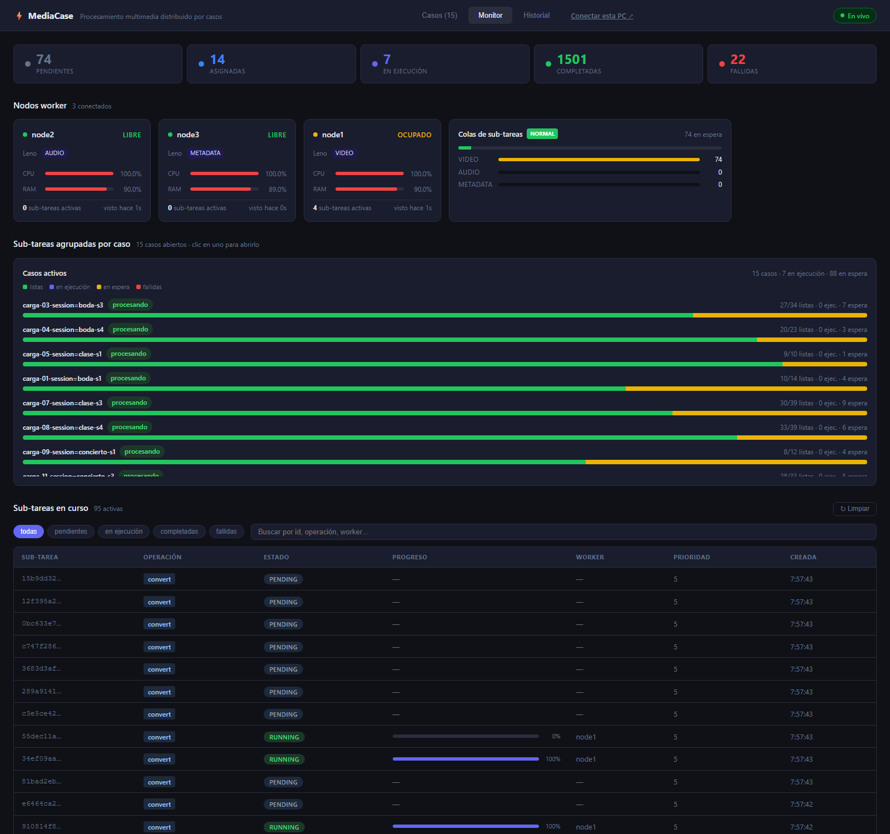
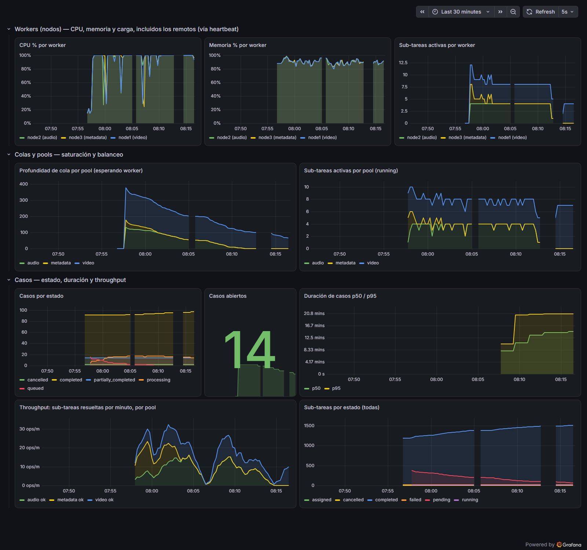
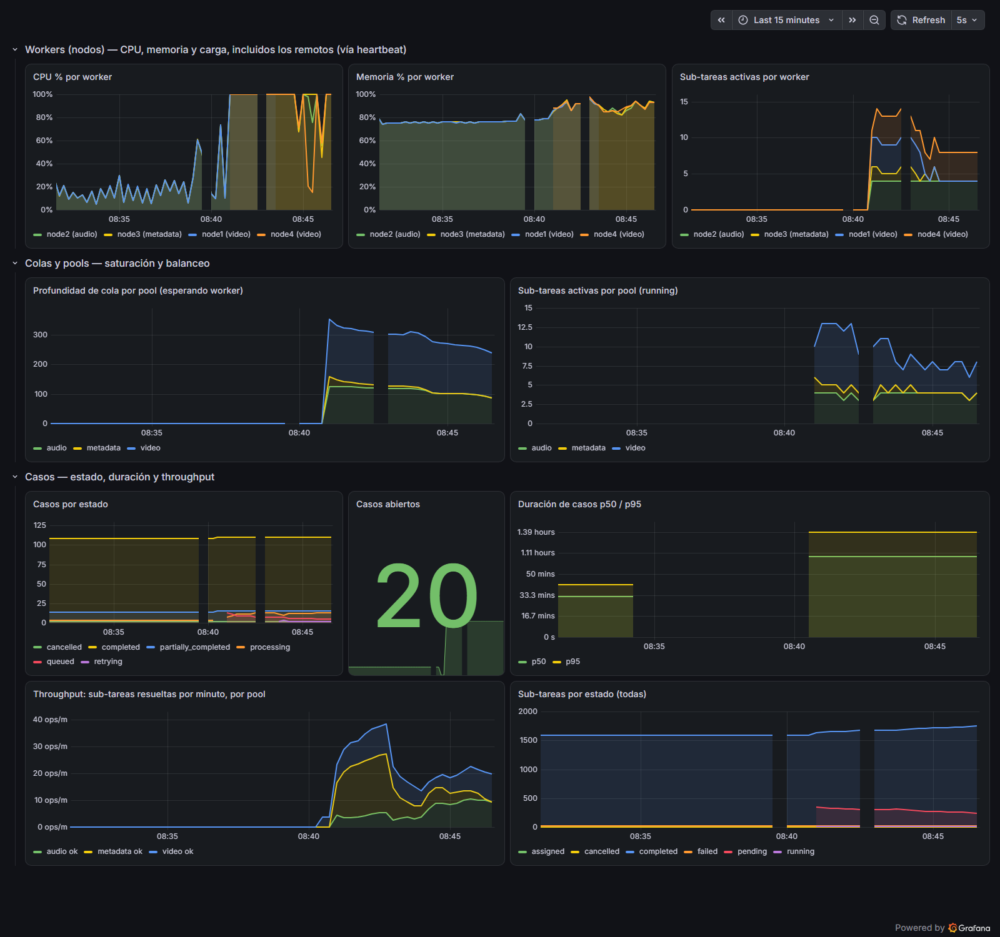
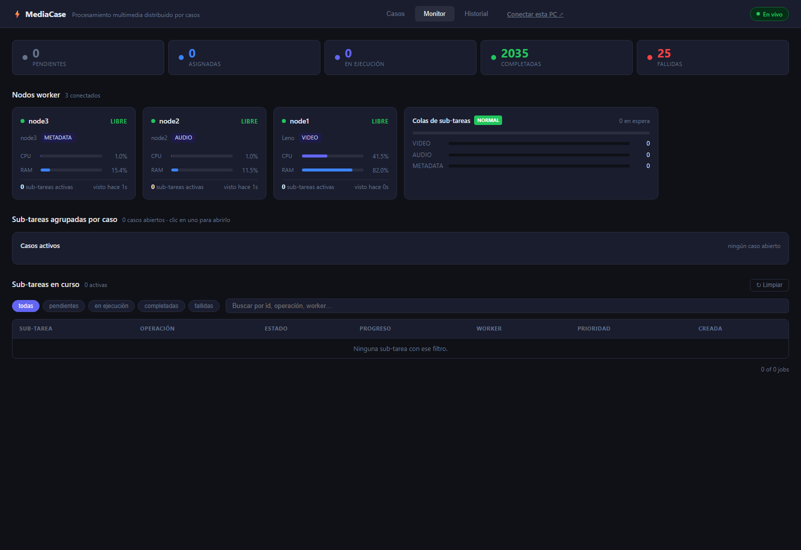

# Informe de pruebas

Evidencia de carga, distribución, casos heterogéneos y comportamiento del sistema, con números
tomados de PostgreSQL (`tests/measure_times.sh`), de los scripts de hito (`tests/*.sh`, todos
terminan en `HITO OK`) y de capturas de Grafana y del dashboard (`docs/img/`). Todas las corridas
de este informe son del 2026-09-11 salvo donde se indica.

## 1. Entorno de prueba

| Nodo | Máquina | Rol | Cómo corre |
|---|---|---|---|
| node-1 | Laptop de Leno: Ryzen 7 7445HS (6C/12T), 15 GB RAM, Windows 11 | coordinador + PostgreSQL/Redis/MinIO/Prometheus/Grafana (Docker) + `node1` worker **video** (pool 4) | procesos nativos + Docker Desktop |
| node2, node3 | misma laptop, procesos separados | `node2` worker **audio** (pool 4), `node3` worker **metadata** (pool 4) | procesos nativos independientes, cada uno con su canal WebSocket hacia el coordinador |
| node4 / tmp-video | misma laptop | segundo worker de **video**, solo durante las pruebas de redistribución | proceso nativo temporal |
| lila | PC de otra persona, Windows 11, mismo WiFi (`172.24.84.218`) | worker `all` descargado desde `/connect` | prueba de hardware real del 2026-09-10 (§7) |
| w-video, w-audio, w-meta | misma laptop | tres workers del ZIP con roles distintos | hito de pools del 2026-09-10 |

Para la rúbrica de "3 nodos worker en entidades separadas" el despliegue final usa las VMs de
Vagrant (node2, node3 con IP propia) y las laptops del equipo (Fase 7); las corridas de carga de
este informe se hicieron con los tres workers como procesos separados en node-1 porque las
pruebas de 20 casos concurrentes (412 sub-tareas, 14 GB de entrada) necesitan los 12 hilos de la
laptop, y lo que se mide —colas por pool, barrier, redistribución, reportes— no cambia con la
ubicación física del proceso. La prueba de red real está en §7.

Dataset: 492 archivos, 14.33 GB, en MinIO (`docs/dataset.md`).

## 2. Carga por lotes y concurrencia

`bin/ingest load --cases 20 --concurrency 5 --group-by session --wait` (hito de la Fase 5,
`tests/monitoring_scenario.sh`):

| Métrica | Valor |
|---|---|
| Casos enviados | 20 (uno por sesión del dataset; 8 homogéneos, 12 heterogéneos) |
| Sub-tareas | 412 (video 195 · audio 152 · imagen 65) |
| Tiempo de envío de los 20 casos | 3.4 s con 5 envíos en paralelo (el `POST /cases` más grande, 39 archivos, tardó 3.2 s) |
| Profundidad máxima de la cola `video` | 195 sub-tareas esperando (198 en otra corrida) |
| Workers al 100 % de CPU | los 3, durante toda la carga |
| Cierre de los 20 casos | 25 min 57 s (corrida 1) · ~27 min (corrida 2) |
| Resultado | 20/20 `completed` (corrida 1) · 18 `completed` + 2 `partially_completed` (corrida 2: 2 sub-tareas vencidas a los 15 min por un reinicio del coordinador, ver §5.3) |
| Throughput sostenido | 12-18 sub-tareas/min con las tres colas ocupadas; hasta 40/min al arrancar, cuando entran las livianas |

Una segunda carga de 10 casos (`--cases 10`, 197 sub-tareas) cerró 10/10 `completed`. La misma
carga desde el dataset con `--group-by session --limit 10` (hito de la Fase 4,
`tests/dataset_scenario.sh`): 10 casos, 197 sub-tareas, todas `completed`, todas con `worker_id`.

Concurrencia **intra-caso**: un caso de 39 archivos (`session=clase-s4`) tuvo sus sub-tareas
corriendo a la vez en los tres pools. Concurrencia **inter-casos**: con 20 casos abiertos, el
monitoreo mostró 10 sub-tareas en ejecución y 369 en espera repartidas entre los 20
(`/stats.by_case`).



## 3. Tiempos por sub-tarea y por caso

Ventana: las 9 horas de pruebas del 2026-09-11 (2 000+ sub-tareas, 133 casos cerrados).

| operation | pool | n | media | p50 | p90 | p99 | max |
|---:|---:|---:|---:|---:|---:|---:|---:|
| convert_audio | audio | 686 | 27.1 | 8.9 | 72.2 | 236.0 | 367.3 |
| thumbnail | metadata | 259 | 3.6 | 3.1 | 6.8 | 14.3 | 26.4 |
| convert | video | 993 | 44.2 | 11.3 | 80.9 | 871.5 | 1797.2 |
| extract_audio | video | 1 | 0.2 | 0.2 | 0.2 | 0.2 | 0.2 |

Lectura: la mediana de un `convert` de video es 11 s porque la mayoría del dataset es liviano; el
p99 y el máximo (870 s, 1 797 s) son videos pesados que corrieron durante el período en que la
laptop estuvo sobresuscrita (§5.4). Con ffmpeg en prioridad baja los pesados quedan en ~3-4 min.

Por nivel de tamaño del archivo (la consigna pide tres niveles reales):

| nivel | pool | n | media | p50 | p90 | max |
|---:|---:|---:|---:|---:|---:|---:|
| liviano (< 5 MB) | audio | 407 | 9.0 | 5.6 | 11.5 | 285.9 |
| mediano (20-50 MB) | audio | 226 | 44.0 | 29.7 | 90.0 | 367.3 |
| otro | audio | 1 | 0.3 | 0.3 | 0.3 | 0.3 |
| pesado (150-400 MB) | audio | 52 | 95.9 | 78.3 | 187.2 | 359.4 |
| imagen | metadata | 258 | 3.7 | 3.2 | 6.8 | 26.4 |
| otro | metadata | 1 | 0.2 | 0.2 | 0.2 | 0.2 |
| liviano (< 5 MB) | video | 545 | 7.8 | 5.3 | 11.3 | 827.2 |
| mediano (20-50 MB) | video | 349 | 44.6 | 26.1 | 45.6 | 1496.7 |
| otro | video | 2 | 0.3 | 0.3 | 0.4 | 0.4 |
| pesado (150-400 MB) | video | 98 | 245.2 | 174.2 | 276.9 | 1797.2 |

Los tres niveles se separan con claridad: video liviano 5 s, mediano 26 s, pesado 174 s (mediana);
audio liviano 5.5 s, mediano 29 s, pesado 77 s.

Duración de los casos (creación → cierre por el barrier):

| clase | status | casos | sub_tareas_media | media_s | p50_s | p90_s | max_s |
|---:|---:|---:|---:|---:|---:|---:|---:|
| heterogéneo | completed | 52 | 24.1 | 1040.2 | 1373.0 | 1720.1 | 2562.1 |
| heterogéneo | partially_completed | 6 | 26.7 | 2575.1 | 1970.1 | 4633.7 | 4633.9 |
| homogéneo | completed | 54 | 9.2 | 669.9 | 583.5 | 1448.4 | 1973.9 |
| homogéneo | partially_completed | 3 | 12.7 | 1344.7 | 1532.1 | 1554.1 | 1559.6 |

Los casos heterogéneos tardan más porque tienen más sub-tareas (20 en promedio contra 8) y porque
el barrier espera a la más lenta, que casi siempre es un video pesado en la cola saturada. Los
`partially_completed` de esta ventana son los de §5.3 y §5.4 (reportes perdidos por reinicio del
coordinador), no fallos de ffmpeg.

Espera en cola (creación → inicio), que es donde se ve la saturación por pool:

| pool | n | media_s | p50_s | p90_s | max_s |
|---:|---:|---:|---:|---:|---:|
| audio | 687 | 352.6 | 260.0 | 780.0 | 1377.8 |
| metadata | 259 | 48.5 | 18.3 | 159.3 | 228.2 |
| video | 1004 | 635.3 | 507.4 | 1408.6 | 2559.1 |

El pool `video` es el cuello de botella (mediana 8.4 min de espera bajo 20 casos concurrentes),
`audio` lo sigue y `metadata` casi no espera: exactamente lo que predice el modelo de pools
especializados (`architecture.md` §6). La respuesta operativa es conectar otra PC con rol
`video`, y eso es lo que se probó en §6.

## 4. Distribución entre nodos

| worker_id | pool | sub_tareas | ok | fallidas | minutos_cpu |
|---:|---:|---:|---:|---:|---:|
| node1 | video | 877 | 867 | 10 | 526.4 |
| node2 | audio | 659 | 658 | 1 | 305.0 |
| node3 | metadata | 239 | 239 | 0 | 14.5 |
| node4 | video | 119 | 119 | 0 | 200.9 |
| tmp-video | video | 8 | 8 | 0 | 3.6 |
| w-audio | audio | 28 | 28 | 0 | 5.0 |
| w-meta | metadata | 20 | 20 | 0 | 1.2 |

Cada worker solo recibió sub-tareas de su pool (`tests/pools_scenario.sh`: 4/4 sub-tareas en el
nodo esperado, corrido tres veces hoy). El worker de video hizo 534 minutos de CPU de ffmpeg en la
sesión; cuando se sumó un segundo worker de video (node4) tomó 119 sub-tareas en 20 minutos sin
tocar la configuración: el scheduler reparte por *least-loaded* dentro del pool.

## 5. Casos heterogéneos y comportamiento ante fallos

### 5.1 Caso heterogéneo con archivo corrupto → `partially_completed`

`tests/case_scenario.sh` (hito de la Fase 1, repetido en modo local y distribuido): un caso con un
video, un audio y un archivo de texto renombrado `.mp4`, enviado sin indicar operaciones. El
coordinador enrutó `convert` / `convert_audio` / `convert`; las dos válidas completaron, la corrupta
falló con el error de ffmpeg; el barrier cerró el caso como `partially_completed` y el reporte dice
`de 3 archivos — 1 video convertido, 1 audio convertido, 1 fallido por formato no soportado`.

### 5.2 Caída de un worker a mitad de un caso → redistribución

`tests/failure_scenario.sh` (hoy, 09:20): caso de 8 videos medianos con prioridad 9; cuando
`node1` tenía 2 en ejecución se lo mató con `kill -9` (sin despedida).

| Momento | Qué pasó |
|---|---|
| t = 0 | kill -9 a node1 con 2 sub-tareas corriendo |
| t ≈ 22 s | el coordinador lo expulsa (15 s sin heartbeat + tick de evicción) y re-encola sus 2 sub-tareas |
| t ≈ 25 s | `tmp-video` (segundo worker del pool) las toma |
| t = 51 s | el caso cierra `completed`, 8/8, **0 fallidas**; las 2 sub-tareas figuran con `worker_id = tmp-video` |

Variantes probadas el 2026-09-10 en hardware real (§7): cierre de la ventana del worker a mitad
de 4 conversiones → despedida (`unregister`) → 4 re-encoladas en el mismo segundo → caso
`retrying` → reabierto 13 s después → `completed` 4/4; y caída sin despedida → expulsión por
heartbeat a los 27 s → mismo resultado.

### 5.3 Reinicio del coordinador durante una carga

Se reinició el coordinador tres veces con 20 casos en curso (hoy, para desplegar cambios). Los
workers se reconectan solos (espera exponencial 1→30 s) y siguen procesando; ningún caso se pierde
porque el estado está en PostgreSQL y la cola en Redis. Se encontró un defecto real: los reportes
`completed` emitidos **mientras** el coordinador estaba caído se perdían, y esas sub-tareas
quedaban en `assigned`/`running` hasta vencer a los 15 min (5 sub-tareas en la primera corrida, 2
en la segunda: son los `partially_completed` de §3). Arreglo: el worker reintenta los reportes
terminales hasta 15 min y el coordinador devuelve a la cola lo `assigned` sin noticias. En las
corridas posteriores al arreglo (`tests/failure_scenario.sh` y una carga de 10 casos) no volvió a
ocurrir.

### 5.4 Sobresuscripción de CPU

Con 16 ffmpeg simultáneos (4 workers × 4 slots) en los 12 hilos de la laptop, el coordinador y
Postgres se quedaban sin CPU: los heartbeats tardaban >30 s, el coordinador expulsó a `node1` y
`node4` por error y re-encoló trabajo que sí estaba corriendo (trabajo duplicado, no perdido).
Arreglo: ffmpeg corre con prioridad por debajo de la normal (`BELOW_NORMAL_PRIORITY_CLASS` en
Windows, `nice 10` en Linux) y el worker usa un cliente HTTP con plazo de 10 s. Verificado con
`Get-Process ffmpeg` → `BelowNormal`. Es un caso de libro de planificación: los procesos de
control deben tener prioridad sobre los de cómputo.

### 5.5 Cancelación

Desde el dashboard (hito de la Fase 3) y por API: un caso en cola se cancela con sus sub-tareas
`pending` → `cancelled` y reporte inmediato; uno a medio procesar deja terminar las sub-tareas en
ejecución pero no cambia más de estado. Los dos casos `cancelled` de la ventana de §3 son esas
pruebas.

## 6. Saturación y redistribución de carga (monitoreo)



Panel por panel, durante la carga de §2: CPU de los tres workers al 100 %; cola `video` sube a
~380 y baja linealmente durante 25 min mientras `metadata` se vacía en 2 min; sub-tareas activas
por pool estables en 8 video / 4 audio / 4 metadata (los slots de cada worker); casos abiertos de 20
a 0; duración p50/p95 de casos; throughput por pool en sub-tareas/min.



Redistribución: con la carga en curso se levantó `node4` (video) a las 08:41 y se mató `node1` a
las 08:43. En "Sub-tareas activas por worker" `node1` cae a 0 y `node4` se mantiene en 4; el
coordinador re-encoló las 6 sub-tareas en vuelo de `node1` (log: `reclaimed job … from dead worker
node1 — re-enqueuing`) y las procesó `node4`. `node1` se relanzó a las 08:45 y volvió a recibir
trabajo. Todo sin intervención sobre el coordinador.

## 7. Hardware real

**2026-09-10, 23:40 — PC "lila"** (Windows 11, otra persona, mismo WiFi): abrió
`http://172.24.83.164:8080/connect`, bajó el ZIP de Windows, doble clic, y apareció en el dashboard
como `lila`. En esa máquina pasaron `tests/distributed_smoke.sh` (con el worker del host apagado: la
sub-tarea la procesó `lila`), `tests/case_scenario.sh` (caso heterogéneo con fallo parcial) y las dos
pruebas de caída de §5.2. También se reconectó sola tras un reinicio del coordinador. Lecciones
para el manual: Smart App Control bloquea el `.exe` sin firma, y "Desbloquear" en las propiedades
del ZIP evita el aviso de archivo de internet.

**2026-09-11, 17:52 — tres máquinas con IP propia (Vagrant + VirtualBox 7.2.8)**: `vagrant up`
en `infra/vagrant` creó `node2` (Ubuntu 24.04, 2 vCPU, 1.5 GB, `192.168.56.101`, rol **audio**) y
`node3` (1 vCPU, 1 GB, `192.168.56.102`, rol **metadata**), ambas sin Docker: `ffmpeg 6.1.1` de apt,
`bin/worker-linux-amd64` copiado por la carpeta compartida y el servicio `mediacase-worker` bajo
systemd (`Restart=always`). El coordinador y el worker `node1` (**video**) corren en el host
(`192.168.56.1`). Los tres nodos se comunican solo por la red host-only de VirtualBox (registro
HTTP + canal WebSocket hacia el 8080; entradas y resultados por S3 al 9000).

`tests/pools_scenario.sh` con esa topología:

```
→ workers y sus pools:
   node3        rol=metadata  pools=metadata
   node2        rol=audio     pools=audio
   node1        rol=video     pools=video
→ caso b805ce11-4553-472d-834f-c74af76494b8
   [  2s] processing
   [  4s] completed
   resumen: de 4 archivos — 1 audio convertido, 1 miniatura generada, 1 video convertido, 1 audio extraído
   OK  pool_video.mp4     video  convert        corrió en node1      (esperado node1)
   OK  pool_audio.wav     audio  convert_audio  corrió en node2      (esperado node2)
   OK  pool_imagen.png    image  thumbnail      corrió en node3      (esperado node3)
   OK  pool_video.mp4     video  extract_audio  corrió en node1      (esperado node1)
HITO OK — cada sub-tarea corrió en el nodo de su pool
```



Observaciones del despliegue: con Hyper-V activo en el host (Docker Desktop / WSL) VirtualBox arranca
Ubuntu en ~6 min, más que el `boot_timeout` de 300 s de Vagrant; se subió a 900 s en el `Vagrantfile`.
Y dos comandos `vagrant` en paralelo en Windows fallan con `powershell_error`: hay que levantar los
nodos de uno en uno.

**Laptops del equipo (Jennifer y Jonathan)**: pendiente, Task 7.4. Se anotará aquí el mismo escenario
con los roles repartidos entre las tres laptops físicas.

## 8. Throughput

| minuto | completadas | video | audio | metadata |
|---:|---:|---:|---:|---:|
| 09:21 | 8 | 8 | 0 | 0 |
| 09:19 | 5 | 5 | 0 | 0 |
| 09:18 | 9 | 9 | 0 | 0 |
| 09:17 | 4 | 2 | 1 | 1 |
| 09:15 | 2 | 2 | 0 | 0 |
| 09:13 | 6 | 6 | 0 | 0 |
| 09:12 | 1 | 1 | 0 | 0 |
| 09:10 | 4 | 4 | 0 | 0 |
| 09:09 | 8 | 8 | 0 | 0 |
| 09:08 | 2 | 2 | 0 | 0 |
| 09:07 | 4 | 4 | 0 | 0 |
| 09:06 | 4 | 4 | 0 | 0 |
| 09:05 | 22 | 21 | 1 | 0 |
| 09:04 | 29 | 16 | 13 | 0 |
| 09:03 | 10 | 7 | 3 | 0 |
| 09:02 | 17 | 9 | 8 | 0 |
| 09:01 | 17 | 8 | 9 | 0 |
| 09:00 | 4 | 3 | 1 | 0 |
| 08:59 | 8 | 5 | 3 | 0 |
| 08:58 | 13 | 4 | 9 | 0 |
| 08:57 | 2 | 1 | 1 | 0 |
| 08:56 | 4 | 2 | 2 | 0 |
| 08:55 | 2 | 2 | 0 | 0 |
| 08:54 | 18 | 10 | 8 | 0 |
| 08:53 | 17 | 8 | 9 | 0 |
| 08:52 | 17 | 8 | 9 | 0 |
| 08:51 | 12 | 9 | 3 | 0 |
| 08:50 | 14 | 9 | 5 | 0 |
| 08:49 | 9 | 7 | 2 | 0 |
| 08:48 | 1 | 1 | 0 | 0 |

## 9. Defectos encontrados gracias a las pruebas de carga (todos corregidos)

| Defecto | Cómo se vio | Arreglo |
|---|---|---|
| `POST /cases` con decenas de archivos superaba el `WriteTimeout` de 10 s | `ingest` recibía EOF con el caso ya creado | plazo propio de 5 min en el handler |
| Un avance de progreso rezagado devolvía a `running` una sub-tarea `completed` | casos que nunca cerraban y vencían a los 15 min | `jobProgress` no regresa estados terminales |
| `by_pool` del dashboard en −1 bajo carga | Redis pierde el `lag` del consumer group tras `XDEL` | conteo con `XRANGE` desde el último id entregado |
| Snapshot WebSocket de ~1 MB por segundo por cliente | 2 000 sub-tareas serializadas cada segundo | solo las vivas; contadores del servidor |
| Reportes `completed` perdidos si el coordinador reinicia | sub-tareas en `assigned`/`running` hasta vencer | reintento 15 min en el worker; re-encolar `assigned` viejas |
| Sobresuscripción: workers expulsados por error | heartbeats de >30 s con 16 ffmpeg | ffmpeg `BelowNormal`/`nice 10`, cliente HTTP con plazo |
| El generador de dataset no era reproducible ni respetaba tamaños | `$RANDOM` re-sembrado en subshells; libvpx al doble de bitrate | PRNG propio; tamaño objetivo verificado con `stat` |

## 10. Cómo reproducir

```bash
docker compose -f docker-compose.infra.yml up -d      # infra
scripts/run-coordinator.ps1 ; scripts/run-worker.ps1  # coordinador + node1 (y node2/node3 con otro WORKER_ROLE)
bin/ingest upload                                     # dataset a MinIO (una vez)
bash tests/pools_scenario.sh                          # cada sub-tarea en su pool
bash tests/dataset_scenario.sh                        # 10 casos automáticos desde el dataset
WAIT=1 bash tests/monitoring_scenario.sh              # 20 casos concurrentes + monitoreo (≈ 25 min)
bash tests/failure_scenario.sh                        # caída de un worker a mitad de un caso
SINCE='2 hours' bash tests/measure_times.sh --markdown   # las tablas de este informe
```
