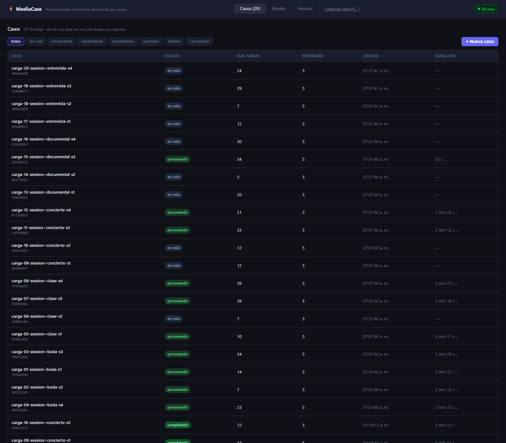

# Manual de usuario

Cómo usar MediaCase desde el navegador y cómo sumar una computadora como nodo worker. Para levantar
la infraestructura (node-1) ver el [README](../README.md); para la API ver [`api.md`](api.md).

Todo se maneja desde una sola dirección: **`http://<ip-de-node-1>:8080`** (en la laptop de Leno,
`http://localhost:8080`). Grafana está en `http://<ip-de-node-1>:3001` y se ve sin login.

## 1. El dashboard



Tres pestañas arriba: **Casos**, **Monitor** e **Historial**, más el enlace **Conectar esta PC**.
El punto verde "En vivo" indica que el navegador recibe el estado en tiempo real; "Reconectando…"
significa que el coordinador no responde (ver §6).

### Pestaña Casos

La lista de todos los casos, del más nuevo al más viejo, con estado, cantidad de sub-tareas,
prioridad, hora de creación y duración. Los filtros de arriba dejan ver solo los de un estado
(`en cola`, `procesando`, `reintentando`, `completados`, `parciales`, `fallidos`, `cancelados`).
El número junto a "Casos" en la pestaña es cuántos siguen abiertos.

### Pestaña Monitor


- **Contadores** de sub-tareas por estado en todo el sistema.
- **Nodos worker**: una tarjeta por máquina conectada con su rol (pool), CPU y RAM del host,
  sub-tareas activas y hace cuánto se vio. Se pone "OCUPADO" cuando tiene trabajo.
- **Colas de sub-tareas**: cuántas esperan un worker, por pool. Si `VIDEO` crece y `AUDIO` está en
  cero, el pool de video está saturado: esa es la señal para conectar otra PC con rol video.
- **Sub-tareas agrupadas por caso**: una barra por caso abierto (verde listas, azul en ejecución,
  amarillo en espera, rojo fallidas). Clic en un caso lo abre en la pestaña Casos.
- **Sub-tareas en curso**: la tabla de lo que está pendiente, asignado o corriendo, con el worker
  que lo tiene y el progreso.

### Pestaña Historial

Todas las sub-tareas, también las terminadas, con filtro y búsqueda. Clic en una fila para ver el
detalle (archivo, operación, worker, tiempos, URL del resultado o error).

## 2. Enviar un caso

1. En **Casos**, botón **+ Nuevo caso**.
2. Elegir los archivos. Hay dos maneras, combinables:
   - **Subir** archivos desde tu computadora (video, audio o imágenes; varios a la vez).
   - **Elegir del dataset**: los archivos que ya están en el sistema (los 492 del dataset de prueba).
3. Nombre del caso y prioridad (1-10; 8 o más va a la cola alta).
4. **Enviar**. El coordinador decide la operación de cada archivo por su tipo: video → convertir a
   MP4, audio → convertir a WAV, imagen → miniatura. No hay que indicarla.

Un caso con archivos de un solo tipo es **homogéneo**; con mezcla es **heterogéneo** y sus
sub-tareas corren en paralelo en pools distintos. Si algún archivo no es válido (extensión
desconocida) el caso se rechaza entero y el mensaje dice cuál.

## 3. Seguir un caso y leer el reporte

Clic en un caso de la lista abre su detalle: estado agregado, cada sub-tarea con su archivo,
operación, estado, worker responsable y progreso. Se actualiza solo cada 2 s.

Cuando el caso cierra (`completado`, `parcial` o `fallido`) aparece el **reporte consolidado**:

- resumen en una línea (*"de 39 archivos — 20 videos convertidos, 12 audios convertidos, 7
  miniaturas generadas"*),
- totales y tabla por tipo y operación,
- cada sub-tarea con inicio, fin, duración, worker, y **enlace de descarga** del resultado o el
  error si falló,
- tiempos de inicio y fin del caso completo.

Un caso queda `parcial` cuando al menos una sub-tarea falló (por ejemplo un archivo corrupto): las
demás igual se procesan y sus resultados están disponibles. El reporte también se puede pedir por
API (`GET /cases/{id}/report`) y queda guardado en MinIO en `results/cases/<id>/report.json`.

### Cancelar

En el detalle de un caso abierto, botón **Cancelar**. Las sub-tareas que no habían empezado se
cancelan; las que ya estaban corriendo terminan (no se interrumpe un ffmpeg a medias) pero el caso
queda `cancelado` y ya no cambia. Se genera el reporte con lo que alcanzó a hacerse.

## 4. Enviar casos sin el navegador

Desde la carpeta del repo, con el coordinador arriba:

```bash
# un caso a mano (claves de archivos que ya están en MinIO)
go run ./cmd/client -case -name "prueba" -files "video_light_1.mp4,audio_light_2.flac,image_3.webp" -watch

# seguir un caso existente hasta que cierre e imprimir su reporte
go run ./cmd/client -case-status <id>

# generación automática de casos desde el dataset (agrupa por sesión, evento, lote, usuario…)
bin/ingest cases --group-by session --limit 10
bin/ingest cases --group-by event --only heterogeneous --dry-run

# generador de carga: 20 casos concurrentes, 5 envíos en paralelo, espera y resume
bin/ingest load --cases 20 --concurrency 5 --group-by session --wait
```

Detalles en [`dataset.md`](dataset.md) y [`api.md`](api.md).

## 5. Conectar tu computadora como worker

Cualquier PC de la red (o de otra red, si Leno abrió el túnel) puede procesar sub-tareas. No hay
que instalar nada ni abrir puertos: el worker se conecta **hacia** el coordinador.

1. En el dashboard, clic en **Conectar esta PC** (o abrir `http://<ip-de-node-1>:8080/connect`).
2. **Descargar para Windows** o **Descargar para Linux**. El ZIP trae el programa, ffmpeg (en
   Windows) y un `worker.env` ya apuntando al coordinador.
3. Descomprimir en cualquier carpeta.
4. **Windows:** doble clic en `start-worker.bat`. **Linux:** `bash start-worker.sh`
   (si falta ffmpeg: `sudo apt install ffmpeg`, o `sudo pacman -S ffmpeg` en Arch; el ZIP ya se
   probó en Ubuntu 24.04 y en Arch).
5. En unos segundos la máquina aparece en **Monitor → Nodos worker** con el nombre de la PC y
   empieza a recibir sub-tareas. Dejar la ventana abierta; cerrarla desconecta el worker y sus
   sub-tareas en curso vuelven a la cola para otro nodo.

### Elegir el rol (pool)

Por defecto el worker descargado es genérico (`WORKER_ROLE=all`): atiende video, audio e imágenes.
Para especializarlo, editar `worker.env` antes de arrancar:

```
WORKER_ROLE=audio        # video | audio | metadata | all
WORKER_POOL_SIZE=2       # sub-tareas simultáneas: 2 en una laptop normal, 4 si tiene 6+ núcleos
WORKER_ID=laptop-jenn    # nombre que se ve en el dashboard (vacío = nombre de la máquina)
```

### Desde otra red (túnel)

Si la PC no está en el mismo WiFi que node-1, Leno abre un túnel: `scripts	unnel.ps1` publica el
coordinador y MinIO en dos URLs `https://….trycloudflare.com` (sin abrir puertos ni tener cuenta) y
pasa la URL del dashboard. Los pasos son los mismos de arriba usando esa URL en vez de la IP: el
ZIP descargado por el túnel ya trae `COORDINATOR_URL=https://…` (el worker se conecta por `wss://`)
y `MINIO_ENDPOINT=<túnel de MinIO>` con `MINIO_USE_SSL=true`. Las URLs cambian cada vez que se abre
el túnel, así que el ZIP hay que bajarlo con el túnel ya abierto. Requisitos del lado de Leno:
`winget install --id Cloudflare.cloudflared` y una red que deje salir a Cloudflare (el WiFi del TEC
lo bloquea; con **Cloudflare WARP** activo, o desde una casa, funciona).

### Avisos de Windows 11

El ejecutable **no está firmado** (un certificado de firma cuesta dinero y está fuera del alcance del
proyecto). Windows puede reaccionar de dos formas:

- **"Archivo descargado de internet" / SmartScreen**: clic derecho en el ZIP → *Propiedades* →
  marcar **Desbloquear** → Aceptar, antes de descomprimir. Con eso no pide permisos de
  administrador ni muestra el aviso.
- **Smart App Control** (viene activo en algunas instalaciones nuevas de Windows 11) bloquea
  cualquier `.exe` sin firma y no ofrece "ejecutar de todos modos". Se apaga en *Seguridad de
  Windows → Control de aplicaciones y navegador → Smart App Control → Desactivado*. **Es
  irreversible** (solo se reactiva reinstalando Windows); si no querés apagarlo, usá otra PC, una
  VM o Linux.

## 6. Si algo no funciona

| Síntoma | Qué mirar |
|---|---|
| El worker arranca y se cierra, o dice `no se pudo conectar` | La PC no llega a `COORDINATOR_URL` del `worker.env`: ¿mismo WiFi? ¿el firewall de node-1 permite el 8080 (`scripts/firewall-node1.ps1`)? ¿cambió la IP de node-1? Volvé a bajar el ZIP desde `/connect`, trae la IP actual |
| El worker aparece pero sus sub-tareas fallan con `descarga de entrada` | No llega a MinIO (`MINIO_ENDPOINT` en el `worker.env`, puerto 9000). Mismo diagnóstico que arriba |
| `Falta ffmpeg` en Linux | `sudo apt install ffmpeg` |
| El dashboard dice "Reconectando…" | El coordinador está caído o reiniciando. Los workers esperan y se reconectan solos; nada se pierde |
| Un caso lleva mucho en `en cola` | No hay worker del pool que necesita (mirar **Colas** en Monitor: el pool con número alto es el que falta). Conectar una PC con ese `WORKER_ROLE` |
| Un caso quedó `reintentando` | Un worker se cayó a mitad; sus sub-tareas ya volvieron a la cola y las toma otro worker del pool en cuanto haya |
| Un archivo termina `fallido` con error de ffmpeg | El archivo está corrupto o no es lo que dice su extensión; el resto del caso sigue y el caso cierra `parcial` |

## 7. Apagar

- **Un worker**: cerrar su ventana (Ctrl+C). Se despide del coordinador y sus sub-tareas en curso se
  re-encolan de inmediato.
- **Todo en node-1**: `scripts/stop-all.ps1` (coordinador y workers locales) y
  `docker compose -f docker-compose.infra.yml down` (infra; los datos quedan en los volúmenes,
  `down -v` los borra).
