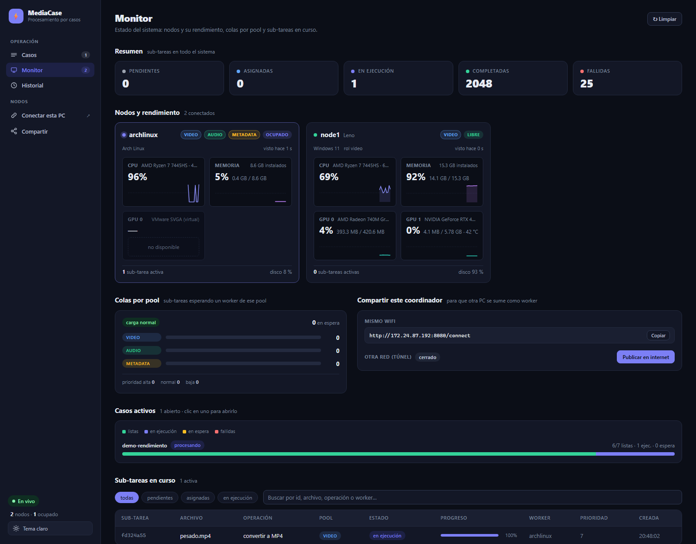
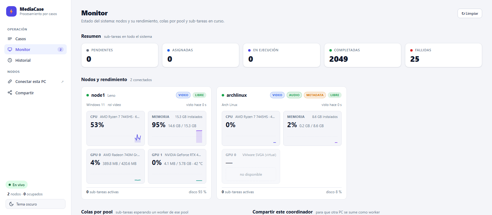
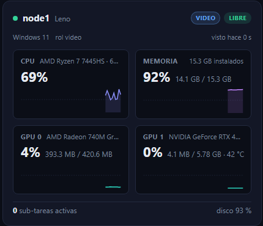
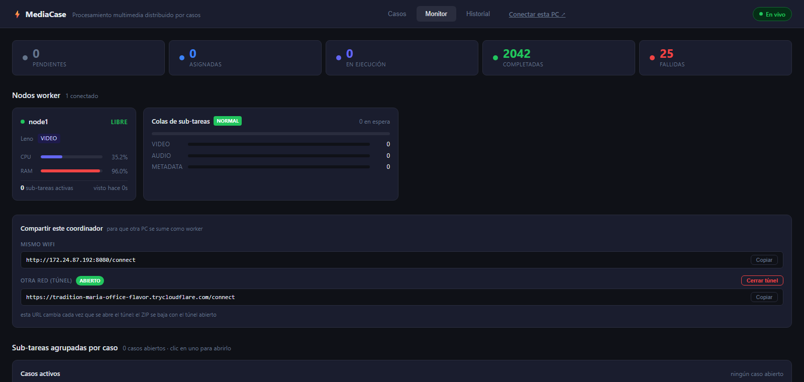

# Manual de usuario

Cómo usar MediaCase desde el navegador y cómo sumar una computadora como nodo worker. Para levantar
la infraestructura (node-1) ver el [README](../README.md); para la API ver [`api.md`](api.md).

Todo se maneja desde una sola dirección: **`http://<ip-de-node-1>:8080`** (en la laptop de Leno,
`http://localhost:8080`). Grafana está en `http://<ip-de-node-1>:3001` y se ve sin login.

## 1. El dashboard



Una barra lateral con tres secciones —**Casos**, **Monitor** e **Historial**—, los accesos
**Conectar esta PC** y **Compartir**, y abajo el indicador "En vivo" (el navegador recibe el estado
en tiempo real; "Reconectando…" significa que el coordinador no responde, ver §6), el conteo de
nodos y el botón de **tema claro / oscuro** (se recuerda en el navegador; también sirve
`?theme=light` o `?theme=dark` en la URL). Cada sección se abre por URL: `#casos`, `#monitor`,
`#historial`, y `#caso=<id>` abre directamente un caso.



### Casos

La lista de todos los casos, del más nuevo al más viejo, con estado, cantidad de sub-tareas,
prioridad, hora de creación y duración. Los filtros de arriba dejan ver solo los de un estado
(`en cola`, `procesando`, `reintentando`, `completados`, `parciales`, `fallidos`, `cancelados`).
El número junto a "Casos" en la barra lateral es cuántos siguen abiertos. **+ Nuevo caso** está
arriba a la derecha.

### Monitor

De arriba hacia abajo:

- **Resumen**: contadores de sub-tareas por estado en todo el sistema.
- **Nodos y rendimiento**: una tarjeta por máquina conectada, como la pestaña *Rendimiento* del
  Administrador de tareas de Windows: nombre, pool (chip de color), estado LIBRE/OCUPADO, sistema
  operativo y hace cuánto se vio; y adentro **CPU** (modelo, núcleos, %), **Memoria** (usada /
  instalada y %), y **una tarjeta por GPU** —la integrada y la dedicada— con su nombre, %,
  VRAM y temperatura, cada una con la gráfica de los últimos 60 segundos. Lo que esa máquina no
  puede medir dice "no disponible" (p. ej. el % de una GPU virtual); nunca se muestra un cero
  inventado. Abajo, las sub-tareas activas y el uso del disco.

  

- **Colas por pool**: cuántas sub-tareas esperan un worker de cada pool. Si `VIDEO` crece y
  `AUDIO` está en cero, el pool de video está saturado: esa es la señal para conectar otra PC con
  rol video. El chip de carga pasa a *alta* con más de 200 en espera y a *crítica* con más de 1000.
- **Compartir este coordinador**: la URL para otra PC en el mismo WiFi y el botón del túnel (§5).
- **Casos activos**: una barra por caso abierto (verde listas, índigo en ejecución, ámbar en
  espera, rojo fallidas). Clic en un caso lo abre en Casos.
- **Sub-tareas en curso**: lo pendiente, asignado o corriendo, con archivo, pool, worker y progreso.

### Historial

Todas las sub-tareas, también las terminadas, con filtro y búsqueda. Clic en una fila para ver el
detalle (id completo, archivo, caso, tiempos, reintentos, URL del resultado o error).

## 2. Enviar un caso

1. En **Casos**, botón **+ Nuevo caso**.
2. Elegir los archivos. Hay dos maneras, combinables:
   - **Subir** archivos desde su computadora (video, audio o imágenes; varios a la vez).
   - **Elegir del dataset**: los archivos que ya están en el sistema (los 542 del dataset de prueba).
3. Nombre del caso y prioridad (1-10; 8 o más va a la cola alta).
4. Por cada archivo el formulario muestra lo que el coordinador va a hacer, como `mkv → MP4`. No
   hay que tocar nada, pero se puede cambiar la **operación** y el **formato de salida**:

   | Tipo | Operación (la primera es la automática) | Salidas |
   |---|---|---|
   | video | **convertir video** · extraer audio · miniatura · metadatos | MP4 · MKV · WebM / MP3 · WAV · FLAC · AAC / JPG · PNG · WebP (320, 640 o 1280 px) / JSON |
   | audio | **convertir audio** · miniatura (forma de onda) · metadatos | FLAC · MP3 · WAV · AAC · OGG / JPG · PNG · WebP / JSON |
   | imagen | **miniatura** · metadatos | JPG · PNG · WebP / JSON |

   En las conversiones el formato que el archivo ya tiene no aparece en la lista (un `.mp4`
   ofrece MKV o WebM, un `.flac` ofrece MP3, WAV, AAC u OGG): convertir mp4 a mp4 no es una
   conversión. En *miniatura* sí puede repetirse el formato (`png → PNG`), porque ahí lo que
   cambia es el tamaño, no el formato.

   *Metadatos* consulta el archivo con ffprobe y entrega un JSON con contenedor, duración, tamaño,
   bitrate, cada pista (códec, resolución, fps, canales, muestreo) y etiquetas. Entradas aceptadas:
   mp4, mkv, mov, webm, avi, m4v, flv, wmv, ts, mpg · mp3, wav, flac, aac, ogg, m4a, opus, wma,
   aiff, dsf, dff · jpg, png, gif, webp, bmp, tiff.
5. **Enviar**.

Un caso con archivos de un solo tipo es **homogéneo**; con mezcla es **heterogéneo** y sus
sub-tareas corren en paralelo en pools distintos. Si algún archivo no es válido (extensión
desconocida) el caso se rechaza entero y el mensaje dice cuál.

## 3. Seguir un caso y leer el reporte

Clic en un caso de la lista abre su detalle: estado agregado, cada sub-tarea con su archivo,
operación, estado, worker responsable y progreso. Se actualiza solo cada 2 s.

Cuando el caso cierra (`completado`, `parcial` o `fallido`) aparece el **reporte consolidado**:

- resumen en una línea (*"de 39 archivos — 20 videos convertidos, 12 audios convertidos, 7
  miniaturas generadas"*),
- totales y tabla por tipo y operación,
- cada sub-tarea con inicio, fin, duración, worker, y **enlace de descarga** del resultado o el
  error si falló,
- tiempos de inicio y fin del caso completo.

Un caso queda `parcial` cuando al menos una sub-tarea falló (por ejemplo un archivo corrupto): las
demás igual se procesan y sus resultados están disponibles. El reporte también se puede pedir por
API (`GET /cases/{id}/report`) y queda guardado en MinIO en `results/cases/<id>/report.json`.

### Cancelar

En el detalle de un caso abierto, botón **Cancelar**. Las sub-tareas que no habían empezado se
cancelan; las que ya estaban corriendo terminan (no se interrumpe un ffmpeg a medias) pero el caso
queda `cancelado` y ya no cambia. Se genera el reporte con lo que alcanzó a hacerse.

## 4. Enviar casos sin el navegador

Desde la carpeta del repo, con el coordinador arriba:

```bash
# un caso a mano (claves de archivos que ya están en MinIO)
go run ./cmd/client -case -name "prueba" -files "video_light_1.mp4,audio_light_2.flac,image_3.webp" -watch

# seguir un caso existente hasta que cierre e imprimir su reporte
go run ./cmd/client -case-status <id>

# generación automática de casos desde el dataset (agrupa por sesión, evento, lote, usuario…)
bin/ingest cases --group-by session --limit 10
bin/ingest cases --group-by event --only heterogeneous --dry-run

# generador de carga: 20 casos concurrentes, 5 envíos en paralelo, espera y resume
bin/ingest load --cases 20 --concurrency 5 --group-by session --wait
```

Detalles en [`dataset.md`](dataset.md) y [`api.md`](api.md).

## 5. Conectar su computadora como worker

Cualquier PC de la red (o de otra red, si Leno abrió el túnel) puede procesar sub-tareas. No hay
que instalar nada ni abrir puertos: el worker se conecta **hacia** el coordinador.

1. En el dashboard, clic en **Conectar esta PC** (o abrir `http://<ip-de-node-1>:8080/connect`).
2. **Descargar para Windows** o **Descargar para Linux**. El ZIP trae el programa, ffmpeg (en
   Windows) y un `worker.env` ya apuntando al coordinador.
3. Descomprimir en cualquier carpeta.
4. **Windows:** doble clic en `start-worker.bat`. **Linux:** `bash start-worker.sh`
   (si falta ffmpeg: `sudo apt install ffmpeg`, o `sudo pacman -S ffmpeg` en Arch; el ZIP ya se
   probó en Ubuntu 24.04 y en Arch).
5. En unos segundos la máquina aparece en **Monitor → Nodos worker** con el nombre de la PC y
   empieza a recibir sub-tareas. Dejar la ventana abierta; cerrarla desconecta el worker y sus
   sub-tareas en curso vuelven a la cola para otro nodo.

### Elegir el rol (pool)

El rol es el **pool principal** del nodo: lo que atiende primero. Por defecto el worker descargado es
genérico (`WORKER_ROLE=all`). Un nodo con rol `video` recibe los videos por *afinidad*, pero si
está libre y hay audio o miniaturas esperando, también los toma (*ayuda*): nadie se queda parado
mientras haya trabajo. El coordinador además evita cargar un nodo con la RAM sobre 90 % o la CPU
sobre 95 % mientras haya otro descansado. En el Monitor cada tarjeta dice "ayuda en …" y cada
sub-tarea marca si llegó por ayuda. El rol se elige en la página `/connect` antes de descargar
("¿Qué va a procesar esta PC?"); si la PC es la más potente, conviene **Video**. Cuántas sub-tareas
procesa a la vez lo calcula el worker con sus núcleos y su RAM, y la tarjeta del Monitor lo muestra
como "2 de 6 cupos ocupados". Para cambiar cualquiera de las dos cosas después, editar `worker.env`
antes de arrancar:

```
WORKER_ROLE=audio        # video | audio | metadata | all
WORKER_POOL_SIZE=auto    # sub-tareas simultáneas: auto = según núcleos y RAM; un número la fija
WORKER_ID=laptop-jenn    # nombre que se ve en el dashboard (vacío = nombre de la máquina)
```

### Desde otra red (túnel)

Si la PC no está en el mismo WiFi que node-1, en el dashboard de Leno, pestaña **Monitor → tarjeta
"Compartir este coordinador" → "Publicar en internet"**. En unos segundos aparece una URL
`https://….trycloudflare.com/connect` con botón *Copiar*: esa es la que se le pasa a la otra
persona, y los pasos son los mismos de arriba con esa URL en vez de la IP. El ZIP descargado por el
túnel ya sale configurado para él (`https://`, el worker se conecta por `wss://`, y MinIO por su
propio túnel con TLS); no hay nada que editar.



Detalles: el túnel son dos procesos `cloudflared` que maneja el coordinador (se cierran con el botón
*Cerrar túnel* o al apagar node-1); la URL cambia cada vez que se abre, así que el ZIP se baja con
el túnel ya abierto. Necesita `cloudflared` instalado en node-1 (`winget install --id
Cloudflare.cloudflared`; la tarjeta avisa si falta) y una red que deje salir a Cloudflare: **el WiFi
del TEC lo bloquea**; si pasa eso, la tarjeta lo dice y la salida es encender **Cloudflare WARP** (o
una VPN) en la laptop de Leno y volver a intentar. Desde una casa o con datos del celular funciona
directo. El mismo túnel se puede abrir sin dashboard con `scripts\tunnel.ps1`.

### Avisos de Windows 11

El ejecutable **no está firmado** (un certificado de firma cuesta dinero y está fuera del alcance del
proyecto). Windows puede reaccionar de dos formas:

- **"Archivo descargado de internet" / SmartScreen**: clic derecho en el ZIP → *Propiedades* →
  marcar **Desbloquear** → Aceptar, antes de descomprimir. Con eso no pide permisos de
  administrador ni muestra el aviso.
- **Smart App Control** (viene activo en algunas instalaciones nuevas de Windows 11) bloquea
  cualquier `.exe` sin firma y no ofrece "ejecutar de todos modos". Se apaga en *Seguridad de
  Windows → Control de aplicaciones y navegador → Smart App Control → Desactivado*. **Es
  irreversible** (solo se reactiva reinstalando Windows); si no quiere apagarlo, use otra PC, una
  VM o Linux.

## 6. Si algo no funciona

| Síntoma | Qué mirar |
|---|---|
| El worker arranca y se cierra, o dice `no se pudo conectar` | La PC no llega a `COORDINATOR_URL` del `worker.env`: ¿mismo WiFi? ¿el firewall de node-1 permite el 8080 (`scripts/firewall-node1.ps1`)? ¿cambió la IP de node-1? Vuelva a bajar el ZIP desde `/connect`, trae la IP actual |
| El worker aparece pero sus sub-tareas fallan con `descarga de entrada` | No llega a MinIO (`MINIO_ENDPOINT` en el `worker.env`, puerto 9000). Mismo diagnóstico que arriba |
| `Falta ffmpeg` en Linux | `sudo apt install ffmpeg` |
| El dashboard dice "Reconectando…" | El coordinador está caído o reiniciando. Los workers esperan y se reconectan solos; nada se pierde |
| Un caso lleva mucho en `en cola` | No hay worker del pool que necesita (mirar **Colas** en Monitor: el pool con número alto es el que falta). Conectar una PC con ese `WORKER_ROLE` |
| Un caso quedó `reintentando` | Un worker se cayó a mitad; sus sub-tareas ya volvieron a la cola y las toma otro worker del pool en cuanto haya |
| Un archivo termina `fallido` con error de ffmpeg | El archivo está corrupto o no es lo que dice su extensión; el resto del caso sigue y el caso cierra `parcial` |

## 7. Encender y apagar node-1

- **Encender**: doble clic en `MediaCase.bat` (en la raíz del repo). Arranca Docker Desktop si
  hace falta, levanta la infraestructura, detecta la IP de la laptop en el WiFi, abre el coordinador
  y el worker local en dos ventanas minimizadas y abre el dashboard en el navegador. Al final
  imprime la URL para pasarle a otras PCs. Si es la primera vez en esta máquina, correr una vez
  `scripts\firewall-node1.ps1` como administrador (el lanzador avisa si falta la regla).
- **Apagar todo**: doble clic en `MediaCase-detener.bat`. Cierra coordinador, worker local y túneles,
  detiene los contenedores (los datos quedan) y cierra Docker Desktop para liberar memoria.
- **Un worker en otra PC**: cerrar su ventana (Ctrl+C). Se despide del coordinador y sus sub-tareas
  en curso se re-encolan de inmediato.
